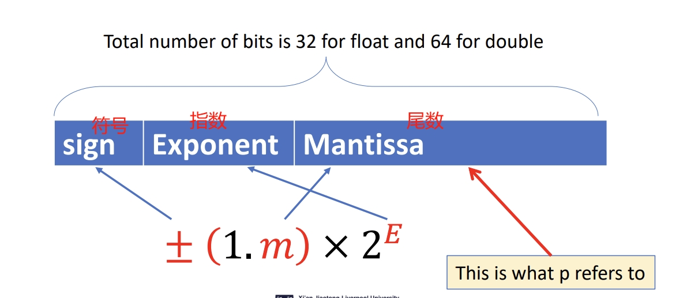
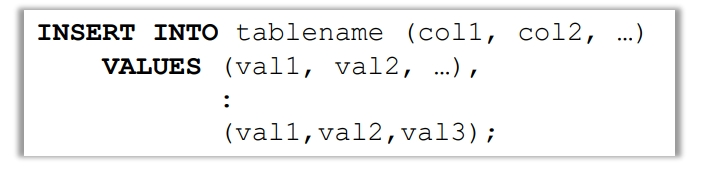
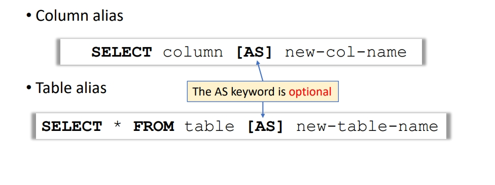

## CPT 103 NOTE  

- 什么是CPT103?  
cpt103的课程名称为: Introduction to databases 即数据库导论。下面是Module Handbook上面的原话  
Database systems is an essential part of the education of computer science and
information systems students, and this module is designed to provide you with a
strong theoretical background which is presented early and used throughout the
course. This module also gives you the practical skills required in the design and
development of actual working databases.  
往年的考核模式主要是以quiz加上大作业的形式来进行，今年的考核模式并没有在Module Handbook上面写明。编者听到一些口风说要在规定时间内设计一套数据库出来，但我认为可能性不大。鉴于限时考试的形式，估计还是以选择题为主。那么废话少说，我们正式开始cpt103的复习。


- Knowledge Summary  
    Tables and Data  
    SQL的全称是“Structured Query Language” 并且包含两种类型的操作语言。分别是：  
    DDL（Data Definition Language）  
    DML（Data Management Language）  
    前者主要是用于表的创建，规定了数据存储的规范和形式。后者主要是用于后期的数据管理和维护。 

    **SQL语句并不区分大小写，但是表的名字和和列的名字是区分大小写的**  
    比如

    ```sql
    SELECT Name, name FROM Student;
    ```

    **SQL的语句用分号(即“；”)结尾**，但是在实际操作的过程中，分号的加不加都可以。但是按照学校的要求，分号是一定要加上的。

    SQL的注释模式为： --注释内容 （注意不能留空格）

    Database Containment Hierarchy（数据库包含层次结构）  
    - A computer may have one or more clusters.  
        - A cluster is a database server.  
        - a computer can run multiple database servers.
    - Each cluster contains one or more catalogs.
        - Catalog is just another name for “database”.
    - Each catalog consists of set of schemas. 
        - Schema is a namespace of tables, and security boundary.
        - A good discussion about this is available here.
    - A schema consists of tables, views, domains, assertions, 
        collations, translations, and character sets. All have same 
        owners.
        - (一个模式由表、视图、域、断言、排序规则、翻译和字符集组成。)
        - 表（Tables）：在数据库中，表是数据的基本存储单位。它由行和列组成，每一行代表一个数据记录，每一列代表一个数据字段。

        - 视图（Views）：视图是一个虚拟表，它的内容由查询定义。与表不同，视图不存储数据，而是在查询时动态生成数据。

        - 域（Domains）：在数据库中，域是一组值的集合，它定义了一个字段可以接受的可能值。

        - 断言（Assertions）：断言是对数据库中数据的一种约束。它是一个布尔表达式，当插入或更新数据时，这个表达式必须为真。

        - 排序规则（Collations）：排序规则定义了字符的排序方式和比较规则。不同的语言和地区可能需要不同的排序规则。

        - 翻译（Translations）：这可能是指在数据库中处理多语言数据时使用的翻译或转换。

        - 字符集（Character Sets）：字符集是一组字符和它们对应的编码。在数据库中，字符集决定了可以存储哪些字符。  

    SQL Database and Related Sorftware  
    - DBMS(database management system) 是部署在一个服务器上的程序。  
    - Different client applications can access this server simultaneously.不同的引用可以同时访问数据库。

    Setup database:
    首先我们需要创建database和schema,使用下面语句:  
    ```sql
    CREATE SCHEMA name -- 或者下面的语句
    CREATE DATABASE name
    ```
    我们在执行SQL命令的时候需要指定需要被操作的数据库
    ```sql
    USING name
    ```

    在使用sql的时候请不要操作这些数据库:
    - information_schema
    - mysql
    - performance_schema
    - sys

    SQL: Creating tables:
    使用"CREATE TABLE"语法来创建表并且来设定表的结构.  

    

    `col-options`是列选项的简写，它用于为数据库表的某一列指定额外的属性或约束。这些选项可以包括以下几种：

    1. **默认值（DEFAULT）**：为列指定一个默认值。如果在插入数据时没有为这一列指定值，那么将使用默认值。

    2. **非空约束（NOT NULL）**：指定这一列不能包含NULL值。

    3. **唯一约束（UNIQUE）**：指定这一列的值必须是唯一的。

    4. **主键约束（PRIMARY KEY）**：指定这一列为表的主键。主键的值必须是唯一的，且不能为NULL。

    5. **外键约束（FOREIGN KEY）**：指定这一列为外键，它引用另一表的主键。

    6. **检查约束（CHECK）**：为这一列的值指定一个检查条件，只有满足条件的值才能被接受。

    这些列选项可以单独使用，也可以组合使用。例如：

    ```sql
    CREATE TABLE Employees (
        ID INT PRIMARY KEY,
        Name VARCHAR(100) NOT NULL,
        Age INT CHECK (Age >= 18),
        Salary DECIMAL(10, 2) DEFAULT 0.00
    );
    ```

    在这个例子中，`ID`列被指定为主键，`Name`列不能包含NULL值，`Age`列的值必须大于或等于18，`Salary`列的默认值是0.00。`Decimal`的总长度是10,精度是2.

    Table and Colomn Names
    在SQL语句当中,列名和表名可以使用空格加上字母的组合,比如`my table`这样的形式.但是强烈不建议这么做,一是不符合代码规范,另一个是需要加上``来进行表达:
      
    Data type:  
    Numerical data type 数字数据类型  
    整数(Integer):  
    SQL中的数字数据类型有三种,他们存在的意义就是节省存储空间.
    - SMALLINT 
        - 用两个字节(2bytes = 2 * 8 bit)来存储
        - range: -32768 to + 32767 (范围是2*16-1 其中负的比正的大是因为补码反码运算,详情参考CPT101)
    - INT or INTERGER
        - 用四个字节(4bytes = 4 * 8 bit)来存储
        - range: -2147483648-+2147483647 (2^32 -1, 程序员圣经)
    - BIGINT
        - 用八个字节来储存
        - range: -9,223,372,036,854,775,808-+9,223,372,036,854,775,807  
        
    定点数(fixed number)  
    顾名思义: 固定了长度和精度的数字
    

    浮点数(float)
    这里的浮点数按照IEEE 754的标准来定义的  
    MYSQL会以位为单位,预先处理精度.  
    然后根据数据来选择使用双精度精度还是使用单精度
      

    字符串类型(String)  
    CHAR(m) (M is the length, 0 ~ 255) 是一种固定长度的字符串,M就是长度.并且每次被创建的时候都会通过空字符去填充(如果给出的字符串比规定的长度要小的话)有点类似于c风格的字符串.
    VARCHAR(M) (the range of m is 0 to 65,535) VARCHAR是可变的字符串类型  
    对于mysql来说
    - CHAR is faster, but occupies more memory
    - VARCHAR is slower, but occupies less memory

    字符串数据:
    SQL中的字符串数据用单引号包裹:
    - 'This is a String'
    在字符串中如果想要使用单引号的话需要使用/来进行转义或者使用两个连续的单引号来表示一个.
    - 'This \' is A STRING'
    - 'I''M A STRING'
    在MySQL当中,双音后也是可以的,但是这并不规范.

    日期和时间(Date and Time)
    - DATE  
        - 支持的范围是在`1000-01-01`到`9999-12-12`
        - MySQL通过`YYYY-MM-DD`的格式来展示DATE类型的数据
    - DATETIME  
        - 支持的范围是`1000-01-01 00:00:00.000000` to `9999-12-31 23:59:59.999999` 
            MySQL的展示格式是'YYYY-MM-DD hh:mm:ss[.fraction]'后面跟小数

    Timestamp  
    可以将时间以电脑所对应的时间来进行时间的转化.会将存入数据库中的时间转化为当地市区的时间，计算公式如下：
    - 数据库存储时间+-时区的差值  

    Column Options:  
    指的是对于数据库中每一列的限制.在学校的教材当中主要涉及四种的限制： 
    - Not NUll  
    这个列的值不能为空
    - UNIQUE
    每一个值都必须是特殊的，不能被重复（有点类似于定义在一个物体上面的candidate key）

    - Default value（规定的数据）：
    如果用户没有特定的数据输入，这个列里面会填入的默认值。

    - 在MS Access中不适用。（MS
     Access是由微软开发的关系数据库管理系统（RDBMS），通常作为Microsoft Office套件的一部分提供。它提供了一个图形用户界面和工具，允许用户创建和管理数据库。）
    
    - AUTO_INCREMENT = baseValue:
    必须要放到一个键的列中（主键或者特殊键）。
    当一个数据被输入的时候，数据库就会自动将索引增加1。  
    你也可以手动的重写这个behavior.下面的代码将自动增加的索引的初始值调成100.
    ```sql
    ALTER TABLE Person AUTO_INCREMENT = 100;
    ```  
      

    Implicit Default Values  
    - 当你没有给列设置Default关键字的时候，数据库会根据列的数据类型来给出隐式的默认值。
        - 当这个列可以接收NULL值的时候，这个column就会被自动地被DEFAULT NULL给限制  
        - 如过这个列不能接受NULL值，MYSQL就不会为这个列提供值，并且这个列没有设置默认值，MySQL 将会报错或者使用某些数据库默认的行为（比如将其设置为 0 或者空字符串，具体取决于列的数据类型）。  

        


    Tuple Manipulation  
    Insert  
    - 给数据库添加行数据  

     
    - 如图，在前面行的顺序，必须与插入的数据保持一致。 
    - 如果你往所有列里面加数据，你就不需要一个一个的将所有的属性列出来。  

    Update
    - 根据where语句来改变数据库中特定的行（row）。
    - 所有满足where后面条件的行会被设定成给定的值
    - 如果没有给任何条件的话，所有行都会被改变
    - 值都是常数，并且可以被列来计算。  

        


    Delete  
    - 消除所有的行，或者满足一定条件的行
        
    - 如果没有给出条件，那么就删掉所有的行。  

    Table Constraints
    - 表约束可以在表创建的时候被定义
    - 你也可以给已经存在的表添加约束。

    Syntax of Constraints
    - 总体的语法：Constraint name TYPE details；
    - 约束名是为了后续的删除或者引用操作而创建的。
    - Mysql提供一下几种约束的类型：
        - PRIMARY KEY
        - UNIQUE
        - FOREIGN KEY
        - INDEX
    - 他们中的大多数都可以被单独定义在一个列中，或者分开被定义。  

    Domain Constraints
    - 你可以限制输入进属性的值，通过增加Domain Constraints  

        

    UNIQUE
    - 用法
    CONSTRAINT name UNIQUE （col1，col2....）
    - 一个表可以定义不同的UNIQUE KEY下面的写法是不一样的。  

        

    PRIMARY KEY
    - 用法
    主键的限制名实际上是被MYSQL忽略的，但是在其他的数据库当中适用。
    - PRIMARY KEY 同时给相关列添加UNIQUE和NOT NULL限制。  

    Foreign Key  
    - 一个外键包含了下面这些部分：
        - 一个限制名称。
        - 引用表的列
        - 被引用表和被引用列
        - 引用选项（这个是比较重要的部分）   

       
    下面是一些学校提供的提示，可能会被当成考点：  

       
    在上面这个例子当中，当外键被适配之后，数据库会检查应用键和被应用键的值，这里面的所有值要没事branch表里面已经存在的branch和branchNo要么就是NULL  

    MYSQL：Stirng Comparison  
    在mysql当中，默认情况下，字符串比较是不区分大小写的。这意味着当你尝试插入新的数据到一个使用CHAR或VARCHAR类型的列，并且这个列有PRIMARY KEY或UNIQUE约束时，MySQL将不会区分大小写地检查这些约束。  

    
    加上BINARY关键字就会让mysql根据ascii码表来比较string字符串里面的数据。  

    Foreign Keys and TUple Updates
    在刚刚的例子当中，如果加入在branchNO中不存在的数据就会被DBMS给拒绝。这就引入了接下来Reference Options  

    Reference Options  
    - 对于外键的处理，一般有以下的几种选项：
        - RESTRICT--阻止用户插入数据
            - 这是默认的选项
        - CASCADE-让这个变化继续操作
        - SET NULL-让引用的数据变成NULL
        - SET DEFAULT-让引用的值变成他们列中默认的值  
    - 下面的例子主要是处理删除和更新操作的。
    

    On Update/Delete set Null 是指在处理被引用值的时候，如果删除了一个值，那么引用他的引用值都会被删除。更新的值也会被设置为NULL，这可能会导致对应关系的缺失。


    On Update/Delete Cascade  是指更新和删除的时候，原来的值会对印、、对应被更新和删除，这可能会导致数据丢失。  
     
    On Update/Delete Set Default  是指在进行更新或者删除操作的时候，引用值都会被改为默认值。这个在mysql当中不适用，


    Final FK Definition  
    既然update和delete设置成一种就会有很多的数据问题，那么我们就分开来设计
      


    Alerting Tables 

    下面是一些常规的对表操作。   

    

    下面是一些常规的添加Contraints的方法和表操作类似。
        

    Removing Constraints  
        注意这里的Unique Key是可以被Drop Index删除的，因为unique就是一种index。 

    Deleting Tables
    - 你可以使用drop keyword来实现删除表。  
    ```sql
    DROP TABLE [IF EXISTS] table-name1,table-name2...;
    ```
    - 表会被按照具体的顺序被删除。
        - 表中的数据也会被删除
        - 有时候恢复数据是不可能的

    - 外键限制会使DROP收到RESTRICT选项约束的被引用表的时候被阻止，有三种方法克服：
        - 删除所有的限制然后再删表
        - 按照正确顺序删表（先删引用表）
        - 先关掉mysql的外键检查


    SQL Select
    - select语句是用来让数据库用户来查询数据库表中的数据的  
    - 许多select语句可以用java当中的数组和循环来表示
        - 数据库仅仅是一个更加精细的程序  

        

    - 以最基础的格式，select可以用来获取同一个表中的列和行的数据  
    - select后面的语句用来过滤列
    ```sql
    SELECT col1 from table-name
    ```

    Distinct and all
    - 默认的，select可以显示重复的值
    - 用distinct关键词可以删除重复的元素
    - 用ALL就会保留所有的元素
        - ALL是默认的

    Expressions in SELECT
    - 你可以在select语句里面用简单的表达
    
    Where语句：
    - 用来过滤表的行
    ```sql
    SELECT * from name where condition
    ```  
    The Where Clause
    - where从句限制返回的行
        - 他需要谓词的格式
        - 谓词可以被理解为返回布尔值的语句。
    - 只有满足条件的行会出现在最后的结果当中。  

     

     Where：评估过程
     - select的评估过程：
        - 获取表
        - 对于每一个元组（tuple）进行where从句评估
            - ture -> 接收
            - false -> 消除

    Word Search
    - 通常是用于搜索产品目录的
        - 需要用关键词搜索
        - 可能需要部分关键词
    - 也能被称作模糊查询，我们用like关键字来进行字符串比较
    当文中没有通配符的时候，它与“=”等价
    - 通常不是大小写区分的

    - “%”这个符号可以表示任意数量的字符。包括none。

     
    
    - “_”这个下划线只能表示一个随意的字符。
     

     ```sql
     SELECT * from books where name like '%crypt%' AND bookName like'%cloud%'
     ```  
     ```sql
     SELECT * from books where name like '%crypt%' OR bookName like'%cloud%'
     ```

    Logical Statement in SELECT
    - 所有返回布尔值的语句都可以放在SELECT后面

      

    Select And Caresian Product
    - 两个表的笛卡尔积可以通过  
    SELECT * FROM table1， table2；来获得  
     
    - 如果两个表有相同的列名，那么就需要在列前面加上表名来加以区分。

    SELCET from Multiple Tables
    - Where从句在督导表查询的时候是一个很关键的特征。
    - 不相关的组合会被筛选出来。
    1. select student.name, mCode FROM Student，Enrolment 
    where student.sID = Enrolment.sID
    and 
    2. select mTitles from Module,Student where (Module.mCode = Enrolment.mCode) and (Student.sID = Enrolment.sID)Student.name like '%Harrison%';
    3. select Module.mCode, Module.mTitle where (Module.mcode = Enrolment.mCode) and (Student.sID = Enrolment.sID) and sYear = 1;  

    Aliases
    - Aliases 重命名列和表
        - 可以让名字更加有意义
        - 可以缩短名字，让他们更加容易应用
        - 可以解决模糊的名字
      

    Aliases and self-Joins
    - 别名可以用来复制一个表，所以他可以用来和自己结合。
    - 下面是一个自连接的例子

     
    SELECT name A.Name form Employee A, Employee B where A.Dept = B.Dept And B.name = ‘Andy’  

    Subqueries
    - 一个SELECT语句可以被嵌套在另一个查询当中，从而生成一个子查询。
    - 子查询的结果被传送回这个containing查询。
    - 例如，遍历在andy部门的所有人名  

      
        
    SELECT name From Employee where dept =  （select dept from Employee where name = ‘Andy’）

    Subqueries and Aliases
    - 你可以在from和where当中用一个子序列
    - 但是这个结果必须要被重命名  

    

    Subqueries  
    - 通常一个子序列会返回一个值的集合而不是一个单个的值
    - 我们通常不用单个值

    Joins
    - Joins可以在select语句当中合并表
        - CROSS JOIN：与笛卡尔集相同
        - INNER JOIN：返回满足条件的行的配对 
        - NATURAL JOIN: 是一种特殊的等价连接，它将表中具有相同名称的列自动进行记录匹配。自然连接不必指定任何同等连接条件
        - OUTER JOIN：返回所有满足条件的行（和内连接很像）但是它也会处理NULLS。


    CROSS JOIN：
    - 语法：
    ```sql
    SELECT * FROM A CORSS JOIN B;
    ```
    与下面的表达相同
    ```sql
    SELECT * FROM A,B
    ```
    - 通常需要添加一些where语句来筛选一些不相关的元组。

    INNER JOIN
    - 内连接指定了一个所有元组对都要满足的条件。
    - 如果使用USING关键字的话会输出在特定行中值相同的元组(下面的col1，col2必须同时出现在表A和表B当中)
    ```sql
    SELECT * FROM A INNER JOIN B USING (col1, col2)
    ```
    在思维上可以这么理解内连接：可以看作是拿到右表相对于左表的笛卡尔集，然后一个一个筛选不符和条件的元组。

    NATURAL JOIN
    - 语法：
    ```sql
    SELECT* FROM A NATURAL JOIN B
    ```
    - 一个NATURAL JOIN是一个用内连接和using关键字的等价表达。

    JOINS vs WHERE Clauses
    - 内连接和自然连接并不是绝对必要的
    - 你可以使用where从句来获得所有用join语句可以获得的元组
    - JOIN的优劣
        - 他们可以带来简洁和优雅的查询
        - 自然连接非常的常见
        - 对于join的支持可能会随着DBMS的改变而改变

    OUTER JOIN
    - 语法
    ```sql
    SELECT cols FROM table1 type OUTER JOIN table2 ON condition;
    ```
    - 这里的type可以使LEFT，RIGHT or FULL 
    下面展示我对outerjoin的全部理解：  
    outer join和inner join没有本质的区别，你都可以把他理解成根据主表来对于从表进行连接，拿到笛卡尔集合然后再对于给定的条件进行查询。这两种join的区别就是对于主表的处理，inner join是默认从左边往右边连接，所以得到的数据集也是以左边为键进行排列，对于不符合条件的值全部过滤。但是outer join 分了左右连接，其中左连接的意思就是左表是主表，右连接的意思是右表是主表。外连接对于主表的数据处理也不一样，在最对于主表所有键进行排列的同时，也会把没有满足条件的键一起加到最后，然后后面连接的部分加上NULL。
    
    FULL OUTER JOIN  
    全外连接就是把左外连接和右外连接多出来的键都加上。 mysql并不支持全外连接，如果你en要用的话。就像下面这么写。 

     

    OUTER JOIN存在的意义：有时候我们会碰见一些值存在但是他的一些属性必须是空的情况。下面就是案例：  
   “For students graduating in absentia, find a list of all     student
    IDs, names, addresses, phone numbers and their final
    degree classifications ”

     
     如果用内连接的话，这里面会导致数据的缺失，比如这里但凡是有null值的地方都会被过滤掉。
    所以这边的sql语句应该是
    ```sql
    SELECT ID, name ,pNumber, PMobile, Classification, aStreet, aTown, aPostcode FROM ((Student outer JOIN Phone ON Student.Id = Phone.ID)
    LEFT OUTER JOIN Address ON Student.aID = Address.aID) 
    LEFT OUTER JOIN Degree ON
    Student.ID = Degree.ID
    LEFT OUTER JOIN Phone ON
    Student.pID = Phone.pID WHERE Grad = 'A';
    ```
    下面是结果：
      

    Order By  
    - 语法  
    ```sql
    SELECT columns FROM tables where condition ORDER BY columns [ASC|DESC]
    ```

    - 这里的ORDER BY 从句按照某一列的数据进行排列
        - ascending是默认的，代表从低到高排列，descending是从高到底排列
        - 你可以根据不止一个列，mysql会在第一个列相同的情况下，根据第二个列来排列,你也可以这么写
        ```sql
        SELECT colomuns FROM tables where condiotion ORDER BY col1 desc, col2 asc
        ```

    - 但是你不能选择不在结果里面的列

    Aggregate Functions
    - 你可以使用聚合函数来计算表中的数据
        - COUNT：得到的是行的数字
        - SUM: 得到的是这一列的和
        - AVG：得到的是这一列的平均值
        - MIN，MAX：得到的是这一列的最大或者最小值

    - 大多数的聚合函数都是在（除了COUNT(*)）都是在一个装载数字数据的行上操作的
    
    COUNT
    ```sql
    SELCET(*)[(code)] AS count FROM Grades
    ```
    这个语句返回的是表中所有的数据  
    ```sql
    SELECT COUNT(DISTINCT Code) AS Count FROM Grades;
    ```
    这个语句返回的是表中不同的Code的数量

    SUM/MAX/MIN/AVG
      

    Combining Aggregate Fuctions
    - 你还可以合并聚合函数
      

    这是一个求算是平均数的示例
    ```sql
    SELECT SUM((Grade.Mark*(Modules.Credits/SUM(Credits)))) 
    AS finalMark 
    FROM Grades, Modules 
    Where Grade.Code = Modules.Code AND Grade.Name = 'John';
    ```
    学校是这么写的：
    ```sql
    SELECT SUM(Mark*Credits) / SUM (Credits)
    AS ‘Final Mark’
    FROM Modules, Grades
    WHERE Modules.Code = Grades.Code
    AND Grades.Name = ‘John’;
    ```

    - 你不能在where从句当中适用聚合函数
     
    - 但是你可以在子序列当中适用where从句
    - 使用聚合函数会导致所有在第一段之后的行全部被截断。  

    GROUP BY and HAVING
    - 有时候我们想要使用聚合函数来把元组分组
    ```sql
    SELECT column_set1 
    FROM tbales 
    WHERE predicate 
    GROUP BY column_set2;
    ```
    - 在上面例子当中，所有set2当中的元素都应该是set1当中的元素，要么是一个常量，要么就是一个聚合函数。
    ```sql
    SELECT Name, AVG(Marks) AS Average FROM GRADES GROUP BY NAME;
    ```

    ```sql 
    SELECT Month,Department,SUM(Value) AS Total FROM Sales GROUP BY Department, Month;

     SELECT Month,Department,SUM(Value) AS Total FROM Sales GROUP BY Department, Month;
    ```

    - Group by也只会留下第一行。

    HAVING
    - HAVING像是一个WHERE从句，只是他只能被用在GROUP BY查询当中
    - 它可以被用来选择满足特定条件的组（判断的顺序在最后）

    Index
    - 索引可以帮助数据库来加速select和where语句
    - 但是它减少插入数据的效率
    - 主键和unique key会印象sql当中的
        - 比如_rowid就是一个只有当表中有了主键或者unique key的时候才能访问的一个行

    SET Operation
    - UNION，INTERSECT and EXCEPT
        - 这些关键字把表当成一般的集合，并且进行联合，相交和分化的操作。
        - 在这里面只有UNION是支持的，其他的都可以用子序列来实现。

    - 他们都把两个select语句中的结果合并起来
    - 其中两个select返回的语句都必须有着相通的列和对应的数据类型
        - UNION compatible  

    

    UNION Example：  

    
    ```sql
    SELECT Name, avg(Mark) AS average FROM Grades GROUP BY Name 
    UNION
    SELECT 'Total' AS Name,avg(Mark) AS average
    FROM Grades 
    ```

    Missing Information
    - 有时候我们不知道在一个关系中某一个元素的值是多少
        - 情景1：我们知道这里有一个值，但是不知道他是什么
        - 情景2：这里没有任何一个满足条件的值

    - 为了解决这个问题，下面有两种方法：
        - NULL是可以被用作来表示信息丢失的一个标记
        - 一个默认的值可以被用作来表示消失的值

    NULL
    - NULL 表示了一个现在不知道和对于这个元组并不适用的一个状态
        - NULLS 是用来处理不完整和错误的数据的
        - NULL是一个消失或者错误数据的占位符，它本身并不是一个值
        - 就比如说，我们在表中添加了一个新员工但是我们还没有决定他应该加入哪一个branch

    - Codd 是用来区分两种NULLS的
        - A-marks：数据是可以使用的，但是不知道是多少
        - I-marks：数据是不可以使用的，（这里的使用都是逻辑上的，比如逻辑上不能使用的话，就像是一个人没有电话就不能有电话号码这样）

    Problems with NULLS
    - 将代数操作扩展到NULLS的问题
        - 选择操作：如果我们想要检查Mark>40的元组，但是一些元组的mark是NULL，我们会把他加进去么？
        - 比较两个关系的元组：两个元组（含有NULL）是相同的还是不同的？
    Theoretical Solution
    - 用 three-valued 逻辑而不是two-logic来评估状况
        - 当没有NULL的时候，条件会被根据true和false来进行评估，但是固若有一个NULL，条件会被引入第三个评估量（‘undefined，or'unknown'）
    
    SQL NULLS in Conditions
    只有当条件被认定为true时，才会被返回  
    
    
    
    关于null的处理就不在本笔记中展示了，难度相对较低。

    Database Design
    - ER模型是用来进行概念设计的，他包括三个部分
        - Entities：有意义的物体
        - Attribute：entity的属性
        - Relationships：entity之间的联系
      

    ER：Diagram Conventions
    - 有许多的标志来表示ERdiagrams
    - 这些标志是不同的组件变得特殊，优势后标志也用来表示关系

    Entities
    - Entity表示相关的物体或者东西
    - 每一个实体都有
        - 一个总的类型或者类
        - 一个特殊的类型
        - 有属性
    - 在ER图当中，我们会用box来表示实体
    - 这些盒子是用被实体的名字表示的物体或类的名字来标记的
     

    Attributs
    - 属性是一个实体的事实，方面，性质和细节
    - 所有的属性都有
        - 一个名字
        - 一个关联的实体
        - 可能值的域
        - 对于每一个关联实体的物体，一个来自性质域的值（就是在范围内的值的意思）
     

    Relationships
    - 一个关系是两个或者更多实体的关联
    - 关系含有
        - 一个名字
        - 一个参与关系的实体的集合
        - 一个度（degree）：参与关系的实体的数量。通常是2
        - 一个Cardinality ratio（基数比率）

    Cardinality Ratios
    - One to one
        - 写作(1:1)
    - One to many
        - 写作(1:M)或者(1:*)
    - Many to many
        - Written as (M:M)or(M:N)or(*:*)
         

    Designing ER Models
    - 你需要下面这些东西才可以绘制ER模型图
        - Entity
        - Attributes
        - Relationship and Cardinality ratios

    - 我们铜过一个问题描述来获得这些
    - General guidelines
        - 因为所有的实体都是东西和物体，纳闷我们经常使用描述中的名词
        - 属性是事实和性质，所以他们也经常是名词
        - 动词一般是用来描述实体之间的关系的

    Entities in ER Diagram
    
    我们先画实体
    
    然后再慢慢补全关系  
     

    M：M Relationships
    - M:M 关系在数据库中是很难表示的
    - 我们可以分离多对多的关系变成两个一对多的关系
    - 创建一个新的实体来表示这个关系（在开发当中，也就是将物理外键改成逻辑外键，我们在开发过程当中一般不用物理外键） 

     
    我们将刚刚例子当中的学生和module进行上面的操作
    

    Entity and Attributes
    - 有时候很难说一个物体到底是实体还是属性
        - 他们都表示现实世界中的物体和事实
        - 他们都在描述中以名词的形式出现

    - General guidelines
        - 实体可以拥有属性，但是属性不能有更小的部分
        - 实体可以与其他实体建立关系，但是一个属性属于一个独立的实体

    One to One Relationships
    - 有时候一对一的关系是多余的
        - A与B是一对一的关系
        - 每一个A都与B有关，每一个B都与A有关。
    这个时候我们就可以将一对一的关系变成一个实体和所有的属性

     
    下面就是最终的ER图

     
    
    Summary：
     

    From ER Diagram to SQL Tables
    - 实体变成表名
    - 属性变成列
    - 关系变成外键
        - 一对一进行不被使用，或者被当成一种特殊的多对一
        - 多对一进行被当成从多端到一端的外键来表示
        - 多对多会被拆分成多对一的关系

    Database：Normalisation
    一个好的数据库设计是用来减少多余的数据冗杂的

    - 数据规范化是一种重新将数据安排成多个相关表的技术，这样数据的冗杂性就会降低

    Update Anomalies
    - 数据冗杂不仅会增加储存量，也会导致更新异常。
        - 比如       
            - 插入异常，在一个都放在一起的表中，你不能单独的抽象并且加入一个数据，因为有主键的存在。
            - 删除异常：删除一个实体的时候有可能会永远的删除另一个应该变成实体的数据。
            - 修改异常：如果想要改变一个数据，所有数据都应该被改变 

    Functional Dependency
    - 我们想要找到一个表中不同的属性的关系，所以我们可以重新根据他们的语境进行分组，然后分开这个原来的大表。
    - 函数依赖的定义：
    “If A and B are attribute sets of relation R, B is functionally 
    dependent on A (denoted A → B), if each value of A in R is 
    associated with exactly one value of B in R.”
    - 这里的A就是determinant
    - FD的概念是和多对一和一对一的关系很像的

    下面是一些例子：
    

    - 通过观察你可以发现：
        - 如果属性被放在一起，他们可以产生一个关系，这里的determinant就是这个关系的unique key或者主键

    Full and Partial FD
    - 全函数依赖：如果A和B是关系中两个属性的集合，B是完全函数依赖A的，只有当B函数依赖于A，而且A没有可以被B依赖的子集的时候才成立
    - 部分函数依赖：在上面的情况中，如果在A里面拿掉一点元素出来，依赖还是成立，那么B就是部分函数依赖于A的。 

    
    More about Determinants
    - 如果你观察的仔细，我们可以推断。对于所有的有着M：1关系的属性，如果他们有相通的语境，那他们就可以被分组成一个关系。书费他们可以被分开并且用一个外键链接。

    传递依赖
    - “Transitive dependency describes a condition where A, B, and 
    C are attributes of a relation such that if A → B and B → C, 
    then C is transitively dependent on A via B (provided that A is 
    not functionally dependent on B or C).”

    下面的部分难度会偏大一点，建议配合ppt使用，这里只做简单的概念介绍
    Normal Forms  
    一些关于nomal forms的讨论
     

     First Normal Form
     - 所有的数据都必须是原子的
     - 这意味着所有元素的数据都必须只有一个简单的值，没有集合或者复杂的值
     

     Second Normal Form
     - "A relation is in second     normal form (2NF) if it is in 1NF and 
    no non-key attribute is partially dependent on the primary 
    key"
    - 也就是说如果，C → B，那么C就是一个严格的主键子集，并且B是没有键的属性。
    

    Third Normal Form
    - 根据传递依赖的概念来建立的
    - “A relation that is in 1NF and 2NF and in which no non-key 
    attribute is transitively dependent on the primary key.”
      
    


        
     

    


    


      


    


 

    


    

        

    

    


    

    
 

    
    

    


