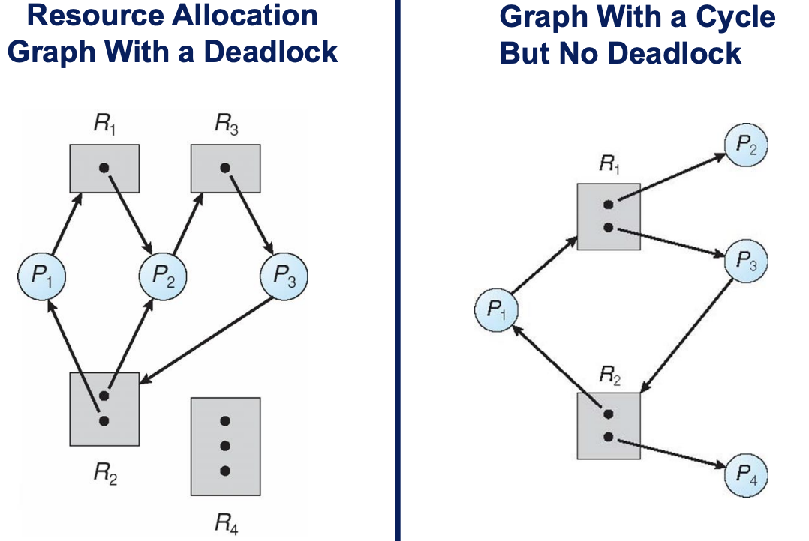
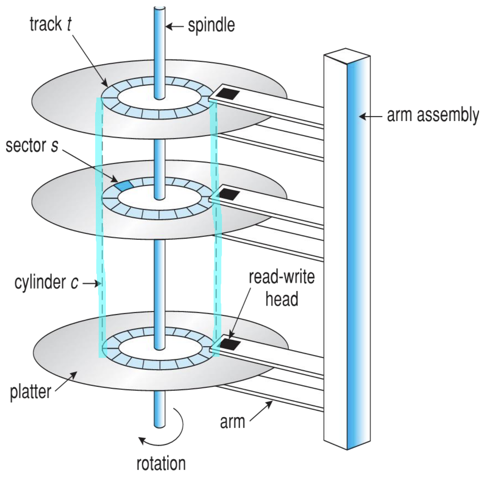
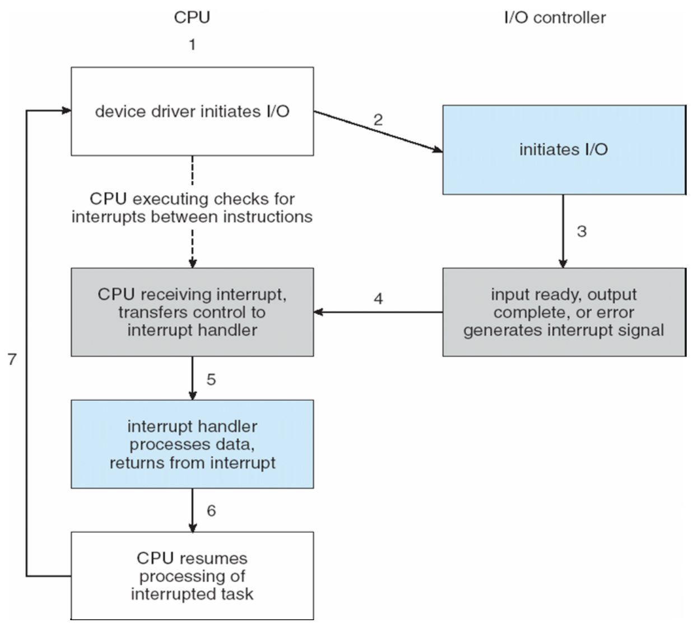
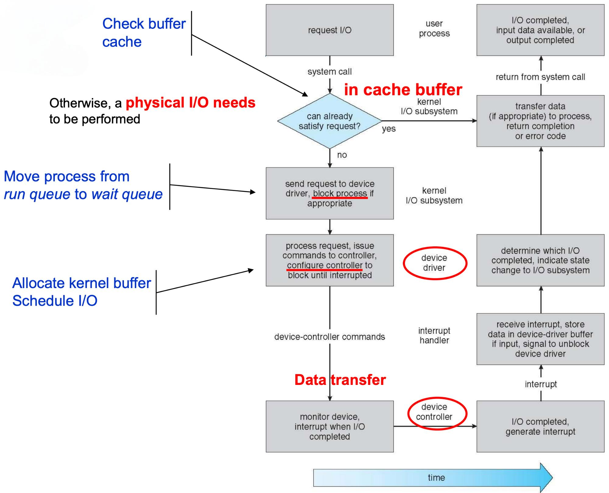
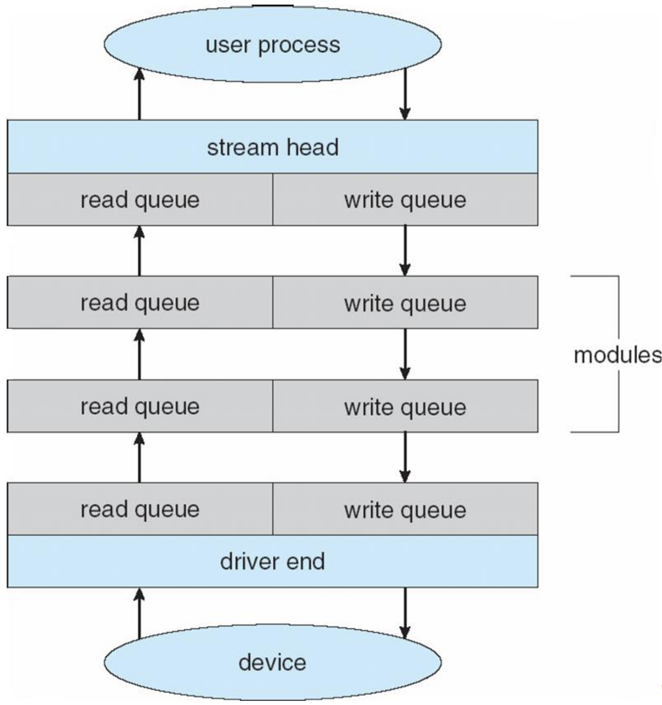

<h1 align="center">CPT104 Review (W6, W9, W10, W11)</hjson>

# Deadlock

The permanent blocking of a set of processes that either compete for system resources or communicate with each other.\
一组进程由于竞争系统资源或相互通信而永久阻塞的状态
- **Characterization**: 
  - **互斥 Mutual Exclusion**: 资源只能被一个进程占用
  - **占有并等待 Hold and Wait**: 进程持有资源并等待获取其他资源
  - **非抢占 No Preemption**: 进程不能强制抢占其他进程的资源
  - **循环等待 Circular Wait**: 进程之间形成一个循环等待资源的环(如P1等待P2的资源, P2等待P3的资源, P3等待P1的资源)
- **Resource Allocation Graph**: 
  - **Resource Ri**: 用矩形表示
  - **Process Pi**: 用圆形表示
  - **Pi -> Rj**: Pi请求Rj的资源(instance), Request
  - **Rj -> Pi**: Rj将资源(instance)分配给Pi, Assignment
  - 若无环, 则系统处于安全状态, 即没有死锁
  - 若有环, 在环内寻找以下情况以判断是否有死锁:
    - 若所有进程都在请求资源, 且所有资源都被分配给进程, 则系统处于死锁状态
    - 若有资源未被分配且存在进程请求该资源, 则考虑该进程请求该资源并释放后的资源分配情况
    - 若有进程不请求资源, 则考虑该进程释放后的资源分配情况
- **Handling Deadlocks**:\
  确保系统永远不会进入死锁状态, 或者在进入死锁状态后, 通过检测和恢复来解决死锁
  - **Deadlock Prevention**: 
    - **Mutual Exclusion**: 保证资源不可被多个进程同时占用
    - **Hold and Wait**: 进程在开始时一次性获取所有资源, 或者在获取资源时释放已占用的资源
    - **No Preemption**: 当进程请求资源时, 如果资源不可用, 则释放已占用的资源
    - **Circular Wait**: 给资源编号, 进程只能按编号递增的顺序请求资源
  - **Deadlock Avoidance**:\
    Constrain resource requests to prevent at least one of the four necessary conditions for deadlock
    - Do not start a process if its demands might lead to deadlock
    - Do not grant an incremental resource request if this allocation might lead to deadlock
    - **Safe State**: A state is safe if there exists a sequence of processes that can finish execution without entering a deadlock state
    - 所需信息: 
      - **Max Needs**: 进程可能需要的最大资源数
      - **Available Resources**: 系统中可用的资源数
      - **Need / Resources Needed**: 进程还需要的资源数
      - **Allocation / Current Allocated Resources**: 进程已分配的资源数
    - 对于多个正在进行的进程, 通过银行家算法(Banker's Algorithm)来判断是否分配资源
    - **Banker's Algorithm**: 
      - $Available$: 系统中可用的资源数
      - $Allocation$: 进程已分配的资源数
      - $Need/Request$: 进程还需要的资源数
      - 遍历所有进程, 若存在一个进程的$Need \le Available$, 则认为该进程可以被执行(Can be granted), 并释放其资源($Available$+=$Allocation$), 重复此过程直至所有进程都执行完毕\
      若所有进程都执行完毕, 则系统处于安全状态, 否则系统处于不安全状态
  - **Deadlock Detection**:
    - **Resource Allocation Graph**: 通过资源分配图来检测死锁
    - **Wait-for Graph**: 通过等待图来检测死锁
    - **Detection Algorithm**: 类似于Banker's Algorithm, 结果为一个布尔数组 Finish[i], 若存在 Finish[i]=False, 则进程i处于死锁状态
- **Deadlock Recovery**:
  - **Process Termination / Abort Process**: 
    - 每次只终止一个进程, 直至死锁解除
    - 一次性终止所有进程
  - **Resource Preemption**: 
    - **Selecting Victim**: 选择一个进程作为牺牲者, 释放其资源
    - **Rollback**: 将牺牲者进程回滚到某个状态
    - **Starvation**: 牺牲者进程可能会被反复终止, 无法执行, 可以通过设置一个进程被选为牺牲者的次数来解决

# Disk

- **Disk Organization**: 
  - **Platter**: 磁盘盘片, 由多个盘片叠加而成
  - **Track**: 磁道, 每个盘片上的一个圆环
  - **Sector**: 扇区, 每个磁道上的一个扇形区域
  - **Cylinder**: 柱面, 多个盘片上的同一磁道
  - **Head**: 磁头, 用于读写数据
  - **Arm**: 磁臂, 用于移动磁头
- **Disk Management**: 
  - **Low-level Formatting**: 磁盘分成扇区以便 Disk Controller 读写, 物理格式化
  - **Partitioning**: 将磁盘分成由一个或多个柱面组成的扇区, 逻辑格式化
- **Disk Attachment**: IO(Host-attached, local), Network(Storage Area Network, Network Attached Storage)
- **Disk Scheduling**: 
  - **FCFS**: First Come First Serve, 先到先服务
  - **SSTF**: Shortest Seek Time First, 最短寻道时间优先
  - **SCAN**: Elevator Algorithm, 从一侧顶部到另一侧顶部, 然后返回, 两趟均处理请求
  - **C-SCAN**: Circular SCAN, 从一侧顶部到另一侧顶部, 然后返回, 只有返回时处理请求
  - **LOOK**: SCAN 的变种, 不到最边缘, 而是到最后一个请求的位置
  - **C-LOOK**: C-SCAN 的变种, 不到最边缘, 而是到最后一个请求的位置
- **Boot Block**: 存储在 ROM 中, 用于引导操作系统加载, 负责找到磁盘上的操作系统内核并将其加载到内存中进行执行(Bootstrap Loader)
- **Swap-Space**: 用于存储内存中暂时不用的数据, 以便腾出内存空间给其他程序使用
  - **Swap-Space Management**: 
    - **Swap-Space Setup**: 
      - **Swap File**: 一个文件, 用于存储交换空间, 通常在文件系统中, 且便于改变大小 
      - **Swap-Space Partition**: 专门的分区, 效率更高, 但由于初始化限制, 无法应对过多的交换需求
    - **Swap-Space Management**: 内核使用交换映射表(Swap Map)来跟踪哪些页面在交换空间中, 以及它们在交换空间中的位置
    - **Solution**: 先使用交换空间, 然后建立交换分区
- **RAID**: Redundant Array of Independent Disks, 独立磁盘冗余阵列
  - **RAID 0**: Striping, 无冗余, 数据被分割成块并存储在多个磁盘上, 一个盘坏, 所有数据丢失, 但读写速度快
  - **RAID 1**: Mirroring, 有冗余, 数据被写入两个磁盘, 一个盘坏, 另一个盘仍可用, 但读写速度慢
  - **RAID 2**: Mirror-Style Error-Correcting Code, 有冗余, 通过 Hamming Code 纠错
  - **RAID 3**: Bit-Interleaved Parity, 有冗余, 使用异或运算纠错
  - **RAID 4**: Block-Interleaved Parity, 有冗余, 通过奇偶校验位纠错
  - **RAID 5**: Block-Interleaved Distributed Parity, 有冗余, 通过奇偶校验位纠错
  - **RAID 6**: P+Q Redundancy, 有冗余, 通过 P+Q 纠错(P: 奇偶校验位, Q: 二次奇偶校验位), 可以同时容忍两个盘坏
  - **RAID 0+1**: 数据先被分割, 然后对分散的 RAID 0 进行镜像
  - **RAID 1+0**: 数据先被镜像, 然后对镜像的 RAID 1 进行分割
  - **Conclusion**: 
    - Improve Performance(multiple disks can be read/written simultaneously)
    - Improve Reliability(when one disk fails, data can be recovered from redundant copies)
    - RAID is not a backup solution. It can only protect against disk failure, not against data corruption or accidental deletion

# File System

## Interface: The `USER` level of the file system
  - **Access Methods**: Sequential, Direct, Indexed
    - **Sequential**: 顺序访问, 适用于磁带, 有访问顺序限制, 只能从头始读取
    - **Direct**: 直接访问, 适用于磁盘, 通过文件的物理地址访问, 没有问顺序限制
    - **Indexed**: 使用多个下标, 每个下标对应一个文件, 通过索引筛选并搜索主文件的内容
  - **Disk Structure**:
    - A disk can be used in its entirety for a file system
    - A disk can be subdivided into one or more partitions, slices, or mini-disks, each of which can be used by a different file system
  - **Directory Structure**: 
    - For `USER` - Provide a structured way to organize files
    - For `FILE SYSTEM` - Provide an interface that allows the implementation to separate logical file organization from physical file placement on the disk
    - **Single-Level Directory**: 一个目录包含所有文件
    - **Two-Level Directory**: 一个目录包含多个子目录, 每个子目录包含多个文件
    - **Tree-Structured Directory**: 一个目录包含多个子目录, 每个子目录包含多个文件或子目录, Absolution Path, Relative Path
    - **Acyclic-Graph Directory**: 允许文件或目录有多个父目录
  - **Mounting**: 
    - **Mounting**: 将文件系统连接到文件系统的目录树中
    - **Unmounting**: 断开文件系统与文件系统的目录树的连接
    - **Mount Point**: 文件系统连接到文件系统的目录树中的位置
  - **Sharing**: 
    - Must be done through a protected scheme
    - May use network to allow file system access between different systems
    - **Manually**: Via FTP, SSH, etc.
    - **Automatically**: Via Distributed File Systems
    - **Semi-Automatically**: Via World Wide Web
  - **Protection**: 
    - 通过限制不同用户对文件的拥有的不同权限来保护文件
    - 常见权限 Types of Access：\
      Read(r), Write(w), Execute(x), Delete, Append, List
    - **Access Control List (ACL)**: 为每个文件设置权限\
      Specifying usernames and the type of access allowed for each user\
      Access Mode: Read, Write, Execute (rwx)
      - **Owner**: 文件的创建者
      - **Group**: 文件的所属组, 由多个所需权限一致或相似的用户组成
      - **Public/Universe**: 所有用户
## Implementation: The `OS` level of the file system
  - **On-Disk Structure**: 
    - **Boot Control Block (BCB)**: 存储OS引导程序的信息
    - **Volume Control Block (VCB) / Superblock**: 存储卷的信息, 如 number of blocks, block size, free block count, block pointers, etc.
    - **File Control Block (FCB)**: 存储文件的信息, 包含唯一标识码用于关联文件和 Directory Entry, Known as `Inode (Index Node)` in Unix
    - **Files and Directory Structure**: 存储文件名和关联的文件名
  - **In-Memory Structure**: 
    - **Mount Table**: 存储已经挂载的文件系统的信息, 如文件系统类型, 挂载点, etc.
    - **Directory (Structure Cache)**: 存储最近访问的目录的信息
    - **System-Wide Open-File Table (SOFT)**: 维护所有打开文件的信息
    - **Per-Process Open-File Table (OFT)**: 维护每个进程打开文件的信息, 以及 Entry in OFT points to a SOFT
    - **Buffer Area**: 内存中的缓冲区, 用于帮助对磁盘的读写
  - **Directory Implementation**: 
    - **Linear List**: 目录中的所有文件都存储在一个线性列表中, 每个文件都包含指向数据块的指针和下一个文件的指针
    - **Hash Table**: 通过文件名的哈希值来查找文件, 每个文件包含指向数据块的指针
  - **Allocation Methods**: 
    - **Contiguous Allocation**: 
      - 可以近似地理解为数组
      - **Advantages**: 
        - Simple to implement
        - Fast and Random access
      - **Disadvantages**: 
        - External fragmentation
        - Difficult to change file size
      - **Solution**:
        - Compaction (rearrange files to eliminate fragmentation)
        - On-line backup (copy all files to a new disk)
    - **Linked Allocation**: 
      - 可以近似地理解为链表
      - **Advantages**: 
        - No external fragmentation
        - Easy to change file size
      - **Disadvantages**: 
        - Slow access
        - Disk space is wasted (each block has a pointer)
      - **Solution**:
        - 将块组合成簇(Cluster), 减少指针数量
        - File Allocation Table(FAT): Store all the links in a separate table at the beginning of the disk
    - **Indexed Allocation**: 
      - 选定一个索引块, 该块包含所有文件的索引, 每个文件的索引指向文件的数据块
      - **Advantages**: 
        - Fast and Random access
        - No external fragmentation
        - Able to change file size
      - **Disadvantages**: 
        - Disk space is wasted (Small files will also use a whole block)
        - For large files, the index block may be too small to store all the pointers
      - **Solution**:
        - Linked Scheme: Use a linked list to store the pointers
        - Multi-Level Index: Use multiple levels of index blocks (Tree Structure)
        - Combined Scheme (Unix Inode): Use a combination of direct, indirect,  double indirect, and triple indirect blocks\
          (索引 -> 块, 一级索引 -> 二级索引 -> 块, 一级索引 -> 二级索引 -> 三级索引 -> 块, etc.)
  - **Free-Space Management**: 
    - **Bit Vector**: Each bit represents a block, 0 for free, 1 for used
    - **Linked List**: link all free blocks together, keep a pointer to the first free block
    - **Grouping**: store the addresses of n free blocks in the first free block
    - **Counting**: keep a count of the number of free blocks
    - **Space Maps**: keep a list of free blocks in a table(bit map), update the table when a block is allocated or freed

# I/O System

The control of devices connected to the computer, vary in function, speed, and methods to control computers.
- Classified:
  - Human-Readable: Mouse, Keyboard, etc.
  - Machine-Readable: Sensors, Controllers, Disks, etc.
  - Transfer of Data:
    - Character-Oriented Device (Byte Stream)
    - Block-Oriented Device (Block of Data)
  - Type of Access:
    - Sequential Access
    - Random Access
  - Network Devices: to send and receive data on a network
    - Network Interface Card (NIC)
    - Modem
    - Router
- **Hardware**: 
  - **Port 端口**: Connection point for devices
  - **Bus 总线**: A set of wires and a defined protocol that specifies a set of messages that can be sent over the wires
    - **PCI**: Peripheral Component Interconnect, connects the processor-memory subsystem to fast I/O devices
    - **Expansion**: Connects slower I/O devices to the processor-memory subsystem (Keyboard and serial and USB ports)
    - **PCI Express (PCIe)**: High-speed serial computer expansion bus standard, 16GB/s
    - **HyperTransport**: High-speed, point-to-point link for integrated circuits, 25GB/s
    - **Small Computer System Interface (SCSI)**: A set of standards for connecting and transferring data between computers and peripheral devices
    - **Daisy Chain**: Connect multiple devices in series, one after the other
  - **Controller (Host Adapter) 主机适配器**: An electronic component that can be used to connect devices to a computer
    - Circuit board and/or integrated circuit adapter
- How can the processor give commands and data to a controller to accomplish an I/O transfer?\
  处理器如何向控制器发送命令和数据以完成I/O传输?
  - **Registers**: 1 to 4 bytes of memory that are used to store data
    - **Status Register**: Contains information about the device
    - **Control Register**: Used to send commands to the device
    - **Data Register**: 
      - Data-In Register: Receive data from the device
      - Data-Out Register: Send data to the device
  - **Data Buffers**: A block of memory used to store data temporarily, can be read from or written to by the device
- How the CPU communicates with the control registers and with the device data buffers?\
  CPU如何与控制寄存器和设备数据缓冲区通信?
  - **Port-Mapped I/O (PMIO)**: 
    - **I/O Port Number**: Each control register is assigned a unique port number (8-bit or 16-bit integer)
    - **I/O Port Space**: The set of all the I/O port form the I/O port space, that can only be accessed by Operating System
    - **I/O Instructions**: 
      - IN: Read data from a device
      - OUT: Send data to a device
      - MOV: Move data between memory and I/O device
  - **Memory-Mapped I/O (MMIO)**: 
    - Each control register is assigned a unique memory address
    - More efficient for large memory transfers
    - vulnerable to accidental modification and errors
- **I/O Communication Techniques**
  - **Polling (Programmed I/O) 轮询**: 
    - CPU executes a busy-wait loop to check the status of the device periodically until the device is ready for data transfer
    - Advantages: Fast and Efficient if both the device and the controller are fast and if the data to be transferred is significant, Simple and easy to implement
    - Disadvantages: Keeps the processor busy needlessly, Wastes CPU time
  - **Interrupt-Driven I/O 中断**: Reduce the processor waiting time
    - CPU sends a command to the device, then continues executing, the device sends an interrupt signal to the CPU when it is ready for data transfer, the CPU stops executing the current program and executes the interrupt handler to transfer data, then resumes executing the program\
    CPU向I/O设备发送命令, 然后继续执行, 当设备准备好数据传输时, 设备向CPU发送中断信号, CPU停止执行当前程序并执行中断处理程序以传输数据, 完成后恢复执行程序
    
    - Non-maskable: Cannot be ignored by the CPU, used for critical errors
    - Maskable: Used by device controllers to request service from the CPU, can be temporarily ignored
  - **Direct Memory Access (DMA) 直接内存访问**: 
    - A device controller can transfer data directly to and from memory without involving the CPU
    - 适合于大量数据传输, 一次传输一个数据块
    - 使用DVMA(Direct Virtual Memory Access)时, 数据可以直接传输到虚拟内存中, 更加高效
    - **Advantages**: 
      - Reduces the load on the CPU
      - More efficient for large data transfers
    - **Disadvantages**: 
      - Complex to implement
      - Requires a DMA controller
      - Can only be used for block-oriented devices
    - **Information needed for DMA**: 
      - **Type of Transfer**: Read or Write
      - **Address of the I/O Device**: The address of the device that is transferring data
      - **Start Address of the Memory Block**: The address in memory where the data will be transferred, along with the total number of words
- **Layered Structure of I/O**:
  - Software
    - Application Layer
    - User-Level I/O Software (User space)
    - Kernel-Level I/O Software (Kernel space)
    - Device Drivers
    - Interrupt Handlers
  - Hardware
    - Device Controller
    - Device
- **Application(User-Level) I/O Interface**:
  - **Characteristics of I/O Devices**: 
    | Aspects | Variation | Example |
    | --- | --- | --- |
    | Data-Transfer Mode | 字符, 块 | Terminal, Disk |
    | Access Method | 顺序, 随机 | Modem, CD-ROM |
    | Transfer Schedule | 同步, 异步 | Tape, Keyboard |
    | Sharing | 专用, 共享 | Tape, Keyboard |
    | Device Speed | Latency,  Seek Time,  Transfer Rate,  Delay Between Operations |  |
    | I/O Direction | 仅读, 仅写, 读写 | CD-ROM, Disk,  Graphics Controller |
  - **Block and Character Devices**: 
    - **Block**: 
      - Access a block of data at a time
      - Commands: Read, Write, Seek
        - Raw I/O: access blocks on a hard drive directly
        - Direct I/O: use normal filesystem access
        - Memory-Mapped I/O: use memory-mapped files
    - **Character**: 
      - Include Keyboard, Mouse, Serial Ports
      - Commands: get(), put()
      - Supported by higher-level library routines
  - **Network Devices**: 
    - 有自己的接口和协议, 通过网络传输数据, 有多种传输类型
    - Socket: 用于连接两个网络设备, 类似于cable / pipeline, 被广泛用于Linux, Unix, Windows等操作系统
    - 包含Pipes, FIFOs, Streams, Queues, Mailboxes等
  - **Clocks and Timers**: 
    - 用于获取当前时间, 用于计算程序运行时间/事件间隔时间, 用于特定时间触发事件(定时器)
    - Programmable Interrupt Timer (PIT): 当达到设定时间时, 会发送中断信号
  - **Blocking and Non-Blocking I/O**: 
    - **Blocking I/O**: The process waits until the I/O operation is complete (move to the waiting queue), Disk, Printer, etc.
    - **Non-Blocking I/O**: The I/O request returns immediately, whether the I/O operation is complete or not, Keyboard, Mouse, etc.
  - **Vector I/O**: Known as Scatter/Gather I/O, allows a single I/O operation to transfer data to or from multiple memory locations, 允许单个I/O操作访问多个内存位置
- **Kernel I/O Subsystem**:
  - **Uniform Interface**: 使用统一的接口以供所有用户程序访问
  - **Scheduling**: 有些 I/O 请求使用队列排序, 有些操作系统尝试平等地处理所有请求
  - **Buffering**: 用于在传输时缓存数据, 以减少 I/O 操作的次数(直接从缓存中读取数据)
    - **Single Buffering**: 一个缓冲区, 可以存在于用户空间或内核空间, 无法同时读取数据和传输数据
    - **Double Buffering**: 两个缓冲区, 均存在于内核空间, 允许读取数据和传输数据同时进行
  - **Caching**: 将数据副本保存在比访问通常存储数据的地方更快的访问位置, 通常与缓冲区使用同一块存储空间
  - **Spooling**: Simultaneous Peripheral Operations On-Line, 为不支持并发操作的设备缓存数据, 后续设备可从缓存中读取数据
  - **Device Reservation**: 提供对设备的独占访问, 由系统分配, 存在死锁问题
  - **I/O Protection**: 为设备提供独占访问
    - 所有 I/O 指令都是特权指令 All I/O instructions defined to be privileged
    - 所有 I/O 操作必须在内核由系统调用 I/O must be performed via system calls that must be performed in kernel mode
    - 内存映射和 I/O 接口必须被保护 Memory-mapped and I/O port must be protected
  - **Error Handling**:
    - Transient Errors: temporary reasons that cause any I/O processing to fail (e.g. buffers overflow 缓存溢出)
    - Permanent Errors: due to the failure of any device or wrong I/O request (e.g. disk crash 磁盘崩溃)
    - **Solution**: Use a memory-protected OS
- **Device Driver**: 设备驱动软件, 用于从内核接受 I/O 请求和控制 I/O 操作
- **Interrupt Handler**: \
  设备驱动软件通过中断拦截器与设备互相传输数据\
  The Interrupt Service Routine (ISR) is executed in order to handle a specific interrupt for an I/O operation.

- **Streams**: A full-duplex communication channel between a user-level process and a device in Unix System V and beyond
  
  - **Stream Head**: The user process interacts with the stream head using read() and write()
  - **Driver End**: Used to interact with the device
  - **Stream Modules**: Each contains a read queue and a write queue
  - **Flow Control**: Optional, data is passed along as soon as it is ready without flow control
- **Improving Performance**:
  - Reduce number of context switches
  - Reduce data copying
  - Reduce interrupts by using large transfers, smart controllers, polling, etc.
  - Use DMA
  - Use smarter hardware devices
  - Balance CPU, memory, bus, and I/O performance for highest throughput