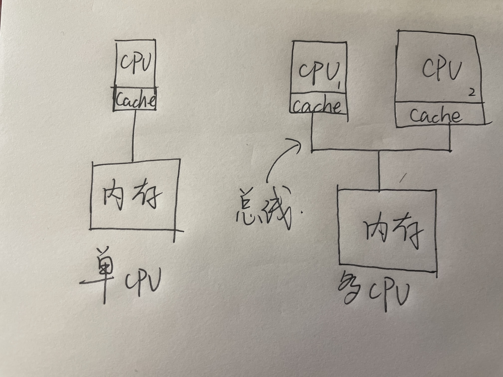
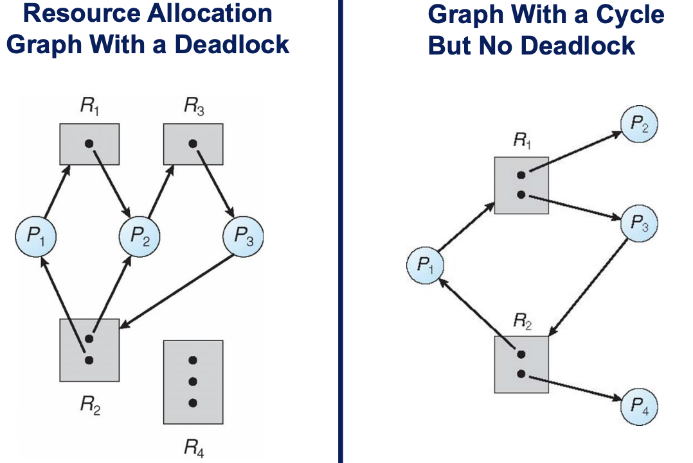
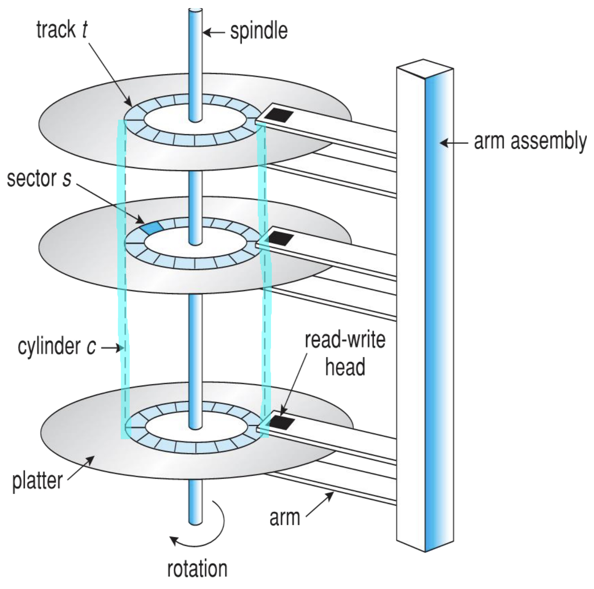
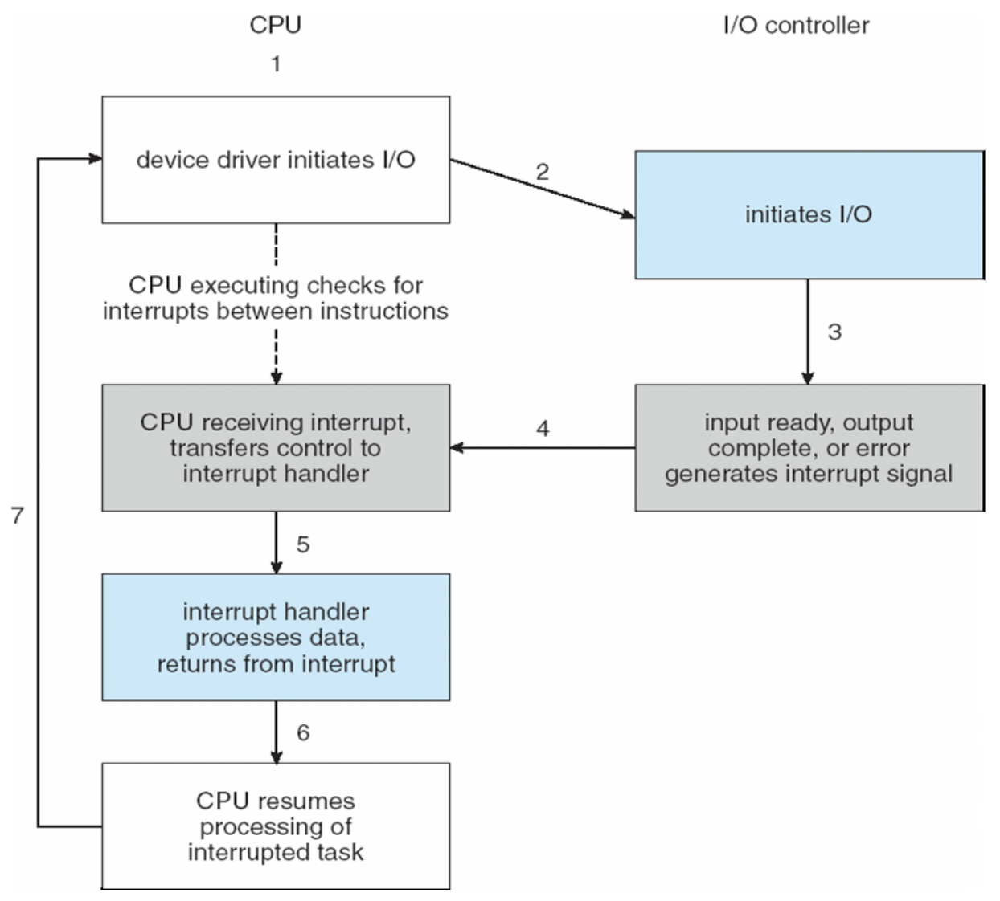

[toc]


写在最前，感谢我们的李哥和我一起通宵写出的这份不够完美的资料，非常感谢。

# 前言

操作系统这门课程纵深复杂，需要对整个计算机框架有比较深入的了解，所以直接去上手学习会非常的吃力，这份速通教程采用结构化的设计，将操作系统这门课抽象为了三个维度，分别是CPU和内存的虚拟化，并发以及Storage。

请谨记下面几句话，这几句话是操作系统这门课的核心，会帮助你快速上手并框架性的记忆相关知识：

**CPU在抽象后就是进程**

**内存在抽象后就是对应进程的每一个地址空间**

**并发问题是在两者抽象后对资源调度的管理问题**

**Storage部分是计算机对于外设的资源调配和持久化问题**

经过这些抽象以及框架性的理解，希望可以帮助你在期末关头快速上手和理解计算机操作系统这门课。

请注意，这份教程不太适合你作为开卷资料，不过非常适合帮助你在考前一天内有一个框架性的理解。

来自[**General_K1ng**](https://github.com/GeneralK1ng)与[**AYPatrL04**](https://github.com/AYPatrL04)

# CPU虚拟化

## 进程

操作系统为正在运行的程序提供的抽象，就是所谓的进程（process）。用人话来说，进程只是一个运行中的程序。

**进程是操作系统资源分配的基本单位，线程是独立调度的基本单位。**

### 进程如何创建

进程是运行中的一个程序，那么一个程序想要运行第一件事就是要将代码和所有静态数据加载到内存当中，也就是加载到对应进程的地址空间中，先从磁盘进行寻道，找到对应的程序和静态数据加载到内存中。加载到内存后，操作系统还需要为运行时栈分配内存，也可以称之为初始化，也可能为堆分配一些内存。然后程序开始运行。

### 进程状态

#### 三态模型

经典的进程三态模型如下：

1. **运行态（Running）：** 进程占用CPU正在执行指令。
2. **就绪态（Ready）：** 进程具备运行条件，但等待系统分配CPU资源以便运行。一旦获得CPU时间片，就可以立即执行。
3. **阻塞态/等待态（Blocked/Waiting）：** 进程不具备运行条件，正等待某个事件的完成。例如，等待输入输出完成、等待资源的释放等。在等待期间，进程暂停执行，直到所等待的事件发生，才能转移到就绪态继续执行。


在计算机系统中，多个进程并发执行，而这种并发性在宏观层面上意味着它们可以同时运行。然而，在微观层面上，每个进程实际上以一种交替的方式运行，即它们共享CPU资源。为了实现公平调度和资源利用，操作系统将CPU时间划分为一小段一小段的时间片，轮流分配给各个进程。

当一个进程的时间片耗尽时，它将从运行态转入就绪态，为其他进程让出CPU。这样的时间片轮转机制确保了每个进程都有机会执行，并减少了不公平调度的可能性。被调度的进程将进入运行态，执行指令，直到其时间片用完或发生阻塞事件。

需要强调的是，阻塞态的转换是由于缺少某些关键资源，但这里不包括CPU时间片。如果一个进程由于时间片用完而从运行态切换为就绪态，它仅仅是等待下一轮的调度，而不是由于资源不足而陷入阻塞。这种调度方式有助于平衡系统中各个进程的执行，确保它们在有限的时间内都能得到处理。

很多系统中都增加了**新建态（new）**和**终止态（exit）**，形成**五态模型**：

#### 五态模型

- **新建态**（new）：进程正在被创建时的状态
- **终止态**（exit）：进程正在从系统中消失时的状态


观察上图，我们可以明显看到只有就绪态和运行态之间存在相互转换的关系，而其它状态之间都是单向转换的。这意味着进程在生命周期中，主要经历了从新建到就绪、运行、阻塞、终止的顺序。

为了更有效地管理这些处于不同状态的进程，操作系统依赖于PCB这个关键的数据结构。PCB包含了进程在不同状态下的关键信息，如进程标识符、寄存器状态、资源分配等。通过组织这些PCB，操作系统形成了**进程队列（Process Queue）**，使得可以对不同状态的进程进行有序的调度。

我的理解是，这个进程队列就像是操作系统的"任务清单"，它根据进程的状态帮助系统有序地决定哪个进程应该获得CPU时间，哪个进程可能需要等待外部事件，以及哪个进程已经完成任务。通过这种方式，操作系统能够实现对多个进程的有效调度和管理，确保系统资源的合理利用和各个进程的公平运行。这种组织结构为操作系统提供了对整个进程生命周期的全局视角，从而更好地满足系统的多任务处理需求。

### 数据结构

每个进程都有需要有一个数据结构来帮助操作系统跟踪进程的状态，以及跟踪当前正在运行的进程的一些附加信息。操作系统还需要以某种方式跟踪被阻塞的进程，当IO事件完成时，操作系统必须确保唤醒正确的进程，准备好让它继续运行。这也被称之为**上下文切换（context switch）**。

那么这个数据结构就是，**PCB（Process Control Block）**，进程控制块。

PCB是进程存在的**唯一标识**，它是操作系统用来记录和描述进程状态以及环境信息的关键数据结构。实际上，PCB是操作系统管理进程的主要依据和唯一的资料结构。

通俗来说，PCB就像是操作系统对每个进程的个人档案，包含了关于进程的所有必要信息。这包括进程的执行状态、寄存器内容、分配的资源清单、以及其他与进程相关的信息。通过维护这个标识符，操作系统能够有效地跟踪和管理系统中运行的各个进程。

## 限制程序直接运行

现在常说的时分共享（time sharing）意思就是让操作系统让很多个任务，或者说进程共享物理CPU，因为我们CPU是有限的，但是相对于任务量来说，并不是那么的富裕，而且这些任务中还包括了操作系统他本身。于是这一环节的两个问题自然出现：

1. 性能：如何在不增加系统开销的情况下让每个任务可以得到CPU
2. 权限：操作系统必须保证在自己失去控制权的这段时间内其他程序不会破坏。

这里的理念就是，永远对外来程序保持最大敌意。

### 受保护的控制权转移

这一部分前面有一段发展历史，因为为了考试，所以此处先按下不表。

我们分为了**用户模式（user mode）**和**内核模式（kernel mode）**。

用户模式下，应用程序不能完全访问硬件资源，在内核模式下，操作系统可以访问机器的全部资源。而且提供了trap内核以及return-from-trap到用户模式。

上面这部分比较晦涩，我解释一下方便记忆。

因为如果直接让进程去操作机器的话，就无法做到权限的保护，想象一个程序在你电脑里可以随意进行IO访问。

所以我们引入了一种新的处理模式，成为**用户模式（user mode）**，在用户模式下运行的进程都会受到限制，比如在用户模式下的进程就无法发出IO请求，如果尝试发出请求就会导致处理器抛出异常，操作系统也许会种植进程。

与用户模式对应的称为**内核模式（kernel mode）**，操作系统就运行在内核内，或者你可以直接把操作系统当作内核，也行。如果在内核中的程序，代码就可以做任何它想干的事情，包括特权操作，比如发出IO请求或者受限指令。

#### 陷入（trap）

所以问题就来了，用户端的程序不可能不进行IO访问，或者说不可能不去直接操作机器，如果某个user端的程序希望执行某种特权操作，这一个怎么做呢？怎么做才能保证OS的安全呢？

用户端进程要想执行系统调用，就必须执行特殊的trap指令，我们称之为陷入，就像某个进程从用户端陷入了内核，非常的形象。

这个指令使得程序陷入内核并且使得权限提升到内核模式，一旦进程进入内核，系统就可以执行任何需要的特权操作。操作完成后，就执行return-from-trap指令从内核返回到用户模式同时降低权限。

这里牵扯到陷阱表的一些知识，就是保证了在进程从用户端陷入内核的时候保证它不会乱搞。

但是我们好像没讲，这里不涉及。

### 进程之间切换

操作系统应该决定停止一个进程再开启另一个进程，或者换句话说，应该把一个进程从CPU上面拽下来，让另一个进程上去享用一下宝贵的CPU资源。

那么这一切如何做到呢？

从抽象的角度来说，操作系统也是一个进程，有的书会称为0号进程，它本身自己也是一个程序，如果一个进程在使用CPU的时候，这就意味着操作系统此时处于离线状态，意味着操作系统并没有运行，如果它没有运行，那操作系统能干什么？

这是一件非常哲学的事情，如果OS没有在CPU上面运行，操作系统怎么掌控每个进程。

好吧，其实这是一个古早时期就解决的问题，**时钟中断（time interrupt）**。

如果你好奇过电脑自己是怎么知道时间，或者如果你拆过电脑的话就可以发现一个金属形状的元器件，我们称之为晶振，它可以以一个固定的频率发出信号，来告诉计算机时间。

也就是说，时钟中断就是在一段时间会产生一次中断，如果产生中断，当前正在运行的进程就会停止，操作系统中预先配置的**中断处理程序（interrupt handler）**就会执行，此时操作系统重获CPU控制权，获得控制权后它就可以接管这一切，包括但不限于：停止当前进程，启动另一个进程。

#### 上下文的保存和恢复

前面有提到**上下文切换（context switch）**，这里说一下它的概念：

操作系统需要为当前正在执行的进程保存一些寄存器的值，并且为即将执行的进程恢复一些该进程上一次中断后的寄存器的值，这样一来对于每个进程来说是无感的，这里比较抽象，因为对于每个进程本身来说，就好像一次无感的时间停止，它的程序还在正常运转，只不过他不知道刚刚他被中断并且让另一个进程享用了它心爱的CPU。这又何尝不是一种NTR？

说人话，中断发生时，操作系统保存一些被中断程序的环境（寄存器的值或者一些堆栈信息），然后加载另一个即将运行的进程的环境。就是这样，这就叫上下文切换。你校考试不可能再考的深了。

## 进程调度

### 调度指标

#### 周转时间

任务周转时间定义为任务完成时间减去任务到达系统的时间。

数学表达式就是
$$
T_{周转时间} = T_{完成时间} - T_{到达时间}
$$
如果我们假设所有任务在同一时间到达，那么$T_{到达时间} = 0$ ，因此 $T_{周转时间} = T_{完成时间}$

**周转时间衡量系统完成任务的效率**

#### 响应时间

对于一个面向用户的机器，我们需要保证系统的交互性能要好，不然用户打个字，系统因为在执行别的任务导致屏幕直接卡住，就不太正常了。

所以响应时间成为了新的衡量标准：
$$
T_{响应时间} = T_{首次运行} - T_{到达时间}
$$
**响应时间衡量系统的交互性能**

### 先进先出（FIFO）

也叫**FCFS（First Come First Served）**

烂中之烂，周转时间爆差


看左图，我们假设ABC三个任务都是10s并且同时到达，也就是到达时间为0，但是A比B早了一丢丢，B比C早了一丢丢，那么这三个任务的平均周转时间就是$(10 + 20 + 30) / 3 = 20s$ 

好我们再看右边，我们还是假设同时到达，但是任务A用时为100s，这下周转时间就变为了$(100 + 110 + 120) / 3 = 110s$

这个问题被称为**护航效应（convoy effect）**，指的是一些耗时较少的潜在资源消费者排在了重量级资源消费者之后，类比你只想在便利店买一瓶水但是前面的人推了一整车的东西正在结账。

#### 优点

除了实现简单外全是缺点

#### 缺点

护航效应，周转时间差

### 最短任务优先（SJF）

**最短任务优先（Short Job First）**，我们就是让耗时最短的任务优先进行资源消费，换成上面在右图情况，我们就让B或者C限制行，让耗时最长的A最后执行，周转时间就变成了 $(10 + 20 + 120) / 3 = 50s$ 这直接让周转时间提升了一倍多。

事实上，如果考虑所有工作都同时到达，我们可以证明SJF时最优的调度算法。

> PS：**抢占式调度程序 （preemptive）**
>
> 抢占式调度程序就是停止当前程序，让另一个程序先执行，**非抢占式（non-preemptive）**就是直到当前程序执行完毕后才考虑下一个执行的程序是什么。当然，抢占是也会发生上下文切换，也会耗费一些时间，频繁抢占也许会导致性能下降。

但是前面两个调度程序都有一个假设前提，那就是所有任务同时到达，考虑以下情况：


如果B和C在A执行期间到达，那么整套调度算法就失效了，直接退化成了FIFO。

也不算完全退化，如果BC在A执行10秒后到达

周转时间为
$$
(100 + (110 - 10) + (120 - 10)) / 3 = 103.33
$$

#### 优点

快，性能好

#### 缺点

在任务到达时间不明确的情况下不是最优方案

### 最短完成时间优先（STCF）

为了解决SJF所遭遇的短板，我们就要允许进程调度程序可以发生**抢占（preempt）**


看右图，也就是BC到达时，发现BC所需时间更短，所以发生抢占，OS进行上下文切换优先执行BC，然后再上下文切换为A。

此时的周转时间计算为
$$
(120 + (20 - 10) + (30 - 20)) / 3 = 46.67
$$
平均周转时间大大提高。

### 最短剩余时间优先（SRTF）

最短剩余时间优先（Shortest-Remaining-Time-First），就是看谁剩余时间最短，然后发生抢占


### RR调度（Round-Robin）

RR调度的诞生是为了另一个衡量标准，也就是**响应时间（response time）** 

基本思想如下，RR再一个时间片（time slice或者称为调度量子，scheduling quantum）内运行一个工作，然后切换到运行队列中的下一个任务，而不是运行一个任务直到结束。它在规定时间片内反复执行，直到所有任务完成。因此RR有时候被称为时间切片（time-slicing）

**注意！时间片长度必须是时钟中断周期的倍数**

比如时钟中断10ms一次，那么时间片长度可以是10ms，20ms等等。


我们假设同时到达，也就是到达时间都为0，然后每个任务为五秒。那么左图为SJF，它的周转时间计算为5ms，而右图为RR调度在时间片为1ms时的调度结果，可以发现平均响应时间时1ms，非常的快。

但是时间片太短会让响应时间越快，但是时间片太短会导致OS要频繁进行上下文切换，会影响整体的性能。

那么反过来再看RR的周转时间呢，如果按照这个例子来看，A在13s完成，B在14，C在15，平均周转时间为14，烂完。

所以在大多是情况下的周转时间RR时最差的，甚至有时不如FIFO，但是周转时间又是最好的。

### Priority Scheduling

优先调度，也就是以下这一部分


缺点是会把一些长进程饿死，也就是Starvation，解决办法是老化，也就是aging，或者也可以叫boost。

### 多级队列调度

多级队列调度（Multilevel Queue Scheduling），直接放课件了，不太可能考。


### 多级反馈队列（MLFQ）

这个更不太可能考。特点就是长工作时间可以公平分享CPU，也可以给短工作和交互性工作很好的响应时间，问题还是Starvation，如果有过多的交互性工作，就会不断占用CPU，导致长工作永远得不到CPU，就被饿死了，所以解决办法还是aging，也就是老化，或者叫boost。

直接放课件：


##  多处理器调度

多处理器调度，我感觉不会考这么深入，但是基础知识需要了解，这里以最快以及本人最简单的理解来讲解。

先按我自己的节奏讲，然后再补充课件缺少的知识。

### 区别

首先，明确一点，多处理器调度与单CPU调度之间的区别在于**硬件缓存（hardware cache）**的使用，以及多处理器之间共享数据的方式。

在成熟的单CPU系统中，存在多级的硬件缓存，一般来说会让处理器更快地处理程序。

> 缓存是很小的存储单元，一般拥有着内存当中最热或者说访问最多的数据的备份，相比之下，内存很大且拥有进程所有的数据（所有是相比于缓存来说的），内存访问速度相较于缓存来相差一个数量级，所以缓存的出现对于计算机结构是革命性的。

现在假设只有一个CPU，当需要执行一个程序的时候，数据会先从disk加载到内存中，然后再从内存中逐步取出到CPU中进行运算，因此初次运行的程序都会比较缓慢，需要消耗很多时间（，虽然只有十几ns。然后初次加载后，处理器会判断哪些数据很可能会再次利用，于是会放到CPU的缓存中，目前成熟的CPU都具有一级缓存，二级甚至三级缓存。因此再次执行的时候，CPU先去缓存当中查找，找到了直接返回，无需调用内存寻址操作。

所以这里要牵扯一些底层的并发方面的知识。

要知道缓存的概念是给予**局部性（locality）**的概念，局部性又分为空间和时间两个层面，这里比较抽象，我用人话来说，时间局部性就是这个数据在不久的将来还会被用到。空间局部性就是指，当程序访问某一个地址的数据时，很可能会访问这个地址周围的数据，比如你访问一个数组`arr[0]`的值，那么你就非常有可能访问`arr[1]`。

所以，单处理器关于CPU缓存这一小部分知识讲完了，那么引入正题，如果有**多个**处理器，共享**同一个内存**，那么情况会怎么样呢？



所以问题就成了这样，考虑左边的情况，如果一号CPU的程序从内存地址A中读取数据D，由于初次访问并不在缓存中，所以CPU直接访问内存得到数据D并且程序对D进行了修改，但是一号CPU只更新了缓存当中的值为D'。而又由于数据写会内存比较慢，系统通常会稍后才干这部分事情。但是此时，时钟中断发生了，操作系统接管，切换了别的程序运行。

然后接下来是重点，如果上下文切换为我们原本程序时，操作系统将这个进程分配给了二号CPU，程序继续访问地址A的值，但是二号CPU的缓存中又没有一号CPU刚刚修改的D‘数据，而且再去内存取值取到的还是旧值而不是修改后的新值。

好，至此，**缓存一致性（cache coherence）**出现，这个底层的问题只能靠硬件层面来解决，反正最后就是解决了，具体我觉得不可能考，此处不涉及。

### 同步性问题

那么，硬件底层已经为我们实现并且解决了多核调度的一致性问题，那么应用层面或者说操作系统层面我们还需要关心共享数据的访问吗？

这就是另一个层面的问题，后面看lay的并发部分。

这里简单提一下，就是通过对每个进程的内部进行抽象，细分成每个线程，注意本资料开头的话，**进程是操作系统资源分配的基本单位，线程是独立调度的基本单位。** 于是，操作系统只为每个进程分配资源，至于进程内部的资源怎么利用，怎么调度，就是进程内部的活了。进程内部通过线程来进行调度资源。这是进一步的抽象。 

简单来说，涉及共享数据的操作时我们OS要格外注意，通常是通过锁来完成并发处理的。

### 缓存亲合性（cache affinity）

这个概念非常简单，有了前面那个例子的铺垫理解起来更快：一个进程在某个CPU上面运行的时候，会在该CPU的缓存中维护很多状态，我习惯称之为环境，如果此时发生了中断，上下文切换，再下次切换回来的时候，如果该进程还在这个CPU上面，由于有之前的缓存，那么这个程序在恢复后就会更快的执行，而不是再去内存中寻址。

相反，如果上下文切换后恢复到了别的CPU上面执行，会由于需要重新加载数据而变得更慢一些。

这就是缓存亲和性。

### 单队列调度（SQMS）

多处理器系统调度最简单的方式就是复用单处理器的调度方式，也就是单队列调度，我们称之为**单队列多处理器调度（Single Queue Multiprocessor Scheduling）**。

这个方式优点就是实现非常的简单，操作系统维护一个大队列，然后所有任务在队列中，然后有几个处理器就从队列中取出任务分配给处理器，比如如果是八核处理器，就从队列中找八个适合的任务丢给每个核慢慢忙活。

缺点非常明显：

1. **缺乏可扩展性（scalability）**为了保证在多核CPU上面工作，调度程序必须通过维护锁来保证每个进程的原子性操作。

所以锁的存在就会造成非常大的性能开销，尤其是对于现在动辄十几个核的CPU来说，锁的争抢导致性能问题。

2. **缓存亲合性（cache affinity）** 假如我们有五个任务，四个处理器，每个任务执行一定的时间片，那么调度队列的就会是

   ```mermaid
   gantt
       title 单队列多处理器调度时的缓存亲和性问题
       dateFormat  HH:mm
       section 处理器1
       T1 :t1, 00:00, 00:01
       T5 :t5, 00:01, 00:02
       T4 :t4, 00:02, 00:03
       T3 :t3, 00:03, 00:04
       T2 :t2, 00:04, 00:05
       section 处理器2
       T2 :t2, 00:00, 00:01
       T1 :t1, 00:01, 00:02
       T5 :t5, 00:02, 00:03
       T4 :t4, 00:03, 00:04
       T3 :t3, 00:04, 00:05
       section 处理器3
       T3 :t3, 00:00, 00:01
       section 处理器4
       T4 :t4, 00:00, 00:01
   
   ```

   三和四不想画了，意思很简单，几乎只要进行上下文切换后，原本的任务就不会再之前的CPU上，导致严重的缓存亲和性问题。

### 多队列调度（MQMS）

单队列问题多多，所以就诞生了多队列调度，也就是每一个CPU都维护一个任务队列，我们称之为多队列处理器调度（Multi-Queue Multiprocessor Scheduling）。

在多队列调度中，每个队列都可以使用不同的调度规则，这样每个CPU之间的调度相互独立，就没有了单队列中数据共享带来的同步问题。

所以就是，每个CPU都有自己的队列，对于每个CPU内部又能进行选择的调度算法，比如RR又或者STCF，都可以。

相比于单队列的优点就是以上的缺点反过来：

1. 高扩展性，队列数量会随着CPU增加增加，并不会由于锁而带来额外性能开销
2. 良好的缓存亲和度，因为每个CPU上面任务的队列在上下文切换后还在当前CPU，一般情况下不会出现切换后到另一个CPU上面，因为基本不会把一个任务从这个队列换到另一个队列

好，由此，我们诞生了新的问题。

### 负载均衡（Load Balancing）

什么叫负载均衡，考虑一个情况，我们有两个CPU，分别是一号和二号，然后每个下面有两个任务，比如一号CPU下有AB两个任务，二号CPU下面有CD两个任务。如果此时一号CPU的B任务结束了，那么一号CPU下的任务A就独享了CPU，如果采用RR调度的话，CD两个任务轮流占用二号CPU，但是A任务独享，那么A的占用时间就是C和D的两倍。这就违反了任务调度的公平性原则。

并且如果更加糟糕，一号CPU下的A此时也完成了任务，那么这下一号CPU就空转了，并且二号CPU还在苦苦运行着C和D。

这就是我们所说的一核有难多核围观。

也就是所谓的负载均衡问题。

解决办法很简单，让一个任务跑到另一个CPU上面跑就行了，我们称之为迁移（migration）。

按照课件的说法：

- **Push migration** = a task routinely checks (e.g., every 200ms) the load on each processor. If the workload is unevenly distributed, moves (or push) processes to idle or less busy processor(s).

- **Pull migration** = an idle processor will extract the load from an overloaded processor itself (pulls a waiting task from a busy processor).

# 内存虚拟化

## 地址空间

**对于内存的抽象，就是每个进程的地址空间（address space）**，就这么简单一件事。

所有的虚拟化都是针对于运行的程序来说的，相当于操作系统为每个进程营造了一个假象，假如你是一个进程，操作系统告诉你你的资源在某某地址值，你就去这个地址去找就完了，或者换句话说，每个进程看到的不是你买来的DDR5内存（这个我们称为物理内存），看到的只是操作系统为进程营造的假象，这个假象我们称为地址空间，也就是对于物理内存的抽象。

**一个进程的地址空间包含运行的程序的所有内存状态**，比如程序的代码和指令或者一些静态变量在运行时都要先从磁盘加载到内存中，然后程序在运行的时候，如果进行函数和方法调用又要用到**栈（stack）**，并且局部变量和一些对象会被存储在**堆（heap）**内存中，比如在`Java`中`new`一个对象，如果没有重写`toString` 方法的话，打印这个对象本身就会出现他的十六进制地址值，这个地址要注意，虽然指向的是堆内存，也确实存储在堆内，但是要记住这是操作系统的假象，因为这个地址并不指向真实的物理地址。之后我们会讲到。

抽象后的地址空间长这个样子，我去网上找个图：


你可能会问为什么这破图是反的，因为我习惯低地址在上面，然后高地址在下面，这是个人习惯对不起。

看一看到一个简单的地址空间包含这么几个部分，我们现在只关心三个地方，首先就是代码段，代码段就是我们指令所在的位置，然后就是程序的堆内存，堆的增长方向是从低地址指向高地址，然后就是栈内存，栈内存的增长方向是从高地址向低地址增长，堆和栈之间的空间属于未分配的空间。

这部分我们统称为堆栈，堆在顶部，栈在底部，他们两部分可能增长也可能收缩。

### 目标

认识了一些基础知识，下来的就是明确这部分目标是什么。

首要目标就是要实现**透明（transparency）**，这个透明指的是无感，就是对于每个进程来说，他们不知道自己所享有的内存是被虚拟化后的假象，也就是地址空间，就是让程序以为它拥有自己的私有物理内存。

下一个目标是**效率（efficiency）**，操作系统要保证尽可能的具有效率，也就是空间上不占用过多的内存，时间上访问要足够迅速。

第三个目标就是**保护（protection）**，也就是让每个进程的地址空间不受其他进程影响，或者说要让进程之间保持隔离（isolation）。

## 地址转换

**地址转换（address translation）**，顾名思义，要对每个进程的地址空间提供一个从虚拟地址到物理地址的转换，不然机器也不知道每个进程发出的寻址指向哪里。这个全称是**基于硬件的地址转换（hardware-based address translation）**

当然仅仅依靠硬件是不够的，我们需要在关键时刻让操作系统介入来**管理内存（manage memory）**，需要记录被占用和空闲的内存位置，保持对内存的管理和使用。

所以这复杂的一切只是为了提供一个美丽的假象，一个针对每个进程的谎言——你拥有超级大和干净的而且私有的内存，你独享这一切！

但是丑陋的事实就是基本上所有的程序在同一时间共享着内存，这太丑陋了。

### 动态重定位

这一部分就是一个非常简单的思想，我们称之为**基址加界限（base and bound）**，或者——**动态重定位（dynamic relocation）**

具体实现就是，每个CPU都需要两个寄存器：

1. **基址（base）**寄存器 课件说现在被称为 **relocation register**
2. **界限（bound）**寄存器 或者称之为**限制（limit）**寄存器

有了这么一组寄存器，我们就可以将地址空间放在物理内存的任何位置，同时又能确保进程只能访问自己的地址空间。

怎么做到的呢，非常的简单，对于每个进程的地址空间，我们都假设地址0开始，在程序执行时操作系统会决定这个进程在实际物理内存中的实际加载地址，通过这么简单的一个加法运算:
$$
\text{physical address} = \text{virtual address} + base
$$
在地址转换的时候，首先我们先随便拿一个虚拟内存地址比如说128，然后此时的基址比如说是300，然后界限寄存器是200，那么这个虚拟内存地址被映射到物理内存的地址就是428，并且128小于200这个界限寄存器，所以被正确映射，并且是合法的地址。当然如果超过界限寄存器就会引发异常，我还没见过。

界限寄存器的作用就在于保证进程产生的所有地址都在进程地址的界限当中，这句话很晦涩，多理解几遍。

这种基址寄存器配合界限急窜起的硬件结构存在于芯片当中，我们通常把CPU负责地址转换功能的部分统称为**内存管理单元（Memory Management Unit）**，也就是我们常说的**MMU**，这个MMU还有一个功能，那就是控制内存的访问权限，后面会涉及。

但是这个简单的动态重定位有效率低下的问题，因为如果进程的堆栈需求并不是很多，就会导致堆和栈之间的空间直接被浪费，这个浪费我们称之为**内部碎片（internal fragmentation）**，指的就是已经分配的内存单元内部有未使用的空间，也就是碎片，造成了浪费。在目前这个简单的系统中，我们要求将地址空间放在固定大小的槽中，所以就会产生内部碎片，所以我们需要更复杂的机制，避免内部碎片，首先就是**分段（segmentation）**的概念。

## 分段（Segmentation）

分段的概念就是为了解决内部碎片，也就是每个地址空间中堆和栈中间那一部分未分配的内存，虽然未分配，并没有被进程使用，但是却依然占据了实际的物理内存。所以简单的通过基址寄存器和界限寄存器实现的虚拟内存是非常浪费的。而且如果剩余的物理内存无法提供连续的区域来放置完整的地址空间，进程就无法运行。所以也不够灵活。

于是，**分段（Segmentation）**的概念被提出。这个想法很简单，在MMU中引入不止一个基址和界限寄存器对，而是给地址空间内的每个**逻辑段（segment）** 一对。一个段只是地址空间里的一个连续定长的区域，或者这么说，也就是把我们刚刚构建的简单的地址空间分为了简单的三段（实际不止三段）代码段，堆段和栈段。

分段的机制让OS能够将不同的段放到不同的物理内存当中，从而避免了虚拟地址中堆和栈之间那一大段的空闲内存，或者说，碎片。

所以这部分，只需要知道一些术语，然后知道分段概念是为了解决内部碎片的即可，看了一下课件，就涉及了一下引用段的问题。

### 段表（segment table）

段表就是一个数据结构，或者说一个寄存器，里面规定了几位为段表，后面几位为偏移量。

用课件的例子来说


就是这个寄存器前面四位代表了这个是哪个段，本例中代表着`0001`这个段，然后后面的12位就是**偏移量（offset）**，怎么计算呢，直接用偏移量和基址寄存器相加，就得到了最终的物理地址，当然我们还有界限寄存器用来对段地址引用做段边界判断，确保引用的地址合法。

这里其实还有一个问题就是栈和堆的增长方向不同的问题，但是我们课程没有涉及，所以暂且不表。

### 缺点

都解决这么多问题了还有什么缺点？还真有

分段增加了操作系统在上下文切换时的开销，因为各个段寄存器中的内容必须保存和恢复，每个进程都有自己的地址空间，所以操作系统必须确保这些寄存器被正确恢复和保存。

在新的地址空间被创建的时候，操作系统需要在物理内存中为这个它的段找到空间。之前我们可以假设所有的地址空间大小相同，物理内存是一个槽，进程可以丢进去，现在每个进程都有一些段，每个段的大小可能还不一样，这下问题就是物理内存很快充满了许多空闲的小洞，因此如果有新的虚拟地址空间需要被创建或者已有的段需要扩充，就会变得非常困难，这个问题称之为**外部碎片（external fragmentation）**。

所以缺点有两个：

1. 额外的性能开销
2. 外部碎片

>对于外部碎片，有一种解决办法，就是采用紧凑（compact）物理内存，重新安排所有的段。
>
>比如操作系统先终止运行的程序，然后把它们的数据复制到连续的内存区域中，改变他们段寄存器中的值，指向新的物理地址，重新分配获得足够大的连续空间。但是内存的紧凑成本很高，会占用大量CPU时间。
>
>在课件中就是：Compaction - moving all occupied areas of storage to one end of memory. This leaves one big hole.
>
>然后就是课件这里讲错了，分段不太能解决外部碎片，大家注意。

当然对于外部碎片我们还有另一个更简单的方法，就是空闲链表管理算法，就是在分配空余内存时尝试保留大的内存块用于分配。这部分算法有一堆，我们讲过的好像就一个传统的**最优匹配（best-fit，从空闲链表当中找最接近需要分配空间的空闲块返回）**，还有**最坏匹配（worst-fit）**，还有**首次匹配（first-fit）**。

所以一个彻底解决的方法出现了。

## 分页（Paging）

分页就我个人理解，就是反其道而行之，因为无论是简单的动态重定向还是分段，空间本身自己就会碎片化，那么我为什么不能直接让整个空间碎片化。人话就是，让整个物理空间都分割成固定长度的小片，在需要用的时候我们可以调用这些小片组合成一个大片，要多少，我就取用多少。

那么在内存虚拟化中，这种思想我们称之为**分页（Paging）**，注意明晰概念，分页不是分段！

分页是将一个进程的地址空间分割成固定大小的单元，每个单元我们称之为页，相应的，我们把物理内存看成是定长的槽阵列，叫做**页帧（page frame）**。每个这样的页帧包含一个虚拟内存页。

所以想法很好，我们的问题就转变了，怎么实现。

### 数据结构

为了记录地址空间的每个虚拟页放在物理内存中的位置，操作系统为每个进程保存一个数据结构，称之为**页表（page table）**。

页表的作用就是为地址空间的每个虚拟页面保存地址转换，让我们知道每个页在物理内存中的位置，就像一本书的目录，记录了虚拟到物理的映射关系。

重点在于，页表是每一个进程的数据结构！

所以我们为了进行地址转换就必须把这个地址拆开来看，分为**虚拟页面号（virtual page number, VPN）**和页内**偏移量（offset）**。

这里要注意每个页面大小必须为2的次方，比如如果一个进程的虚拟地址空间是64byte，那么我们的虚拟地址就需要6位（$2^6 = 64$），所以就想想象一个六位的寄存器，然后我们可以规定前两位是虚拟页面号，后面四位是偏移量，这一部分和分段的寻址很像。、

比如如果这个六位是 `01|1001`

那么VPN就是 `01`，代表处于第 `01` 的虚拟页的第 `1001` 个字节处， 用十进制就是第一页的第9个字节处。

有了VPN，我们就可以去查询页表，找到虚拟页 `01` 所在的物理页面，也就是对应的物理**页帧（page frame）**，比如如果页表中存的 `01` 对应的物理页帧是 `111`

那么我们就知道在物理内存中的第 `111` 对应十进制的第7页帧，这个我们称之为**物理页帧号（physical page number, PPN）**。

于是上面的 `01|1001` 经过页表查询转换后就变成了 `111|1001` ，这就是对应的最后的物理地址，非常的简单，我已经用尽可能简单的语言来描述了。

所以页表存储的信息就是给了一个映射关系，是什么映射关系呢？是从虚拟页面号VPN到物理页帧号PPN的映射。

### 存储与速度

页表这么方便，但是问题随之而来，刚刚举得例子只是一个虚拟空间64字节的，这几本上不可能是现代操作系统可以运用的空间。

想象一个32位的地址空间，就有4KB的页，这个虚拟地址分为20位的VPN和12位的偏移量。

 一个20位的VPN意味着操作系统必须为每个进程管理 $2^{20}$ 个地址转换，假设每个页表条目需要4个Byte，那么这个页表直接变成4MB，听上去感觉没什么对吗？但是这才只是一个进程的情况，如果1000个进程启动，页表直接开始膨胀成为4G，希望你的DDR5经得起消耗。

而且这还只是32位的操作系统，64位的呢？

如果页表很大，那么每次查表都要访问主存，这会加大内存访问的工作量，并且会让进程的速度大打折扣并且还占用着大量内存，所以这两个问题需要首先被解决。

### 页表中有什么

页表中最重要的就是页表项（PTE），对于每一个PTE，里面有许多不同的位，我没想到我们课居然连这些都讲了。

**有效位（valid bit）**，这个位用于指示特定地址转换是否有效，比如当一个进程运行时，它的代码和堆在地址空间的一段， 栈在另一端，所有夹在中间没有使用的空间就会被标记为无效（invalid），如果其他进程想要访问无效内存就会trap进操作系统，这可能会导致这个进程终止。

通过将地址空间中没有使用的页面标记为无效，我们就不需要为页面分配物理页帧，节省大量内存。

**保护位（protection bit）**，这个位表明页是否可以读取、写入或执行。同样，如果不是以这个位允许的方式访问内存，同样会trap进操作系统。

**存在位（present bit）**，这个位主要涉及这个页表是否还在内存中，在后面页表交换的时候会提到，这里先列出来，表示的含义就是这个页是在物理内存中还是**已被交换到磁盘上（swapped out）**。

**脏位（dirty bit）**，这个位就是主要表明页面被交换如内存后是否被修改过。

目前应该就涉及这么多。

## 快速地址转换（TLB）

如果使用分页来实现内存虚拟化，上面分析过了，会带来巨大的性能开销，因为如果要使用分页，我们就必须把内存地址空间分割成大小相同的小碎片，也就是页，并且还要记录虚拟页和物理页帧的映射，这下映射又存储在物理内存当中，每次需要地址转换时都要额外的进行内存访问，这一次内存访问可以说是多余的甚至没有意义的。

所以到这里我们就能发现每当我们操作系统出现速度缓慢时，我们就会引入新的硬件缓存来帮助我们，也就是常说的空间换时间。

这里我们引入新的存储器，我们称之为**地址转换旁路缓冲存储器（translation-lookaside buffer, TLB）**，也可以成为**地址转换缓存（address-translation cache）**，对每次内存访问，硬件都会优先查看TLB，如果有就直接转换（非常快），如果没有，可惜，就要进行内存访问了。

### 流程

流程非常简单，就是先从虚拟地址中找到VPN，然后检查TLB中是否有这个VPN的映射，如果有，我们称之为`TLB hit` 也就是TLB命中，然后就会飞速完成地址转换，获得物理地址对应的页帧号，然后和偏移量组成物理地址，然后带着这个地址进行内存访问，这带来了巨大的性能提升。

如果TLB没有命中，那么就惨了，就会带来巨大的性能开销，然后更新TLB，为了让下次尽可能的命中。

所以我们非常希望TLB一直命中。

这里有一个计算 **EFFECTIVE MEMORY-ACCESS TIME (EAT)：** estimation of the impact of the TLB on the execution speed of the computer：
$$
EAT = A(E+M)+(1-A)(E+2 \times M)
$$

- E 代表TLB访问时间
- M代表内存访问时间
- A代表TLB命中率

根据流程来看，很好理解对吧。

## 更小的表

前面提到了存储和速度的问题，TLB帮助我们获得了更好的性能，也就是解决了速度问题，那么这么大的页表，我们应该如何存储呢？或者如何获得更小的表呢？

#### 更大的页

这种就属于投机取巧，我们以32位地址空间为例，如果我们使用16KB的大小为一页呢？

简单算一下哈，16KB是就是 $2^{14}$ 的页面大小，也就是我们需要14位的offset，然后32-14=18位的VPN。

假设每个页表项还是4Byte，那么现在页表中就只有 $2^{18}$ 个项，每个页表的总大小也就降到了1MB（$2^{18} \times 4Byte = 2^{20}Byte$）。

但是问题也非常明显，内部碎片，因为一个进程可能用不了这么多页，没用到的内存就成为了内部碎片浪费掉了。

所以基本上大部分系统依旧采用了4KB为一个页面大小。

### 多级页表（Hierarchical Paging）

这是一个数据结构层面的改变，它将原来线性的页表改为了类似树的数据结构，成为**多级页表（multi-level page table）**。这项技术称为**分层分页（Hierarchical Paging）**

“break up virtual address space into multiple page tables at different levels”

这部分直接放课件吧，不是非常难。


此处注意，多级页表是由成本的，如果TLB没有命中，那么就要从内存多加载n次，n是你的页表层数，如果是两层页表，就要访问内存两次，一次用于第一层页表，一次用于第二层页表...

另一个缺点是复杂性过高，实现比较复杂，不如简单的线性页表实现容易。虽然更多时候我们愿意提升复杂性来换取更高性能。

### 哈希页表（Hashed Page Tables）


### 倒排页表（Inverted Page Table）

或者叫反向页表，就是保留一个页表，这个页表中的项代表系统的每个物理页帧，而不是为每个进程建立一个页表。

反向页表的页表项告诉我们哪个进程正在使用这个页，以及这个进程的哪个虚拟页映射到这个物理页帧。

非常的聪明和大胆的想法，但是缺点也很明显，就是每当我们要找到正确的进程的时候，就要对这个反向页表进行遍历，这非常消耗性能，所以一般都是在此结构上建立散列表加速查找。


## 虚拟内存

请注意，虚拟内存和内存虚拟化不是一个东西，虚拟内存指的是一个技术，内存虚拟化是一个抽象概念，就是我们目前正在讲的这一整个概念。

所以就是

**Virtual memory (VM)** is a method that manages the exceeded size of larger processes as compared to the available space in the memory.

**Virtual memory** - separation of user logical memory from physical memory.

- Only part of the program needs to be in memory for execution.
- The components of a process that are present in the memory are known as resident set of the process
- Need to allow pages/segments to be swapped in and out.

### 交换空间（swap space）

交换空间指的就是在硬盘上面开辟一部分空间用于物理页帧的移入和移出。因为我们将内存中的页交换到这部分空间中，并在需要的时候再交换回去，所以就叫交换空间，非常的容易理解。

因此，我们要假设操作系统可以以页的大小为单元读取或者写入交换空间，所以操作系统需要记住给定页的硬盘地址，也就是常说的（disk address）。

### 存在位（present bit）

这里注意，课件讲错了，后续我会向老师反应，有效位应该是前面我提到过的，代表空间是否已被分配，这里涉及到的应该是存在位而不是有效位。

还记的前面说的存在位的目的是什么吗，就是告诉操作系统，所查找的页表项是否在物理内存中。

如果在物理内存中则会把存在位设置成1，反之如果是0，那么操作系统就知道该页在硬盘中。

那么至此分页整个流程就已经明晰了，我来简单梳理一遍。

首先，我们有一个进行需要访问内存，我们获得了虚拟地址，也就是VPN加上一个偏移量。

然后我们先查询TLB，TLB中如果有对应VPN的映射信息直接返回，然后与偏移量拼接成物理地址进行访问。

如果TLB未命中，那么就需要进行访问物理内存中的页表，查找对应VPN的页表项（PTE），如果页表项的存在位为1（也就是存在于物理内存中），将页表项加入TLB，然后返回与偏移量拼接成物理地址访问。

如果存在位为0，也就是查询的页表项并不在物理内存中，于是产生**页错误（page fault）**，此时就会唤醒操作系统起来干活，来处理这个错误，于是就发现需要进行磁盘IO访问交换区，将我们需要的页表交换到内存中，IO进行时进程将处于**阻塞态（还记得吗，blocked）**，此时操作系统可能会调度其他进程以便CPU高效利用。IO结束后，则会刷新物理内存中的页表，并更新TLB，然后返回。

如果访问物理内存中没有的页，则会产生**页错误（page fault）**

希望我表达的足够清晰。

这里有几个计算过程，我放一下课件：


### 物理内存满了怎么办？

由于物理内存限制，很有可能发生内存不够的事情，在这种情况下，操作系统不得不换出（page out）一些页，为需要使用的页来腾出空间，这里牵扯到操作系统的替换策略之中，这就牵扯到了**页替换算法（page-replacement algorithms）**，用来决定哪些页应该被替换。

页面替换流程：

1. **Locate the Desired Page:**
   - Find the location of the desired page on disk.
2. **Find a Free Frame:**
   - If there is a free frame, use it.
   - If there is no free frame, use a page replacement algorithm to select a victim frame.
3. **Check the Modify (Dirty) Bit:**
   - If the bit is set (page modified), the page needs to be written to disk before replacement.
   - If the bit is not set (page not modified), the page can be overwritten without paging-out, reducing page-fault service time.
4. **Bring in the Desired Page:**
   - Load the desired page into the (newly) free frame.
   - Update the page and frame tables.
5. **Resume Execution:**
   - Continue the process by restarting the instruction that caused the trap.

### 页面替换算法

>A good replacement algorithm achieves:
>
>- a low page fault rate
>  - ensure that heavily used pages stay in memory
>  - the replaced page should not be needed for some time
>- a low latency of a page fault
>  - efficient code
>  - replace pages that do not need to be written out
>  - a special bit called the modify (dirty) bit can be associated with each page.

#### First-In First-Out (FIFO) Algorithm

- When a page must be replaced, the oldest page is chosen.
- Reference string: 7,0,1,2,0,3,0,4,2,3,0,3,0,3,2,1,2,0,1,7,0,1
- 3 frames (3 pages can be in memory at a time per process) 

|       | 7    | 0    | 1    | 2    | 0    | 3    | 0    | 4    | 2    | 3    | 0    | 3    | 2    | 1    | 2    | 0    | 1    | 7    | 0    | 1    |
| ----- | ---- | ---- | ---- | ---- | ---- | ---- | ---- | ---- | ---- | ---- | ---- | ---- | ---- | ---- | ---- | ---- | ---- | ---- | ---- | ---- |
| 0     | 7    | 7    | 7    | 2    |      | 2    | 2    | 4    | 4    | 4    | 0    |      |      | 0    | 0    |      |      | 7    | 7    | 7    |
| 1     |      | 0    | 0    | 0    |      | 3    | 3    | 3    | 2    | 2    | 2    |      |      | 1    | 1    |      |      | 1    | 0    | 0    |
| 2     |      |      | 1    | 1    |      | 1    | 0    | 0    | 0    | 3    | 3    |      |      | 3    | 2    |      |      | 2    | 2    | 1    |
| fault | √    | √    | √    | √    |      | √    | √    | √    | √    | √    | √    |      |      | √    | √    |      |      | √    | √    | √    |

15 page fault

#### Optimal Algorithm

- Replace page that will not be used for longest period of time

|       | 7    | 0    | 1    | 2    | 0    | 3    | 0    | 4    | 2    | 3    | 0    | 3    | 2    | 1    | 2    | 0    | 1    | 7    | 0    | 1    |
| ----- | ---- | ---- | ---- | ---- | ---- | ---- | ---- | ---- | ---- | ---- | ---- | ---- | ---- | ---- | ---- | ---- | ---- | ---- | ---- | ---- |
| 0     | 7    | 7    | 7    | 2    |      | 2    |      | 2    |      |      | 2    |      |      | 2    |      |      |      | 7    |      |      |
| 1     |      | 0    | 0    | 0    |      | 0    |      | 4    |      |      | 0    |      |      | 0    |      |      |      | 0    |      |      |
| 2     |      |      | 1    | 1    |      | 3    |      | 3    |      |      | 3    |      |      | 1    |      |      |      | 1    |      |      |
| fault | √    | √    | √    | √    |      | √    |      | √    |      |      | √    |      |      | √    |      |      |      | √    |      |      |

9 page faults

Optimal algorithm guarantees the lowest possible page fault rate for a fixed number of frames.

It cannot be implemented - there is no provision in the OS to know the future memory references.

#### Least Recently Used (LRU) Algorithm

- replace the page that has been unused for the longest time.

|       | 7    | 0    | 1    | 2    | 0    | 3    | 0    | 4    | 2    | 3    | 0    | 3    | 2    | 1    | 2    | 0    | 1    | 7    | 0    | 1    |
| ----- | ---- | ---- | ---- | ---- | ---- | ---- | ---- | ---- | ---- | ---- | ---- | ---- | ---- | ---- | ---- | ---- | ---- | ---- | ---- | ---- |
| 0     | 7    | 7    | 7    | 2    |      | 2    |      | 4    | 4    | 4    | 0    |      |      | 1    |      | 1    |      | 1    |      |      |
| 1     |      | 0    | 0    | 0    |      | 0    |      | 0    | 0    | 3    | 3    |      |      | 3    |      | 0    |      | 0    |      |      |
| 2     |      |      | 1    | 1    |      | 3    |      | 3    | 2    | 2    | 2    |      |      | 2    |      | 2    |      | 7    |      |      |
| fault | √    | √    | √    | √    |      | √    |      | √    | √    | √    | √    |      |      | √    |      | √    |      | √    |      |      |

12 page faults —— Generally good algorithm and frequently used

两种实现方式：计数器实现和栈实现


但是缺点非常明显，为了实现LRU，在每次进行页面访问的时候，都必须更新一些数据以保证LRU的正常实现，要记录哪些页是最近使用，哪些许久没有用，并且每次要找到这些页面都需要遍历一遍列表或者栈，这样的记录反而会非常的影响性能。

为此，我们可以增加一点硬件支持，硬件可以在每个页访问时更新内存中的时间字段，需要替换页的时候，只需扫描系统所有页的时间字段就能找到，但是这依旧慢的可怕，为了找到精确的最少使用页面，在页面数量大的时候依旧需要耗费相当数量级的时间。

于是产生了以下算法

#### LRU Approximation Algorithms

这个算法的核心就是找到近似的差不多的最少用的页面，以取得性能优势。

- LRU needs special hardware and still slow
- Reference bit - will say whether the page has been referred in the last clock cycle or not.
- The reference bit for a page is set by the hardware whenever that page is referenced (either a read or a write to any byte in the page).
- Reference bits are associated with each entry in the page table.
  - With each page associate a bit, initially = 0
  - When page is referenced, bit set to 1

#### Second-Chance (Clock) Page-Replacement Algorithm


### Counting-Based Page Replacement

- Keep a counter of the number of references that have been made to each page.
- Least Frequently Used (LFU) Algorithm replaces page with smallest count.
- Most Frequently Used (MFU) Algorithm is based on the argument that the page with the smallest count was probably just brought in and has yet to be used

### Frame Allocation Algorithms

1. **Equal Allocation:**

   - Each process receives an equal number of frames.
   - Example: In a system with 100 frames (after allocating frames for the OS) and 5 processes, each process gets 20 frames.

2. **Proportional Allocation:**

   - Frames are allocated based on the size of each process.

   - This method is dynamic, adjusting as the degree of multiprogramming and process sizes change.

   - Formula for frame allocation:

   - $$
     s_i = \frac{S_i}{S} \times m
     $$

     where:

     - $s_i$ : number of frames allocated to process $i$
     - $S_i$ : size of process $i$
     - $S$ : $\sum_i S_i$ = total size of all processes
     - $m$ : total number of frames available for allocation

### Example of Proportional Allocation

#### System with 62 Frames:
- **Process $P_1$**: 10 KB
- **Process  $P_2$**: 127 KB
- **Total Size of Processes** ($S$): 10 + 127 = 137 KB

#### Frame Allocation Calculation:
- For $P_1$:
  $$ \frac{10}{137} \times 62 \approx 4 \text{ frames} $$
- For $P_2$ :
  $$ \frac{127}{137} \times 62 \approx 57 \text{ frames} $$

#### Result:
- $P_1$receives 4 frames.
- $P_2$ receives 57 frames.

### Thrashing (页面抖动)

如果一个进程没有“足够”的页面，页面错误率会非常高。
If a process does not have "enough" pages, the page-fault rate is very high.

这会导致以下情况：

- 低CPU利用率
  Low CPU utilization
- 操作系统认为需要增加多道程序设计的程度
  The operating system thinks that it needs to increase the degree of multiprogramming
- 系统中增加了另一个进程
  Another process is added to the system

页面抖动（Thrashing）：一个进程忙于页面交换进出。
Thrashing: a process is busy swapping pages in and out. 

进程花费更多时间在分页操作上，而不是执行实际任务
A process spends more time paging than executing.

#### 原因

1. **多道程序设计**：当系统中运行的进程过多，内存资源不足时，操作系统会频繁进行页面置换，导致页面抖动。
   **Multiprogramming**: When too many processes run in the system and memory resources are insufficient, the operating system frequently performs page replacements, leading to thrashing.
2. **工作集理论**：如果分配给进程的页面不足以满足其当前的工作集需求，页面错误率会增加，导致频繁的页面置换。
   **Working Set Theory**: If the pages allocated to a process are insufficient to meet its current working set needs, the page-fault rate increases, leading to frequent page replacements.
3. **内存管理策略**：不合理的页面置换算法（如FIFO）可能会导致重要页面被替换，进一步加剧页面抖动。
   **Memory Management Policy**: Inadequate page replacement algorithms (such as FIFO) may cause important pages to be replaced, exacerbating thrashing.

#### 解决办法

1. **减少多道程序数**：通过限制同时运行的进程数量来减少内存压力。
   **Reduce Multiprogramming Level**: Reduce memory pressure by limiting the number of simultaneously running processes.
2. **优化页面置换算法**：使用更加智能的页面置换算法（如LRU或LFU）来减少不必要的页面置换。
   **Optimize Page Replacement Algorithms**: Use more intelligent page replacement algorithms (such as LRU or LFU) to reduce unnecessary page replacements.
3. **增加物理内存**：通过增加系统的物理内存容量，提供更多的页面存储空间，减少页面抖动的可能性。
   **Increase Physical Memory**: Increase the physical memory capacity of the system to provide more page storage space, reducing the likelihood of thrashing.

# 并发

## 死锁

这一部分体现在我们课程中就是死锁部分的知识

The permanent blocking of a set of processes that either compete for system resources or communicate with each other.\
一组进程由于竞争系统资源或相互通信而永久阻塞的状态

- **Characterization**: 
  - **互斥 Mutual Exclusion**: 资源只能被一个进程占用
  - **占有并等待 Hold and Wait**: 进程持有资源并等待获取其他资源
  - **非抢占 No Preemption**: 进程不能强制抢占其他进程的资源
  - **循环等待 Circular Wait**: 进程之间形成一个循环等待资源的环(如P1等待P2的资源, P2等待P3的资源, P3等待P1的资源)
- **Resource Allocation Graph**: 
  - **Resource R<sub>i</sub>**: 用矩形表示
  - **Process P<sub>i</sub>**: 用圆形表示
  - **P<sub>i</sub> -> R<sub>j</sub>**: P<sub>i</sub>请求R<sub>j</sub>的资源(instance), Request
  - **R<sub>j</sub> -> P<sub>i</sub>**: R<sub>j</sub>将资源(instance)分配给P<sub>i</sub>, Assignment
  - 若无环, 则系统处于安全状态, 即没有死锁
  - 若有环, 在环内寻找以下情况以判断是否有死锁:
    - 若所有进程都在请求资源, 且所有资源都被分配给进程, 则系统处于死锁状态
    - 若有资源未被分配且存在进程请求该资源, 则考虑该进程请求该资源并释放后的资源分配情况
    - 若有进程不请求资源, 则考虑该进程释放后的资源分配情况
- **Handling Deadlocks**:\
  确保系统永远不会进入死锁状态, 或者在进入死锁状态后, 通过检测和恢复来解决死锁
  - **Deadlock Prevention**: 
    - **Mutual Exclusion**: 保证资源不可被多个进程同时占用
    - **Hold and Wait**: 进程在开始时一次性获取所有资源, 或者在获取资源时释放已占用的资源
    - **No Preemption**: 当进程请求资源时, 如果资源不可用, 则释放已占用的资源
    - **Circular Wait**: 给资源编号, 进程只能按编号递增的顺序请求资源
  - **Deadlock Avoidance**:\
    Constrain resource requests to prevent at least one of the four necessary conditions for deadlock
    - Do not start a process if its demands might lead to deadlock
    - Do not grant an incremental resource request if this allocation might lead to deadlock
    - **Safe State**: A state is safe if there exists a sequence of processes that can finish execution without entering a deadlock state
    - 所需信息: 
      - **Max Needs**: 进程可能需要的最大资源数
      - **Available Resources**: 系统中可用的资源数
      - **Need / Resources Needed**: 进程还需要的资源数
      - **Allocation / Current Allocated Resources**: 进程已分配的资源数
    - 对于多个正在进行的进程, 通过银行家算法(Banker's Algorithm)来判断是否分配资源
    - **Banker's Algorithm**: 
      - $Available$: 系统中可用的资源数
      - $Allocation$: 进程已分配的资源数
      - $Need/Request$: 进程还需要的资源数
      - 遍历所有进程, 若存在一个进程的$Need \le Available$, 则认为该进程可以被执行(Can be granted), 并释放其资源($Available$+=$Allocation$), 重复此过程直至所有进程都执行完毕\
        若所有进程都执行完毕, 则系统处于安全状态, 否则系统处于不安全状态
  - **Deadlock Detection**:
    - **Resource Allocation Graph**: 通过资源分配图来检测死锁
    - **Wait-for Graph**: 通过等待图来检测死锁
    - **Detection Algorithm**: 类似于Banker's Algorithm, 结果为一个布尔数组 Finish[i], 若存在 Finish[i]=False, 则进程i处于死锁状态
- **Deadlock Recovery**:
  - **Process Termination / Abort Process**: 
    - 每次只终止一个进程, 直至死锁解除
    - 一次性终止所有进程
  - **Resource Preemption**: 
    - **Selecting Victim**: 选择一个进程作为牺牲者, 释放其资源
    - **Rollback**: 将牺牲者进程回滚到某个状态
    - **Starvation**: 牺牲者进程可能会被反复终止, 无法执行, 可以通过设置一个进程被选为牺牲者的次数来解决

# Storage

## Disk

- **Disk Organization**: 
  - **Platter**: 磁盘盘片, 由多个盘片叠加而成
  - **Track**: 磁道, 每个盘片上的一个圆环
  - **Sector**: 扇区, 每个磁道上的一个扇形区域
  - **Cylinder**: 柱面, 多个盘片上的同一磁道
  - **Head**: 磁头, 用于读写数据
  - **Arm**: 磁臂, 用于移动磁头
- **Disk Management**: 
  - **Low-level Formatting**: 磁盘分成扇区以便 Disk Controller 读写, 物理格式化
  - **Partitioning**: 将磁盘分成由一个或多个柱面组成的扇区, 逻辑格式化
- **Disk Attachment**: IO(Host-attached, local), Network(Storage Area Network, Network Attached Storage)
- **Disk Scheduling**: 
  - **FCFS**: First Come First Serve, 先到先服务 
  - **SSTF**: Shortest Seek Time First, 最短寻道时间优先 
  - **SCAN**: Elevator Algorithm, 从一侧顶部到另一侧顶部, 然后返回, 两趟均处理请求 
  - **C-SCAN**: Circular SCAN, 从一侧顶部到另一侧顶部, 然后返回, 只有返回时处理请求 
  - **LOOK**: SCAN 的变种, 不到最边缘, 而是到最后一个请求的位置 
  - **C-LOOK**: C-SCAN 的变种, 不到最边缘, 而是到最后一个请求的位置 
- **Boot Block**: 存储在 ROM 中, 用于引导操作系统加载, 负责找到磁盘上的操作系统内核并将其加载到内存中进行执行(Bootstrap Loader)
- **Swap-Space**: 用于存储内存中暂时不用的数据, 以便腾出内存空间给其他程序使用
  - **Swap-Space Management**: 
    - **Swap-Space Setup**: 
      - **Swap File**: 一个文件, 用于存储交换空间, 通常在文件系统中, 且便于改变大小 
      - **Swap-Space Partition**: 专门的分区, 效率更高, 但由于初始化限制, 无法应对过多的交换需求
    - **Swap-Space Management**: 内核使用交换映射表(Swap Map)来跟踪哪些页面在交换空间中, 以及它们在交换空间中的位置
    - **Solution**: 先使用交换空间, 然后建立交换分区
- **RAID**: Redundant Array of Independent Disks, 独立磁盘冗余阵列
  - **RAID 0**: Striping, 无冗余, 数据被分割成块并存储在多个磁盘上, 一个盘坏, 所有数据丢失, 但读写速度快
  - **RAID 1**: Mirroring, 有冗余, 数据被写入两个磁盘, 一个盘坏, 另一个盘仍可用, 但读写速度慢
  - **RAID 2**: Mirror-Style Error-Correcting Code, 有冗余, 通过 Hamming Code 纠错
  - **RAID 3**: Bit-Interleaved Parity, 有冗余, 使用异或运算纠错
  - **RAID 4**: Block-Interleaved Parity, 有冗余, 通过奇偶校验位纠错
  - **RAID 5**: Block-Interleaved Distributed Parity, 有冗余, 通过奇偶校验位纠错
  - **RAID 6**: P+Q Redundancy, 有冗余, 通过 P+Q 纠错(P: 奇偶校验位, Q: 二次奇偶校验位), 可以同时容忍两个盘坏
  - **RAID 0+1**: 数据先被分割, 然后对分散的 RAID 0 进行镜像
  - **RAID 1+0**: 数据先被镜像, 然后对镜像的 RAID 1 进行分割
  - **Conclusion**: 
    - Improve Performance(multiple disks can be read/written simultaneously)
    - Improve Reliability(when one disk fails, data can be recovered from redundant copies)
    - RAID is not a backup solution. It can only protect against disk failure, not against data corruption or accidental deletion

## File System

### Interface: The `USER` level of the file system

  - **Access Methods**: Sequential, Direct, Indexed
    - **Sequential**: 顺序访问, 适用于磁带, 有访问顺序限制, 只能从头始读取
    - **Direct**: 直接访问, 适用于磁盘, 通过文件的物理地址访问, 没有问顺序限制
    - **Indexed**: 使用多个下标, 每个下标对应一个文件, 通过索引筛选并搜索主文件的内容
  - **Disk Structure**:
    - A disk can be used in its entirety for a file system
    - A disk can be subdivided into one or more partitions, slices, or mini-disks, each of which can be used by a different file system
  - **Directory Structure**: 
    - For `USER` - Provide a structured way to organize files
    - For `FILE SYSTEM` - Provide an interface that allows the implementation to separate logical file organization from physical file placement on the disk
    - **Single-Level Directory**: 一个目录包含所有文件
    - **Two-Level Directory**: 一个目录包含多个子目录, 每个子目录包含多个文件
    - **Tree-Structured Directory**: 一个目录包含多个子目录, 每个子目录包含多个文件或子目录, Absolution Path, Relative Path
    - **Acyclic-Graph Directory**: 允许文件或目录有多个父目录
  - **Mounting**: 
    - **Mounting**: 将文件系统连接到文件系统的目录树中
    - **Unmounting**: 断开文件系统与文件系统的目录树的连接
    - **Mount Point**: 文件系统连接到文件系统的目录树中的位置
  - **Sharing**: 
    - Must be done through a protected scheme
    - May use network to allow file system access between different systems
    - **Manually**: Via FTP, SSH, etc.
    - **Automatically**: Via Distributed File Systems
    - **Semi-Automatically**: Via World Wide Web
  - **Protection**: 
    - 通过限制不同用户对文件的拥有的不同权限来保护文件
    - 常见权限 Types of Access：\
      Read(r), Write(w), Execute(x), Delete, Append, List
    - **Access Control List (ACL)**: 为每个文件设置权限\
      Specifying usernames and the type of access allowed for each user\
      Access Mode: Read, Write, Execute (rwx)
      - **Owner**: 文件的创建者
      - **Group**: 文件的所属组, 由多个所需权限一致或相似的用户组成
      - **Public/Universe**: 所有用户

### Implementation: The `OS` level of the file system

  - **On-Disk Structure**: 
    - **Boot Control Block (BCB)**: 存储OS引导程序的信息
    - **Volume Control Block (VCB) / Superblock**: 存储卷的信息, 如 number of blocks, block size, free block count, block pointers, etc.
    - **File Control Block (FCB)**: 存储文件的信息, 包含唯一标识码用于关联文件和 Directory Entry, Known as `Inode (Index Node)` in Unix
    - **Files and Directory Structure**: 存储文件名和关联的文件名
  - **In-Memory Structure**: 
    - **Mount Table**: 存储已经挂载的文件系统的信息, 如文件系统类型, 挂载点, etc.
    - **Directory (Structure Cache)**: 存储最近访问的目录的信息
    - **System-Wide Open-File Table (SOFT)**: 维护所有打开文件的信息
    - **Per-Process Open-File Table (OFT)**: 维护每个进程打开文件的信息, 以及 Entry in OFT points to a SOFT
    - **Buffer Area**: 内存中的缓冲区, 用于帮助对磁盘的读写
  - **Directory Implementation**: 
    - **Linear List**: 目录中的所有文件都存储在一个线性列表中, 每个文件都包含指向数据块的指针和下一个文件的指针
    - **Hash Table**: 通过文件名的哈希值来查找文件, 每个文件包含指向数据块的指针
  - **Allocation Methods**: 
    - **Contiguous Allocation**: 
      - 可以近似地理解为数组
      - **Advantages**: 
        - Simple to implement
        - Fast and Random access
      - **Disadvantages**: 
        - External fragmentation
        - Difficult to change file size
      - **Solution**:
        - Compaction (rearrange files to eliminate fragmentation)
        - On-line backup (copy all files to a new disk)
    - **Linked Allocation**: 
      - 可以近似地理解为链表
      - **Advantages**: 
        - No external fragmentation
        - Easy to change file size
      - **Disadvantages**: 
        - Slow access
        - Disk space is wasted (each block has a pointer)
      - **Solution**:
        - 将块组合成簇(Cluster), 减少指针数量
        - File Allocation Table(FAT): Store all the links in a separate table at the beginning of the disk
    - **Indexed Allocation**: 
      - 选定一个索引块, 该块包含所有文件的索引, 每个文件的索引指向文件的数据块
      - **Advantages**: 
        - Fast and Random access
        - No external fragmentation
        - Able to change file size
      - **Disadvantages**: 
        - Disk space is wasted (Small files will also use a whole block)
        - For large files, the index block may be too small to store all the pointers
      - **Solution**:
        - Linked Scheme: Use a linked list to store the pointers
        - Multi-Level Index: Use multiple levels of index blocks (Tree Structure)
        - Combined Scheme (Unix Inode): Use a combination of direct, indirect,  double indirect, and triple indirect blocks\
          (索引 -> 块, 一级索引 -> 二级索引 -> 块, 一级索引 -> 二级索引 -> 三级索引 -> 块, etc.)
  - **Free-Space Management**: 
    - **Bit Vector**: Each bit represents a block, 0 for free, 1 for used
    - **Linked List**: link all free blocks together, keep a pointer to the first free block
    - **Grouping**: store the addresses of n free blocks in the first free block
    - **Counting**: keep a count of the number of free blocks
    - **Space Maps**: keep a list of free blocks in a table(bit map), update the table when a block is allocated or freed

## I/O System

The control of devices connected to the computer, vary in function, speed, and methods to control computers.

- Classified:

  - Human-Readable: Mouse, Keyboard, etc.
  - Machine-Readable: Sensors, Controllers, Disks, etc.
  - Transfer of Data:
    - Character-Oriented Device (Byte Stream)
    - Block-Oriented Device (Block of Data)
  - Type of Access:
    - Sequential Access
    - Random Access
  - Network Devices: to send and receive data on a network
    - Network Interface Card (NIC)
    - Modem
    - Router

- **Hardware**: 

  - **Port 端口**: Connection point for devices
  - **Bus 总线**: A set of wires and a defined protocol that specifies a set of messages that can be sent over the wires
    - **PCI**: Peripheral Component Interconnect, connects the processor-memory subsystem to fast I/O devices
    - **Expansion**: Connects slower I/O devices to the processor-memory subsystem (Keyboard and serial and USB ports)
    - **PCI Express (PCIe)**: High-speed serial computer expansion bus standard, 16GB/s
    - **HyperTransport**: High-speed, point-to-point link for integrated circuits, 25GB/s
    - **Small Computer System Interface (SCSI)**: A set of standards for connecting and transferring data between computers and peripheral devices
    - **Daisy Chain**: Connect multiple devices in series, one after the other
  - **Controller (Host Adapter) 主机适配器**: An electronic component that can be used to connect devices to a computer
    - Circuit board and/or integrated circuit adapter

- How can the processor give commands and data to a controller to accomplish an I/O transfer?\
  处理器如何向控制器发送命令和数据以完成I/O传输?

  - **Registers**: 1 to 4 bytes of memory that are used to store data
    - **Status Register**: Contains information about the device
    - **Control Register**: Used to send commands to the device
    - **Data Register**: 
      - Data-In Register: Receive data from the device
      - Data-Out Register: Send data to the device
  - **Data Buffers**: A block of memory used to store data temporarily, can be read from or written to by the device

- How the CPU communicates with the control registers and with the device data buffers?\
  CPU如何与控制寄存器和设备数据缓冲区通信?

  - **Port-Mapped I/O (PMIO)**: 
    - **I/O Port Number**: Each control register is assigned a unique port number (8-bit or 16-bit integer)
    - **I/O Port Space**: The set of all the I/O port form the I/O port space, that can only be accessed by Operating System
    - **I/O Instructions**: 
      - IN: Read data from a device
      - OUT: Send data to a device
      - MOV: Move data between memory and I/O device
  - **Memory-Mapped I/O (MMIO)**: 
    - Each control register is assigned a unique memory address
    - More efficient for large memory transfers
    - vulnerable to accidental modification and errors

- **I/O Communication Techniques**

  - **Polling (Programmed I/O) 轮询**: 
    - CPU executes a busy-wait loop to check the status of the device periodically until the device is ready for data transfer
    - Advantages: Fast and Efficient if both the device and the controller are fast and if the data to be transferred is significant, Simple and easy to implement
    - Disadvantages: Keeps the processor busy needlessly, Wastes CPU time
  - **Interrupt-Driven I/O 中断**: Reduce the processor waiting time
    - CPU sends a command to the device, then continues executing, the device sends an interrupt signal to the CPU when it is ready for data transfer, the CPU stops executing the current program and executes the interrupt handler to transfer data, then resumes executing the program\
      CPU向I/O设备发送命令, 然后继续执行, 当设备准备好数据传输时, 设备向CPU发送中断信号, CPU停止执行当前程序并执行中断处理程序以传输数据, 完成后恢复执行程序
      
    - Non-maskable: Cannot be ignored by the CPU, used for critical errors
    - Maskable: Used by device controllers to request service from the CPU, can be temporarily ignored
  - **Direct Memory Access (DMA) 直接内存访问**: 
    - A device controller can transfer data directly to and from memory without involving the CPU
    - 适合于大量数据传输, 一次传输一个数据块
    - 使用DVMA(Direct Virtual Memory Access)时, 数据可以直接传输到虚拟内存中, 更加高效
    - **Advantages**: 
      - Reduces the load on the CPU
      - More efficient for large data transfers
    - **Disadvantages**: 
      - Complex to implement
      - Requires a DMA controller
      - Can only be used for block-oriented devices
    - **Information needed for DMA**: 
      - **Type of Transfer**: Read or Write
      - **Address of the I/O Device**: The address of the device that is transferring data
      - **Start Address of the Memory Block**: The address in memory where the data will be transferred, along with the total number of words

- **Layered Structure of I/O**:

  - Software
    - Application Layer
    - User-Level I/O Software (User space)
    - Kernel-Level I/O Software (Kernel space)
    - Device Drivers
    - Interrupt Handlers
  - Hardware
    - Device Controller
    - Device

- **Application(User-Level) I/O Interface**:

  - **Characteristics of I/O Devices**: 

    | Aspects            | Variation                                                    | Example                               |
    | ------------------ | ------------------------------------------------------------ | ------------------------------------- |
    | Data-Transfer Mode | 字符, 块                                                     | Terminal, Disk                        |
    | Access Method      | 顺序, 随机                                                   | Modem, CD-ROM                         |
    | Transfer Schedule  | 同步, 异步                                                   | Tape, Keyboard                        |
    | Sharing            | 专用, 共享                                                   | Tape, Keyboard                        |
    | Device Speed       | Latency, <br>Seek Time, <br>Transfer Rate, <br>Delay Between Operations |                                       |
    | I/O Direction      | 仅读, 仅写, 读写                                             | CD-ROM, Disk, <br>Graphics Controller |

  - **Block and Character Devices**: 

    - **Block**: 
      - Access a block of data at a time
      - Commands: Read, Write, Seek
        - Raw I/O: access blocks on a hard drive directly
        - Direct I/O: use normal filesystem access
        - Memory-Mapped I/O: use memory-mapped files
    - **Character**: 
      - Include Keyboard, Mouse, Serial Ports
      - Commands: get(), put()
      - Supported by higher-level library routines

  - **Network Devices**: 

    - 有自己的接口和协议, 通过网络传输数据, 有多种传输类型
    - Socket: 用于连接两个网络设备, 类似于cable / pipeline, 被广泛用于Linux, Unix, Windows等操作系统
    - 包含Pipes, FIFOs, Streams, Queues, Mailboxes等

  - **Clocks and Timers**: 

    - 用于获取当前时间, 用于计算程序运行时间/事件间隔时间, 用于特定时间触发事件(定时器)
    - Programmable Interrupt Timer (PIT): 当达到设定时间时, 会发送中断信号

  - **Blocking and Non-Blocking I/O**: 

    - **Blocking I/O**: The process waits until the I/O operation is complete (move to the waiting queue), Disk, Printer, etc.
    - **Non-Blocking I/O**: The I/O request returns immediately, whether the I/O operation is complete or not, Keyboard, Mouse, etc.

  - **Vector I/O**: Known as Scatter/Gather I/O, allows a single I/O operation to transfer data to or from multiple memory locations, 允许单个I/O操作访问多个内存位置

- **Kernel I/O Subsystem**:

  - **Uniform Interface**: 使用统一的接口以供所有用户程序访问
  - **Scheduling**: 有些 I/O 请求使用队列排序, 有些操作系统尝试平等地处理所有请求
  - **Buffering**: 用于在传输时缓存数据, 以减少 I/O 操作的次数(直接从缓存中读取数据)
    - **Single Buffering**: 一个缓冲区, 可以存在于用户空间或内核空间, 无法同时读取数据和传输数据
    - **Double Buffering**: 两个缓冲区, 均存在于内核空间, 允许读取数据和传输数据同时进行
  - **Caching**: 将数据副本保存在比访问通常存储数据的地方更快的访问位置, 通常与缓冲区使用同一块存储空间
  - **Spooling**: Simultaneous Peripheral Operations On-Line, 为不支持并发操作的设备缓存数据, 后续设备可从缓存中读取数据
  - **Device Reservation**: 提供对设备的独占访问, 由系统分配, 存在死锁问题
  - **I/O Protection**: 为设备提供独占访问
    - 所有 I/O 指令都是特权指令 All I/O instructions defined to be privileged
    - 所有 I/O 操作必须在内核由系统调用 I/O must be performed via system calls that must be performed in kernel mode
    - 内存映射和 I/O 接口必须被保护 Memory-mapped and I/O port must be protected
  - **Error Handling**:
    - Transient Errors: temporary reasons that cause any I/O processing to fail (e.g. buffers overflow 缓存溢出)
    - Permanent Errors: due to the failure of any device or wrong I/O request (e.g. disk crash 磁盘崩溃)
    - **Solution**: Use a memory-protected OS

- **Device Driver**: 设备驱动软件, 用于从内核接受 I/O 请求和控制 I/O 操作

- **Interrupt Handler**: \
  设备驱动软件通过中断拦截器与设备互相传输数据\
  The Interrupt Service Routine (ISR) is executed in order to handle a specific interrupt for an I/O operation.


- **Streams**: A full-duplex communication channel between a user-level process and a device in Unix System V and beyond
  
  - **Stream Head**: The user process interacts with the stream head using read() and write()
  - **Driver End**: Used to interact with the device
  - **Stream Modules**: Each contains a read queue and a write queue
  - **Flow Control**: Optional, data is passed along as soon as it is ready without flow control
- **Improving Performance**:
  - Reduce number of context switches
  - Reduce data copying
  - Reduce interrupts by using large transfers, smart controllers, polling, etc.
  - Use DMA
  - Use smarter hardware devices
  - Balance CPU, memory, bus, and I/O performance for highest throughput
