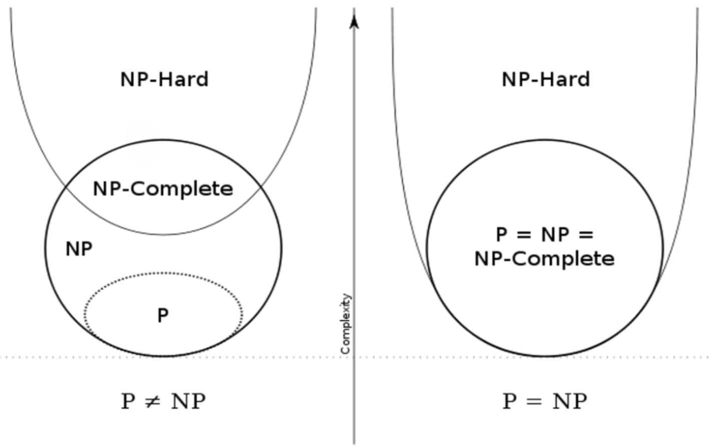

<h1 align="center">INT 102</h1>

# Big O Notation

通常而言，我们会用 $O(n)$ 来表示一个算法的时空复杂度，其中 $n$ 代表了输入的规模。\
常见的复杂度有：
| 复杂度 | 时间 | 空间 |
| --- | --- | --- | 
| $O(1)$ | 常数时间复杂度 （哈希表） | 常数空间复杂度 （变量） |
| $O(\sqrt{n})$ | 平方根时间复杂度 （分块查找） |  |
| $O(\log n)$ | 对数时间复杂度 （二分查找） | 对数空间复杂度 （递归二分查找） |
| $O(n)$ | 线性时间复杂度 （一次遍历） | 线性空间复杂度 （数组） |
| $O(n \log n)$ | 线性对数时间复杂度 （快速排序） | 线性空间复杂度 （DFS） |
| $O(n^2)$ | 平方时间复杂度 （双重遍历） | 平方空间复杂度 （二维数组） |
| $O(n^3)$ | 立方时间复杂度 （三重遍历） | 立方空间复杂度 （三维数组） |
| $O(2^n)$ | 指数时间复杂度 （汉诺塔） |  |
| $O(n!)$ | 阶乘时间复杂度 （旅行商问题） |  |
| $O(n^n)$ | 指数时间复杂度 （穷举法） |  |

对于大部分常见的算法，其时间复杂度通常可以通过观察代码的结构（for, while, if, else, switch, function call）来确定。对于较为复杂的嵌套结构，可以通过分析每一层的复杂度，然后相乘得到总的复杂度。\
对于递归算法(recursion)，可以计算其递归式的时间复杂度。其空间复杂度由递归栈深度决定。

# Sorting Algorithms

## Bubble Sort

冒泡排序是一种简单的排序算法，其基本思想是通过不断地交换相邻的元素，将较大的元素逐渐“沉底”。\
其时间复杂度为 $O(n^2)$，空间复杂度为 $O(1)$ (在原数组上操作，仅使用常数级别的额外空间)。\

```python
def bubble_sort(arr):
    n = len(arr)
    for i in range(n):
        for j in range(n - i - 1):
            if arr[j] > arr[j + 1]:
                arr[j], arr[j + 1] = arr[j + 1], arr[j]
    return arr
```

## Selection Sort

选择排序是一种简单的排序算法，其基本思想是通过不断地选择剩余元素中的最小值，将其放到已排序序列的末尾。\
其时间复杂度为 $O(n^2)$，空间复杂度为 $O(1)$。

```python
def selection_sort(arr):
    n = len(arr)
    for i in range(n):
        min_idx = i
        for j in range(i + 1, n):
            if arr[j] < arr[min_idx]:
                min_idx = j
        arr[i], arr[min_idx] = arr[min_idx], arr[i]
    return arr
```

## Insertion Sort

插入排序是一种简单的排序算法，其基本思想是通过构建有序序列，对于未排序的数据，在已排序序列中从后向前扫描，找到相应位置并插入。\
其时间复杂度为 $O(n^2)$，空间复杂度为 $O(1)$。

```python
def insertion_sort(arr):
    n = len(arr)
    for i in range(1, n):
        key = arr[i]
        j = i - 1
        while j >= 0 and key < arr[j]:
            arr[j + 1] = arr[j]
            j -= 1
        arr[j + 1] = key
    return arr
```

## Merge Sort

归并排序是一种高效的排序算法，其基本思想是将数组分为两部分，分别排序后再合并。\
其时间复杂度为 $O(n \log n)$，空间复杂度为 $O(n)$(需要额外的空间存储中间结果)。\
对于其空间复杂度，由于每次合并完成之后，都会释放掉中间结果，因此其空间复杂度在最坏情况下（即最后一次合并）需要额外申请一个与原数组相同大小的数组，因此为 $O(n)$。

```python
def merge_sort(arr): 
    if len(arr) <= 1:
        return arr
    mid = len(arr) // 2
    left = merge_sort(arr[:mid])
    right = merge_sort(arr[mid:])
    return merge(left, right)

def merge(left, right):
    res = []
    i = j = 0
    while i < len(left) and j < len(right):
        if left[i] < right[j]:
            res.append(left[i])
            i += 1
        else:
            res.append(right[j])
            j += 1
    res.extend(left[i:])
    res.extend(right[j:])
    return res
```

其时间复杂度可以通过迭代法求解：
$$
T(n) = 2T(n/2) + O(n) \\
T(n) = 2(2T(n/4) + O(n/2)) + O(n) = 4T(n/4) + 2O(n) \\
T(n) = 4(2T(n/8) + O(n/4)) + 3O(n) = 8T(n/8) + 3O(n) \\
\cdots \\
T(n) = 2^kT(n/2^k) + kO(n)
$$
当 $n/2^k = 1$ 时，$k = \log n$，原式变为：
$$
T(n) = nT(1) + \log n O(n) = n + O(n \log n) = O(n \log n)
$$

## Counting Sort

计数排序是一种非比较排序算法，其基本思想是通过统计每个元素出现的次数，然后根据元素的大小顺序输出。\
其时间复杂度为 $O(n + k)$，空间复杂度为 $O(n + k)$，其中 $k$ 为数组中元素的最大值。

```python
def counting_sort(arr):
    n = len(arr)
    max_val = max(arr)
    count = [0] * (max_val + 1)
    for num in arr:
        count[num] += 1
    res = []
    for i in range(max_val + 1):
        res.extend([i] * count[i])
    return res
```

- 类似的思想参考睡眠排序（

# Searching Algorithms

## Binary Search

二分查找是一种高效的查找算法，其基本思想是通过不断地将查找区间对半分，直到找到目标元素。\
通常包含 左闭右开，左闭右闭，左开右闭 三种写法。\
其时间复杂度为 $O(\log n)$，空间复杂度为 $O(1)$。

```python
# 左闭右开
def binary_search(arr, target):
    left, right = 0, len(arr)
    while left < right:
        mid = left + (right - left) // 2
        if arr[mid] == target:
            return mid
        elif arr[mid] < target:
            left = mid + 1
        else:
            right = mid
    return -1

# 左闭右闭
def binary_search(arr, target):
    left, right = 0, len(arr) - 1
    while left <= right:
        mid = left + (right - left) // 2
        if arr[mid] == target:
            return mid
        elif arr[mid] < target:
            left = mid + 1
        else:
            right = mid - 1
    return -1

# 左开右闭
def binary_search(arr, target):
    left, right = 0, len(arr)
    while left + 1 < right:
        mid = left + (right - left) // 2
        if arr[mid] == target:
            return mid
        elif arr[mid] < target:
            left = mid
        else:
            right = mid
    return -1
```

# String Matching

## Horspool Algorithm

Horspool 算法是一种高效的字符串匹配算法，其基本思想是通过预处理模式串，然后根据坏字符规则和好后缀规则进行匹配。\
实现时，首先构建 Shift Table (Array or HashMap)， 其中记录了每个字符在 Pattern 串中出现的最右位置（不包括最后一个字符）到末尾的距离。\
然后从 Pattern 串的末尾开始匹配 Text，当发生不匹配时，按照目前 Text 的字符 $k$ 在 Shift Table 中查找对应字符的距离 $v$，然后将 Pattern 向后移动 $v$ 个位置。\
其时间复杂度为 $O(n + m)$，空间复杂度为 $O(m)$。其中 $n$ 为 Text 的长度，$m$ 为 Pattern 的长度。

```python
# ord(字符) 函数返回字符的 ASCII 数值
def horspool(pattern, text):
    m, n = len(pattern), len(text)
    if m > n:
        return -1
    shift = [m] * 256
    for i in range(m - 1):
        shift[ord(pattern[i])] = m - i - 1
    i = m - 1
    while i < n:
        k, j = i, m - 1
        while j >= 0 and text[k] == pattern[j]:
            k -= 1
            j -= 1
        if j == -1:
            return k + 1
        i += shift[ord(text[i])]
    return -1
```

# Complexity Analysis

在正式开始分析之前，需要先了解 `多项式` 和 `时间复杂度` 的概念。
- **多项式**：多项式是由常数和变量的乘积相加得到的表达式，例如 $f(x) = a_n x^n + a_{n-1} x^{n-1} + \cdots + a_1 x + a_0$ 是一个 $n$ 次多项式。
- **时间复杂度**：时间复杂度是一个算法运行时间的函数，通常用大 $O$ 表示，见 [Big O Notation](#big-o-notation)。

## P vs NP
- **P**：多项式时间内可解决的问题集合，即存在一个多项式时间的算法可以解决该问题。
- **NP**：多项式时间内可验证的问题集合，即对于给定的解，可以在多项式时间内验证其正确性，但不一定能在多项式时间内找到解。
- **P vs NP**：P 问题是 NP 问题的子集，即 P $\subseteq$ NP。P = NP 问题是计算机科学中一个重要的未解决问题，即是否存在一个多项式时间的算法可以解决 NP 问题。

## NP-Hard vs NP-Complete
首先需要了解 `归约` 的概念，即将一个问题转化为另一个问题的过程。\
归约是指将特殊问题推广到一般问题，该一般问题具有最大的计算复杂度，若能在多项式时间内解决该一般问题，则特殊问题也可以在多项式时间内解决。\
通常而言，若问题 $A$ 可以归约到问题 $B$，则解决问题 $B$ 就间接解决了问题 $A$。

- **NP-Hard**：NP 难问题的集合。所有的 NP 问题都可以在多项式时间内归约到 NP-Hard 问题，这个问题会比 NP 问题更难。
- **NP-Complete**：NP 完全问题的集合。若一个问题$A$归约为 NP-Hard 问题$X$， 且$X$是 NP 问题，则问题$X$是 NP-Complete 问题。即 
$$
NP-Complete = NP \cap NP-Hard
$$

## Conclusion

- 理想情况下，我们希望所有问题都可以在多项式时间内解决，即 P = NP。此时，所有 NP 问题都可以在多项式时间内解决。如右图
- 现实情况下，我们通常认为 P $\neq$ NP，即存在一些问题是 NP 问题，但不是 P 问题。至今没有人能够证明存在某个 NP-Complete 问题的多项式时间算法。如左图

## Example
- **P 问题**：排序、查找、图的最短路径、最小生成树等。
- **NP 问题**：旅行商问题、背包问题、图的着色问题等。