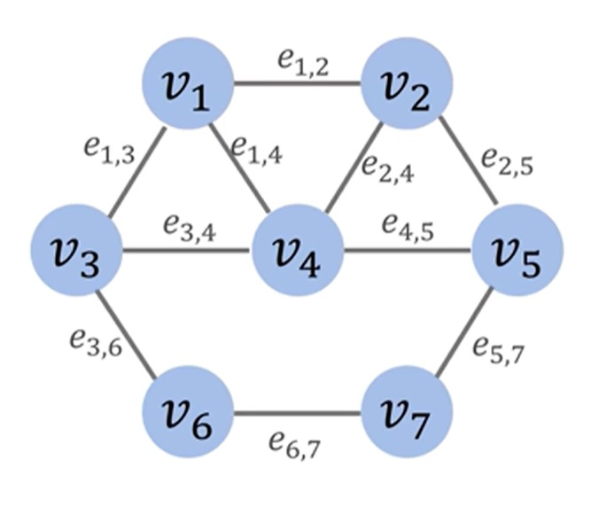
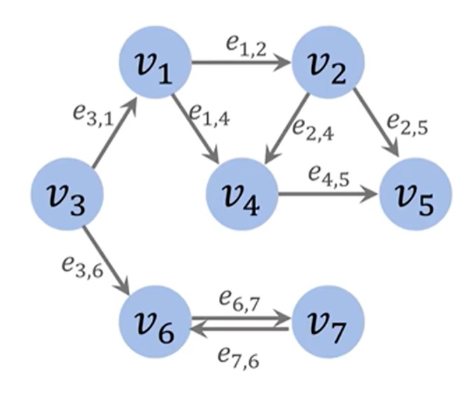
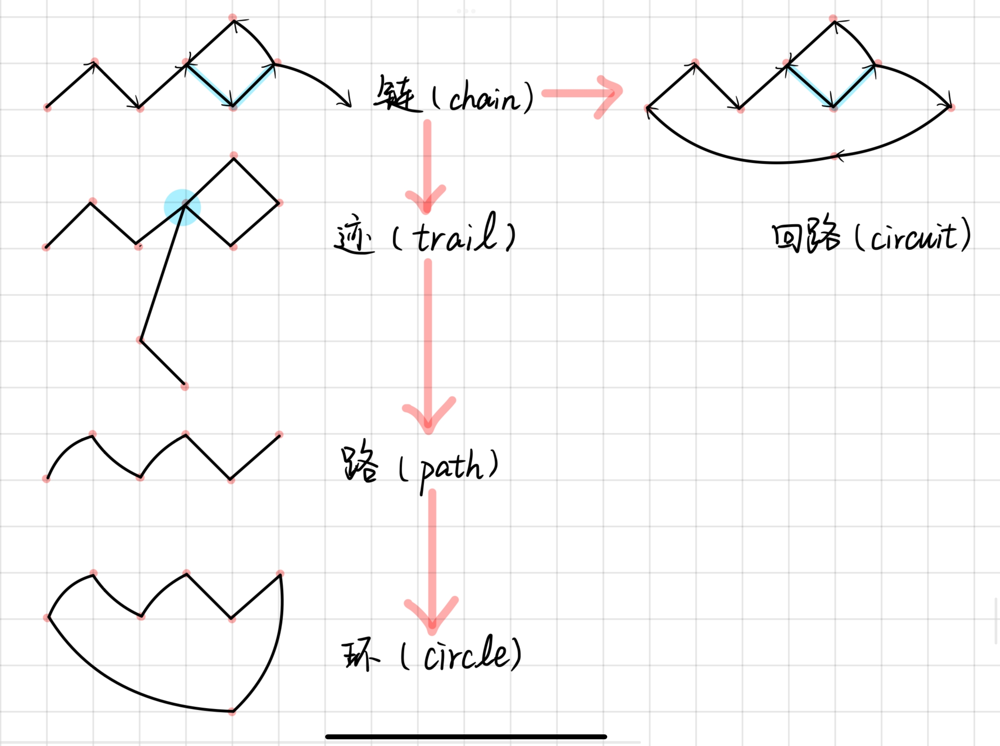
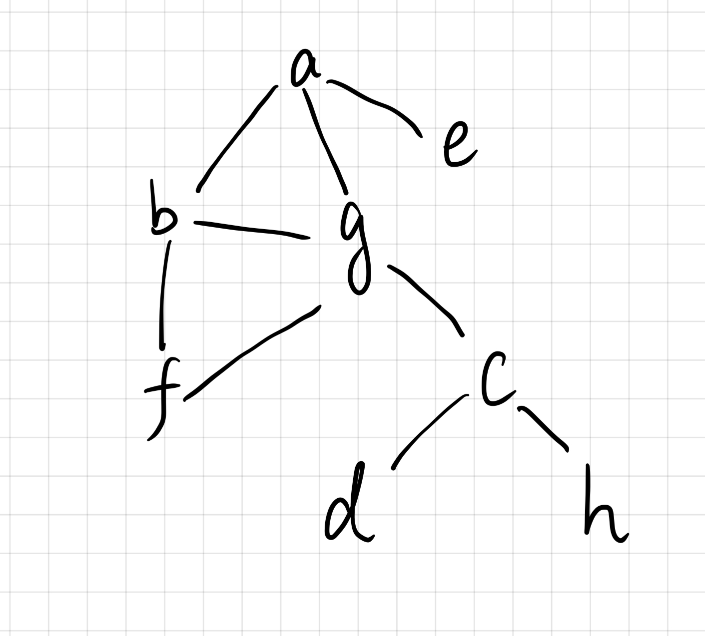

# 图论基本概念

## 什么是图？



- Set of vertices:
  $$
  v = \{v_1,v_2,...v_7\}
  $$

- Set of edge:
  $$
  \epsilon = \{e_{1,2}, e_{1,3},...,e_{6,7}\}
  $$

- Graph：
  $$
  G = (\nu, \epsilon)
  $$

## 无向图与有向图

### 无向图（Undirected）


### 有向图（Directed）



## 有权图与无权图

### 无权图（Unweighted）

.JPG)

### 有权图（Weighted）

.JPG)

## 图的数据结构

### 无向无权图（Undirected Unweighted Graph）

.JPG)

使用邻接表，称之为`Adjacency list`

| vertex | neighbors |
| ------ | --------- |
| 1      | 2,3,4     |
| 2      | 1,4       |
| 3      | 1,4,6     |
| 4      | 1,2,3     |
| 5      | empty     |
| 6      | 3,7       |
| 7      | 6         |

也可以使用邻接矩阵，称为 `Adjacency matrix`

|       | $v_1$ | $v_2$ | $v_3$ | $v_4$ | $v_5$ | $v_6$ | $v_7$ |
| ----- | ----- | ----- | ----- | ----- | ----- | ----- | ----- |
| $v_1$ | 0     | 1     | 1     | 1     | 0     | 0     | 0     |
| $v_2$ | 1     | 0     | 0     | 1     | 0     | 0     | 0     |
| $v_3$ | 1     | 0     | 0     | 1     | 0     | 1     | 0     |
| $v_4$ | 1     | 1     | 1     | 0     | 0     | 0     | 0     |
| $v_5$ | 0     | 0     | 0     | 0     | 0     | 0     | 0     |
| $v_6$ | 0     | 0     | 1     | 0     | 0     | 0     | 1     |
| $v_7$ | 0     | 0     | 0     | 0     | 0     | 1     | 0     |

注意，**无向图的邻接矩阵都是对称的**

### 有向无权图（Directed Unweighted Graph）

.JPG)

邻接表：

| from | to    |
| ---- | ----- |
| 1    | 2,4   |
| 2    | 4,5   |
| 3    | 1,6   |
| 4    | 5     |
| 5    | empty |
| 6    | 7     |
| 7    | 6     |

邻接矩阵：

|       | $v_1$ | $v_2$ | $v_3$ | $v_4$ | $v_5$ | $v_6$ | $v_7$ |
| ----- | ----- | ----- | ----- | ----- | ----- | ----- | ----- |
| $v_1$ | 0     | 1     | 0     | 1     | 0     | 0     | 0     |
| $v_2$ | 0     | 0     | 0     | 1     | 1     | 0     | 0     |
| $v_3$ | 1     | 0     | 0     | 0     | 0     | 1     | 0     |
| $v_4$ | 0     | 0     | 0     | 0     | 1     | 0     | 0     |
| $v_5$ | 0     | 0     | 0     | 0     | 0     | 0     | 0     |
| $v_6$ | 0     | 0     | 0     | 0     | 0     | 0     | 1     |
| $v_7$ | 0     | 0     | 0     | 0     | 0     | 1     | 0     |

### 无向有权图（Undirected Weighted Graph）

.JPG)

这个只能邻接矩阵

|       | $v_1$ | $v_2$ | $v_3$ | $v_4$ | $v_5$ | $v_6$ | $v_7$ |
| ----- | ----- | ----- | ----- | ----- | ----- | ----- | ----- |
| $v_1$ | 0     | 2     | 4     | 1     | 0     | 0     | 0     |
| $v_2$ | 2     | 0     | 0     | 3     | 0     | 0     | 0     |
| $v_3$ | 4     | 0     | 0     | 2     | 0     | 5     | 0     |
| $v_4$ | 1     | 3     | 2     | 0     | 0     | 0     | 0     |
| $v_5$ | 0     | 0     | 0     | 0     | 0     | 0     | 0     |
| $v_6$ | 0     | 0     | 5     | 0     | 0     | 0     | 1     |
| $v_7$ | 0     | 0     | 0     | 0     | 0     | 1     | 0     |

### 有向有权图（Directed Weighted Graph）

.JPG)

这个也只能使用邻接矩阵：

|       | $v_1$ | $v_2$ | $v_3$ | $v_4$ | $v_5$ | $v_6$ | $v_7$ |
| ----- | ----- | ----- | ----- | ----- | ----- | ----- | ----- |
| $v_1$ | 0     | 2     | 0     | 1     | 0     | 0     | 0     |
| $v_2$ | 0     | 0     | 0     | 3     | 10    | 0     | 0     |
| $v_3$ | 4     | 0     | 0     | 0     | 0     | 5     | 0     |
| $v_4$ | 0     | 0     | 0     | 0     | 2     | 0     | 0     |
| $v_5$ | 0     | 0     | 0     | 0     | 0     | 0     | 0     |
| $v_6$ | 0     | 0     | 0     | 0     | 0     | 0     | 2     |
| $v_7$ | 0     | 0     | 0     | 0     | 0     | 1     | 0     |

## 度数（degree）

什么是图的度数，与一个顶点 $v$ 关联的边的条数称作该顶点的 **度（degree）**，记作 $d(v)$。特别地，对于边 $(v,v)$，则每条这样的边会使的度数 `+2`，也就是说有一条自指的边就会使得图的度数 `+2` 。

### 入度（In-degree）

注意，出度和入度的概念仅针对于有向图

对于一个有向图的某一个顶点，入度就是有几条边指向该顶点。

### 出度（out-degree）

出度就是某一个顶点，有几条边从这个顶点发出

入度加出度就是总度数。

## 路径



- 如果一个图任意节点相连的边不超过 2 条的树称为**链（chain）**，也就是如果有重复的边的话则称为链
- 接下来，如果一个图没有边重复，但是有点重复的话，那么就称之为**迹（trail）**，或者换句话说，只要每条边两两不相同，则称之为迹。
- 然后，如果一个图，既没有边重复，也没有点重复，那么我们就称之为**路（path）**，或者换句话说，若连接的点的序列中点两两不同，则称之为路。
- 然后，如果对于一个路来说，如果起点和终点是同一个，则我们称之为**环（circle）**
- 以上四个的强弱定义是很明显的一个层次，最后的**回路（circuit）**定义是非常弱的，它只要求对于一条链来说，起点和终点相同则可称为回路，当然，对于任意的图来说，只要起点和终点相同就可以称为回路。

# 一笔画问题

## 欧拉路径与欧拉回路

就是如果一条通路包含G的所有边，则这条路称之为欧拉通路，也叫欧拉路径。

如果这条路是一条回路，也就是起点和结束是同一个，那么称为**欧拉回路（Euler circuit）**

如果一个图含有欧拉回路，那么这个图称之为欧拉图。

### 对有向图G和无向图H

图G存在欧拉路径与欧拉回路的**充要条件**分别是：

- 欧拉路径：图中所有奇度点的数量为0或2.

- 欧拉回路：图中所有点的度数都是偶数。

- 哦还有一点，奇度数点为奇数的图，不存在。

图H存在欧拉路径和欧拉回路的**充要条件**分别为：

- 欧拉路径：所有点的入度等于出度或者存在一点出度比入度大1（起点），一点入度比出度大1（终点），其他点的入度均等于出度。

- 欧拉回路：所有点的入度等于出度。

此处可以尝试去玩一下一笔画来加深上述理解。

## 哈密顿路径与哈密顿回路

**哈密尔顿回路（Hamiltonian circuit）**是指，从图中的一个顶点出发，沿着边行走，经过图的每个顶点，且每个顶点仅访问一次，之后再回到起始点的一条路径。如上图所示，我们的起始点选定为 Washington DC，灰色实线构成的一条路径就是一条哈密尔顿回路。

- **哈密尔顿回路(Hamilton circuit)** 要求从起始点出发并能回到起始点，其路径是一个环。
- **哈密尔顿路径(Hamilton Path)** 并不要求从起始点出发能够回到起始点，也就是说：起始顶点和终止顶点之间不要求有一条边。

确定图是否含有哈密顿回路或路径是一个非常难的问题，是**NP-hard**问题。

# BFS与DFS

## 广搜（Breadth-first search）

使用去年的例题来说明


这个遍历顺序语言不好说，先把一个图画出来：



就是BFS就是尽可能的去探索每一层级上面的节点，你看这个图就非常的明显，如果从a出发，那么第一层级就是bge三个节点，按照字典序来就是B->E->G的顺序，然后下一层级就应该是f和c，下面一步比较重要，就是c和f谁先访问的问题。

根据bfs的优先队列来说，b在之前已经访问过了，在访问b的同时，f就应该做入队列操作，此时的f应该是在c前面，所以应该是f先被访问，然后再是c。

于是这道题访问的第六个节点就是C。

这就是一个比较简单的BFS。

```python
# 遍历图G中除s之外的每个顶点u
for each vertex u in V[G] - {s}
    # 初始化每个顶点的颜色为白色（未访问）
    color[u] = white

# 初始化一个空队列Q
Q = empty

# 将起始顶点s入队
enqueue(Q, s)

# 当队列Q不为空时，执行以下操作
while Q is not empty
    # 将队列Q中的第一个顶点u出队
    u = dequeue(Q)
    
    # 遍历顶点u的所有邻接顶点v
    for each v in Adj(u)  # u的邻接表Adj(u)
        # 如果邻接顶点v的颜色为白色（未访问）
        if color[v] == white then
            # 将顶点v的颜色标记为灰色（已发现但未完全访问）
            color[v] = gray
            # 将顶点v入队
            enqueue(Q, v)
    
    # 将顶点u的颜色标记为黑色（已完全访问）
    color[u] = black
```

## 深搜（Depth First Search）

那么对于上面那个题目的深度优先搜索，就如同字面意思，尽可能先深入这个图的节点，先深入，再回溯到上一个节点，然后再深入，直到探索完所有节点。

所以上图的DFS顺序应该是 `abfgcd 回溯 h 回溯 e`

```python
# 遍历图G中除起始顶点s之外的每个顶点u
for each vertex u in V[G] - {s}
    # 初始化每个顶点的颜色为白色（未访问）
    color[u] = white

# 深度优先搜索的递归子程序
def DFS_visit(u):
    # 将顶点u的颜色标记为灰色（已发现但未完全访问）
    color[u] = gray
    # 遍历顶点u的所有邻接顶点v
    for each v in Adj(u)  # u的邻接表Adj(u)
        # 如果邻接顶点v的颜色为白色（未访问）
        if color[v] == white then
            # 递归调用DFS_visit函数访问顶点v
            DFS_visit(v)
    # 将顶点u的颜色标记为黑色（已完全访问）
    color[u] = black

# 从起始顶点s开始进行深度优先搜索
DFS_visit(s)
```

# 树（tree）

树是无环的连通图。

连通图就是每个点之间是连通的，就是连通图。

当然树还有其他等效语句：

- There is exactly one path between any two vertices in G
- G is connected and removal of one edge disconnects G
- G is acyclic and adding one edge creates a cycle
- G is connected and m=n-1 (where |V|=n, |E|=m)

**引理：如果一棵树T有n个顶点和m条边，则m=n-1**


## 有根树和无根树

- 有根树：有一个确定的根节点；
- 无根树：根不确定，任何结点都可以作为树的根；

### 无根树

**无根树（unrooted tree）**的定义和特性可以总结如下：

1. **连通无向图**：一个有 $n$ 个结点和 $n-1$ 条边的连通无向图。
2. **无环图**：一个无向无环的连通图。
3. **唯一路径图**：在任意两个结点之间有且仅有一条简单路径的无向图。
4. **桥图**：任何边均为桥的连通图（即去掉任何一条边后，图将变得不连通）。
5. **添加边形成唯一圈**：没有圈，且在任意不同两点间添加一条边后，所得图含唯一的一个圈。

这些定义等价地描述了无根树的性质，主要强调了图的连通性、无环性和唯一路径性。

### 有根树

有根树（rooted tree）是在无根树的基础上指定一个特殊的结点作为根结点（root）的树结构。它具有以下特性和定义：

- **父亲（parent node）**：对于除根以外的每个结点，定义为从该结点到根路径上的第二个结点。
  根结点没有父结点。
- **祖先（ancestor）**：一个结点到根结点的路径上，除了它本身外的结点。
  根结点的祖先集合为空。
- **子结点（child node）**：如果 $u$ 是 $v$ 的父亲，那么 $v$ 是 $u$ 的子结点。
  子结点的顺序一般不加以区分，二叉树是一个例外。
- **结点的深度（depth）**：到根结点的路径上的边数。
- **树的高度（height）**：所有结点的深度的最大值。
- **兄弟（sibling）**：同一个父亲的多个子结点互为兄弟。
- **后代（descendant）**：子结点和子结点的后代。
  或者理解成：如果 $u$ 是 $v$ 的祖先，那么 $v$ 是 $u$ 的后代。


- **子树（subtree）**：删掉与父亲相连的边后，该结点所在的子图。


## 二叉树

我不想讲，非常简单

### 前序遍历

字面意思

### 中序遍历

字面意思

### 后序遍历

字面意思

# 最小生成树（MST）

最小生成树，称为Minimum spanning tree，给定一个无向有权连通图G，生成一个包含所有节点的树，要求这个树的权重和最小。

## Prim算法

```python
# 给定一个加权连通图 G = (V, E)
# 初始化最小生成树的顶点集 VT 和边集 ET

# 选择一个初始顶点 v0 (可以是图中的任意顶点)
v0 = 任意顶点从 V 中

# 初始化最小生成树的顶点集为包含初始顶点的集合
VT = { v0 }

# 初始化最小生成树的边集为空集
ET = ∅

# 循环 |V|-1 次，以添加 |V|-1 条边到最小生成树中
For i = 1 to |V| - 1 do
    # 初始化当前最小权重为无穷大
    minWeight = ∞
    # 初始化待添加的最小边为 null
    minEdge = null

    # 遍历所有以 VT 中的顶点为起点的边 (v, u)
    for each vertex v in VT do
        for each edge e = (v, u) in E do
            // 如果边的终点 u 不在 VT 中，且该边的权重小于当前最小权重
            if u is not in VT and weight(e) < minWeight then
                // 更新当前最小权重和待添加的最小边
                minWeight = weight(e)
                minEdge = e

    # 将最小边的终点 u* 添加到 VT 中
    VT = VT ∪ { u* }
    
    # 将最小边 minEdge 添加到最小生成树的边集 ET 中
    ET = ET ∪ { minEdge }

# 返回最小生成树的边集 ET
Return ET
```

### 正确性

在每个循环之前，$E_T$ 是最小生成树的子集。

1. 贪心策略的正确性

Prim算法的贪心选择是基于以下原理：在生成树的构建过程中，选择连接生成树内部顶点和外部顶点的最小权重边。这种选择保证了每一步都在局部最优的情况下前进，从而最终达到全局最优。

2. 切分定理

切分定理（Cut Property）是证明Prim算法正确性的关键之一。该定理指出，对于任何图的一个切分，如果某条边是跨越该切分的所有边中权重最小的边，那么这条边必然属于某个最小生成树。Prim算法每次选择的就是这样一条边，因此遵循了切分定理，保证了最优性。

3. MST的唯一性

在权重唯一的情况下，最小生成树是唯一的，而Prim算法构建的树也会是唯一的最小生成树。在存在相同权重的情况下，虽然可能存在多个最小生成树，但Prim算法构建的树仍然是其中之一。

4. 算法步骤的验证

让我们通过算法的每一步来验证其正确性：

1. **初始化**：从任意起始顶点开始，初始化最小生成树的顶点集 `VT` 和边集 `ET`。
2. **扩展树**：每一步选择连接 `VT` 中顶点和 `V - VT` 中顶点的最小权重边，并将其加入到生成树中。
3. **重复**：重复上述步骤，直到所有顶点都被包含在生成树中。

在每一步，Prim算法选择的边都是当前可以选择的最小权重边，这一选择保证了每一步的局部最优性。由于所有顶点最终都被包含在生成树中，并且每一步都是在贪心选择的最小权重边下进行的，所以最终生成的树是最小生成树。

### 复杂度

基于邻接表和二叉堆（优先队列）实现

1. **数据结构**：
   - 使用邻接表存储图的边。
   - 使用一个优先队列（最小堆）来选择当前最小 `key[]` 值的顶点。
   - 使用一个数组 `key[]` 来存储每个顶点到生成树的最小边权重。
   - 使用一个布尔数组 `inMST[]` 来标记哪些顶点已经包含在生成树中。
2. **算法步骤**：
   - 初始化 `key[]`，将起始顶点的 `key` 设为0，其他顶点设为无穷大。
   - 将所有顶点插入优先队列，并初始化其 `key` 值。
   - 在 `|V|` 次迭代中，每次从优先队列中取出 `key[]` 值最小的顶点，将其加入生成树。
   - 更新相邻顶点的 `key[]` 值，并在优先队列中调整其位置。
3. **时间复杂度**：
   - 初始化优先队列：`O(V)`
   - 每次从优先队列中取出最小值：`O(log V)`，进行 `V` 次。
   - 更新相邻顶点的 `key[]` 值：`O(E log V)`，在最坏情况下，需要 `E` 次更新，每次调整堆的时间复杂度为 `O(log V)`。
   - 总复杂度：`O(E log V)`

这种实现适用于稀疏图，即边数远小于顶点数的平方。

```python
import heapq

def prim_mst(graph, root):
    """
    使用Prim算法计算最小生成树(MST)
    
    参数：
    graph - 输入图，格式为邻接表，{u: [(v, weight), ...], ...}
    root - 根顶点

    返回：
    mst_edges - 最小生成树的边集合，格式为 [(u, v, weight), ...]
    """
    
    # 初始化
    key = {v: float('inf') for v in graph}  # 存储每个顶点的最小权重
    pi = {v: None for v in graph}  # 存储最小生成树的父节点
    key[root] = 0  # 起始顶点的key值设为0
    
    # 使用优先队列（最小堆）来存储顶点和对应的key值
    priority_queue = [(0, root)]  # 初始化堆，(key值, 顶点)
    in_mst = set()  # 存储已经在最小生成树中的顶点
    mst_edges = []  # 存储最小生成树的边

    while priority_queue:
        # 从优先队列中取出key值最小的顶点
        current_key, u = heapq.heappop(priority_queue)
        
        if u in in_mst:
            continue
        
        # 将该顶点加入到最小生成树中
        in_mst.add(u)
        
        # 如果u的父节点存在，将该边加入到最小生成树的边集合中
        if pi[u] is not None:
            mst_edges.append((pi[u], u, current_key))
        
        # 遍历u的所有相邻顶点
        for v, weight in graph[u]:
            # 如果v不在最小生成树中且(u, v)的权重小于v的当前key值
            if v not in in_mst and weight < key[v]:
                # 更新v的父节点和key值
                pi[v] = u
                key[v] = weight
                # 将v和其key值加入到优先队列中
                heapq.heappush(priority_queue, (key[v], v))
    
    return mst_edges
```

## Kruskal算法

```java
// 给定一个无向连通图 G = (V, E)
// 从边集E中选择权重最小的边e
pick an edge e in E with minimum weight

// 将这条边e添加到生成树T中，T初始为空集，现在包含这条边e
T = { e }

// 从边集E中移除这条边e，得到新的边集E'
E' = E - { e }

// 当边集E'不为空时，重复以下步骤
while E' ≠ null do
begin
    // 从边集E'中选择权重最小的边e
    pick an edge e in E' with minimum weight
    
    // 如果将边e添加到生成树T中不会形成环
    if adding e to T does not form cycle then
    
        // 将这条边e添加到生成树T中
        T = T È { e }
        
        // 从边集E'中移除这条边e
        E' = E' - { e }
end

```

### 正确性

1. **贪心选择的最优性**：
   - Kruskal算法每一步都选择权重最小且不形成环的边，这种贪心选择保证了每次添加的边都是局部最优的。
2. **最小生成树的性质**：
   - 最小生成树的定义是包含所有顶点且总权重最小的树。Kruskal算法通过逐步增加权重最小的边，并确保不形成环，这样逐步构建的树符合最小生成树的定义。
3. **切分定理**：
   - 切分定理指出，对于任意切分（将图的顶点分成两部分），跨越这个切分的最小边一定是最小生成树的一部分。Kruskal算法在每一步选择权重最小的边，这本质上是在使用切分定理确保每次选择的边都是最小生成树的一部分。
4. **并查集的有效性**：
   - 并查集数据结构高效管理和合并连通分量，确保算法在选择边时能够快速判断是否会形成环，从而保证生成的树不会出现环，保持树的连通性。

可以使用归纳法证明此过程：

1. **基础情况**：
   - 初始时，生成树为空，选择权重最小的边显然是局部最优的，不可能有更小的边。
2. **归纳假设**：
   - 假设在某一步前，已选择的边集T是部分最小生成树，即在不形成环的情况下，T中边的权重和最小。
3. **归纳步骤**：
   - 在下一步中，选择当前剩余边中权重最小的一条边e，并检查其是否形成环。如果不形成环，加入边e使得T依然是部分最小生成树。如果形成环，跳过边e，继续选择下一条最小的边。这样，每一步都保证选择的是当前条件下的最优边，最终得到全局最优解。

### 复杂度

Kruskal算法每次要从都要从剩余的边中选取一个最小的边。通常我们要先对边按权值从小到大排序，这一步的时间复杂度为为O(|Elog|E|)。Kruskal算法的实现通常使用并查集，来快速判断两个顶点是否属于同一个集合。最坏的情况可能要枚举完所有的边，此时要循环|E|次，所以这一步的时间复杂度为O(|E|α(V))，其中α为Ackermann函数，其增长非常慢，我们可以视为常数。所以Kruskal算法的时间复杂度为O(|Elog|E|)。

# 最短路问题

## Dijkstra’s algorithm

Dijkstra算法（Dijkstra's algorithm）是一种用于求解加权有向图最短路径问题的经典算法。它能够找出从源点到图中所有其他顶点的最短路径。

Dijkstra算法不适用于以下几种情况：

图中存在负权重的边：Dijkstra算法只适用于计算无负权重的最短路径，如果图中存在负权重的边，该算法可能无法找到正确的最短路径。
图中存在负权重的环：如果图中存在负权重的环，Dijkstra算法也无法正确计算最短路径。这是因为Dijkstra算法基于贪婪策略，在处理负权重的环时可能会陷入局部最优解，导致无法找到全局最优解。
图中顶点的个数很大：Dijkstra算法的时间复杂度为O(|V|^2)，其中|V|表示图中顶点的个数。因此，当图中顶点的个数很大时，Dijkstra算法的计算时间会很长，可能不适用。

输入：

- 一个加权有向连通图 $G$
- 一个源顶点 $s$

输出：

- 对于图 $G$ 中的每个顶点 $v$，找到从 $s$ 到 $v$ 的最短路径。

算法过程：

Dijkstra算法通过一系列迭代来运行：

1. **初始化**：

   - 设定集合 $S$ 包含已经找到最短路径的顶点，初始时 $S$ 仅包含源顶点 $s$。
   - 对于源顶点 $s$，设定其到自身的距离为0，即 $dist(s)=0$。
   - 对于其他所有顶点 $v$，设定初始距离为无穷大，即 $dist(v) = \infty$。
   - 使用优先队列（例如最小堆）来存储和提取当前未处理顶点中距离最小的顶点。

2. **迭代**：

   - 在第 $i$ 次迭代中，找到离源点 $s$ 最近的顶点 $u$（即当前距离最小的顶点）。

   - 将顶点 $u$ 从未处理顶点集合中移除，并加入到集合 $S$ 中。

   - 更新顶点 $u$ 的所有邻接顶点的距离。对于每个邻接顶点 $v$，如果经过 $u$ 的路径更短，则更新 $v$ 的距离和前驱节点信息：
     $$
     如果dist(u)+w(u,v)<dist(v)，则更新dist(v)=dist(u)+w(u,v)
     $$
     其中，$w(u,v)$ 是边 $u$ 到 $v$ 的权重。

3. **重复**：

   - 重复上述迭代过程，直到所有顶点都被处理，即集合 $S$ 包含图中的所有顶点。

```python
import heapq

def dijkstra(graph, source):
    """
    Dijkstra算法实现，找到从源点到图中所有其他顶点的最短路径。
    
    参数：
    graph: 图的邻接表表示，graph[u] 是一个列表，包含所有与 u 相邻的顶点及边权重 [(v1, w1), (v2, w2), ...]
    source: 源顶点
    
    返回：
    distances: 源顶点到每个顶点的最短路径距离
    predecessors: 每个顶点的前驱节点，用于还原最短路径
    """
    # 初始化距离字典，所有顶点距离为无穷大
    distances = {vertex: float('inf') for vertex in graph}
    # 初始化前驱节点字典
    predecessors = {vertex: None for vertex in graph}
    # 设置源点的距离为0
    distances[source] = 0
    # 初始化优先队列并加入源点
    priority_queue = [(0, source)]
    # 已处理顶点集合
    visited = set()

    while priority_queue:
        # 从优先队列中取出距离最小的顶点
        current_distance, u = heapq.heappop(priority_queue)

        # 如果该顶点已被处理，跳过
        if u in visited:
            continue

        # 标记该顶点为已处理
        visited.add(u)

        # 遍历与 u 相邻的所有顶点 v
        for v, weight in graph[u]:
            if v not in visited:
                # 计算从源点到 v 的新距离
                new_distance = current_distance + weight

                # 如果找到更短的路径，更新距离和前驱节点
                if new_distance < distances[v]:
                    distances[v] = new_distance
                    predecessors[v] = u
                    # 将顶点 v 及其新的距离加入优先队列
                    heapq.heappush(priority_queue, (new_distance, v))

    return distances, predecessors
```

### 正确性

#### 原理和保证最短路径的原因

1. **贪心策略**：
   - Dijkstra算法采用贪心策略，每次从未处理的顶点中选择当前距离源点最近的顶点，并将其标记为已处理。
   - 由于选择了当前距离源点最近的顶点，这个顶点的最短路径已经确定，不会再有更短的路径出现。
2. **优先队列（最小堆）维护最短距离**：
   - 使用优先队列（例如最小堆）来维护当前的顶点距离。
   - 每次从队列中取出距离最小的顶点，并更新其邻接顶点的距离。
   - 这种方式确保了每次选择的顶点都是当前最短路径的延续。
3. **三角不等式**：
   - Dijkstra算法依赖于图中的三角不等式性质，即对于任意三顶点 $u$、$v$ 和 $w$，总满足 $dist(u,w)\le dist(u,v)+dist(v,w)$。
   - 当选择当前距离最小的顶点并更新邻接顶点的距离时，如果有一条经过当前顶点的更短路径，那么就会更新邻接顶点的距离。

#### 非负权重的必要性

- **负权重的影响**：
  - 如果图中存在负权重边，Dijkstra算法可能会在处理当前顶点时错误地更新距离，导致无法正确找到最短路径。
  - 例如，在负权重边的情况下，可能会出现已经标记为已处理的顶点，后来发现通过负权重边有更短的路径，这违背了算法假设。
- **其他算法**：
  - 对于含有负权重边的图，可以使用Bellman-Ford算法，它能够处理负权重边，并且可以检测负权重环。

### 复杂度

取决于表示图 $G=(V， E)$和优先级队列的实现的数据结构。如果G由邻接列表表示，优先级队列由min-heap实现，那么答案是 $O(|E|log|V|)$

## Floyd 与 Warshall

可以在一个有权图中找到任意两点之间的最短路

通过维护一个最短路矩阵和一个路径矩阵，并从第一个节点开始选择作为中间点向后更新，更新完后两张表记录的信息就是任意两点的最短路。

妈的，说不清楚，题做多了就知道了。

Floyd和Warshall是差不多的东西。

```python
import numpy as np

def floyd_warshall(graph):
    """
    使用Floyd-Warshall算法计算所有节点间的最短路径。
    
    参数:
    graph: 2D numpy array, 邻接矩阵表示的图，graph[i][j]表示节点i到节点j的边权重。
           如果i到j没有直接边，graph[i][j]应该设置为np.inf。
    
    返回:
    dist: 2D numpy array, dist[i][j]表示节点i到节点j的最短路径距离。
    next_node: 2D numpy array, next_node[i][j]表示从节点i到节点j的最短路径中的下一个节点。
    """
    # 节点数
    n = graph.shape[0]
    
    # 初始化距离矩阵和路径矩阵
    dist = graph.copy()
    next_node = np.zeros((n, n), dtype=int)
    
    # 初始化路径矩阵
    for i in range(n):
        for j in range(n):
            if graph[i, j] != np.inf and i != j:
                next_node[i, j] = j
            else:
                next_node[i, j] = -1
    
    # Floyd-Warshall算法的核心部分
    for k in range(n):
        for i in range(n):
            for j in range(n):
                # 如果通过节点k可以缩短i到j的路径
                if dist[i, k] + dist[k, j] < dist[i, j]:
                    dist[i, j] = dist[i, k] + dist[k, j]
                    next_node[i, j] = next_node[i, k]
    
    return dist, next_node

def construct_path(next_node, u, v):
    """
    构建从节点u到节点v的最短路径。
    
    参数:
    next_node: 2D numpy array, Floyd-Warshall算法生成的路径矩阵。
    u: int, 起始节点。
    v: int, 终止节点。
    
    返回:
    path: list, 从节点u到节点v的最短路径。
    """
    if next_node[u, v] == -1:
        return []
    
    path = [u]
    while u != v:
        u = next_node[u, v]
        path.append(u)
    
    return path
```

### 区别

### Warshall算法

Warshall算法主要用于计算图的传递闭包，适用于无权图。它可以确定一个有向图中任意两点之间是否存在路径。算法的基本思想是通过动态规划逐步更新图的可达性矩阵。

#### 核心思想

- 对于每一个节点k，检查通过k作为中间点，能否连接节点i和节点j。
- 如果节点i通过节点k可以到达节点j，则更新可达性矩阵。

```python
def warshall(graph):
    n = len(graph)
    reach = graph.copy()

    for k in range(n):
        for i in range(n):
            for j in range(n):
                reach[i][j] = reach[i][j] or (reach[i][k] and reach[k][j])
    
    return reach
```

### Floyd算法（Floyd-Warshall算法）

Floyd算法用于计算带权图中所有顶点之间的最短路径。它的核心思想是通过动态规划逐步更新最短路径矩阵。

#### 核心思想

- 对于每一个节点k，检查通过k作为中间点，能否缩短节点i到节点j的路径。
- 如果通过节点k可以缩短从节点i到节点j的路径，则更新最短路径矩阵。

```python
def floyd_warshall(graph):
    n = len(graph)
    dist = graph.copy()

    for k in range(n):
        for i in range(n):
            for j in range(n):
                if dist[i][k] + dist[k][j] < dist[i][j]:
                    dist[i][j] = dist[i][k] + dist[k][j]
    
    return dist
```

- **Warshall算法**：用于无权图，计算图的传递闭包，即确定节点间的可达性。输出是一个可达性矩阵。
- **Floyd算法**：用于带权图，计算所有节点间的最短路径。输出是一个最短路径距离矩阵。

## Bellman-Ford Algorithm

Dijkstra算法无法解决带有负权重边的图，Bellman-ford 算法比dijkstra算法更具普遍性，因为它对边没有要求，可以处理负权边但无法处理负环。缺点是时间复杂度过高，高达O(VE), V为顶点数，E为边数。

其主要思想：对所有的边进行 `n-1` 轮松弛操作，因为在一个含有 `n` 个顶点的图中，任意两点之间的最短路径最多包含 `n-1` 边。换句话说，第1轮在对所有的边进行松弛后，得到的是源点最多经过一条边到达其他顶点的最短距离；第2轮在对所有的边进行松弛后，得到的是源点最多经过两条边到达其他顶点的最短距离；第3轮在对所有的边进行松弛后，得到的是源点最多经过一条边到达其他顶点的最短距离

```python
def bellmanford(n, s):
    dis[s] = 0
    for i in range(1, n + 1):
        flag = False
        for e in edge:
            u, v, w = e.u, e.v, e.w
            if dis[u] == INF:
                continue
            # 无穷大与常数加减仍然为无穷大
            # 因此最短路长度为 INF 的点引出的边不可能发生松弛操作
            if dis[v] > dis[u] + w:
                dis[v] = dis[u] + w
                flag = True
        # 没有可以松弛的边时就停止算法
        if not flag:
            break
    # 第 n 轮循环仍然可以松弛时说明 s 点可以抵达一个负环
    return flag
```

# 装配线问题（Assembly line）


有 $2$ 个装配线，每一个装配线上有 $n$ 个装配站， $[i,j]$ 表示第 $i$ 个装配线上的第 $j$ 个装配站。两个装配线上相同位置的转配站有相同的功能。在装配站 $[i,j]$ 上花费时间为 $a_{i,j}$ 。进入和退出装配线 $i, j$ 的时间分别为 $in[i,j]$ 和 $out[i,j]$ （本题不涉及） 。从一个装配站到相同装配线的下一个的时间忽略不计，到不同的装配站的时间为 $t_{i,j}$，求时间最少的装配方案。

**定义** $f(i,j)$ **为从初始状态到第 $i$ 条装配线第 $j$ 个装配站装配完成后所用的最少时间**。
由于从一个装配站到相同装配线的下一个的时间忽略不计，因此**只需考虑从初始状态进入装配线的时间及退出装配线的时间**

我们采用动态规划，直接写出状态转移方程

初始状态
$$
\left\{
\begin{matrix} 
  f(1,1) = in(1,1) + a(1,1)\\
  f(2,1) = in(2,1) + a(2,1)
\end{matrix}
\right.
$$
状态转移
$$
\left\{
\begin{matrix} 
  f(1,j) = min\{f(1,j-1) + a(1,j) , f(2,j-1) + a(1,j) + t(2,j)\} \\ 
  f(2,j) = min\{f(2,j-1) + a(2,j) , f(1,j-1) + a(2,j) + t(1,j)\}
\end{matrix}
\right.
$$

```python
f(1, 1) = in(1) + cost(1, 1)
f(2, 1) = in(2) + cost(2, 1)
for j = 2 to n do
    f(1, j) = min{f(1, j – 1) + cost(1, j), f(2, j – 1) + trans(2, j) + cost(1, j)}
    f(2, j) = min{f(2, j – 1) + cost(2, j), f(1, j – 1) + trans(1, j) + cost(2, j)}
end for  
return min{f(1, n) + out(1), f(2, n) + out(2)}
```

