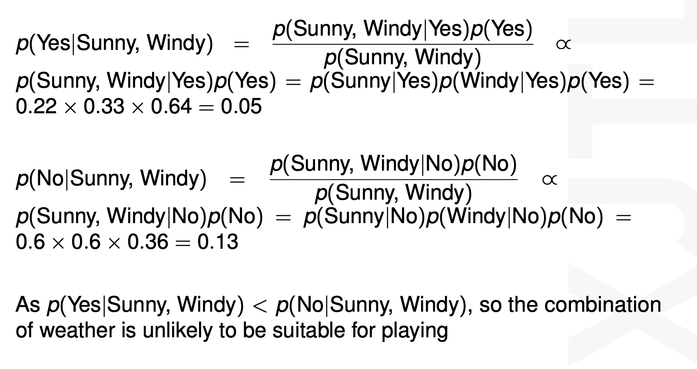

# INT-104 Artificial Intelligence 人工智能


# Week 1 **什么是人工智能**

### **什么是AI?**

1. AI is the study of complex information processing problems that often have their roots in some aspect of biological information processing. The goal of the subject is to identify solvable and interesting information processing problems, and solve them. (David Marr)
2. The intelligent connection of perception to action (Rodney Brooks)
3. Actions that are indistinguishable from a human’s (Alan Turing)

### **当下AI**

· 广泛成为学习生活中的工具-（神经网络，隐藏马尔可夫模型，贝叶斯网络，启发式搜索）

· 以模型，概率，统计，优化，算法为基础的交叉学科

### **人工智能的困难**

1. 大数据集 
2. 最优化 
3. 噪点与缺失数据 
4. NP hard 
5. 描述问题（范化Paradigm）
6. 寻找健壮的算法

# Week 2 DATA PREPROCESSING

隔位置切片

```python
隔位置切片是数之后的第几个然后取，如例子是每两个取第二个，而不是隔2个取一个。
testlist=[0,1,2,3,4,5,6,7]
print(testlist[0:-1:2])

#------out------[0, 2, 4, 6]

```

zip()

```python
zip()将可迭代对象组成元组Tuple
key=[0,1,2]
val1=['a','b','c']
val2=['A','B','C']
print(list(zip(key,val1,val2)))
#------out------[(0, 'a', 'A'), (1, 'b', 'B'), (2, 'c', 'C')]

```

列表解析式

```python
testtuple=[(0, 'a', 'A'), (1, 'b', 'B'), (2, 'c', 'C')]
print([ch1+ch2 for (num,ch1,ch2) in testtuple])
#------out------['aA', 'bB', 'cC']

```

迭代器

```python
def f(n):
    # 生成器函数，依次产生 n, n+1, n+2
    yield n
    yield n + 1
    yield n + 2

# 创建生成器对象
item = f(5)

# 打印第一次调用next时的结果
print(next(item))  # 5

# 再次调用next并打印结果
print(next(item))  # 6

# 第三次调用next并打印结果
print(next(item))  # 7

# 由于生成器已经耗尽，没有更多的值，sum会计算空生成器的和，结果为0
print("sum after next 3 times:", sum(item))  # 0

# 创建新的生成器对象
newitem = f(5)

# 计算新生成器对象中所有元素的和
print("newitem sum:", sum(newitem))  # 18

```

## 2.1 Data Type

- Structured               Example: tables
    - Highly organized
    - Usually with a label
- Unstructured           Example: free text

## 2.2 Data Collection


## 2.3 Data Storage and Presentation

### 2.3.1 CSV (Comma Separated Values)


### 2.3.2 TSV (Tab Separated Values)


### 2.3.3 XML (Extensible Markup Language)

- 是一种可扩展标记语言，用于定义文档的结构和内容。
- XML的基本结构是由一系列标签（即开始标签和结束标签）组成的。
    - 这些标签用于标识数据的结构和含义。
    - 与HTML不同，XML没有预定义的标签，而是允许用户根据自己的需求定义标签。这使得XML非常灵活，适用于各种不同的应用场景。


### 2.3.4 JSON (JavaScript Object Notation)


## 2.4 Data Visualization


## 2.5 Data Pre-processing

- Data cleaning


- Data Integration 数据整合


- Data transformation


- Data reduction

Data reduction is a key process in which a reduced representation of a dataset that produces the same or similar analytical results is obtained.

## 2.6 Feature Selection

- Filter methods – features are selected and ranked according to their relationships with the target
    - 在这种方法中，特征根据它们与目标变量之间的关系进行选择和排序，而不考虑任何特定的机器学习模型。
    - 常见的技术包括使用统计指标（如相关系数、卡方检验、信息增益等）来评估特征与目标之间的相关性。
    - 根据评估结果，可以选择排名最高的特征作为输入模型的特征。

- Wrapper methods – it’s a search for well-performing combinations of features
    - Wrapper方法通过尝试不同的特征子集来搜索最佳特征组合。
    - 它会使用特定的机器学习模型来评估每个特征子集的性能，并选择性能最佳的特征组合作为最终选择。
    - 这种方法的优点是可以更准确地评估特征子集的性能，但计算成本通常比较高，因为需要尝试许多可能的特征组合。

- Embedded methods – perform feature selection as part of the model training process.
    - Embedded方法将特征选择作为模型训练过程的一部分。
    - 这意味着特征选择与模型的训练同时进行，模型会自动学习哪些特征对于给定的任务最重要。
    - 例如，某些机器学习算法（如决策树、Lasso回归、岭回归等）在训练过程中会自动选择具有较高权重的特征，而忽略对模型性能贡献较小的特征。

## 2.7 Looking for Correlations 相关性

Correlation is a statistical analysis that is used to measure and describe the strength and direction of the relationship between two variables.


## 2.8 Feature Extraction 特征提取

Technique in which new features are extracted from the existing ones.

- Identifying and selecting the most relevant and informative features from dataset
- Transforming them into a lower-dimensional space while preserving the most important information.

# LECTURE 3- DIMENSIONALITY REDUCTION

## 3.1 Why need Dimensionality Reduction

Data with high dimensions:
• High computational complexity 计算复杂度
• May contain many irrelevant or redundant features 有可能包含不相关的特征
• Difficulty in visualization 不好可视化
• With high risk of getting an overfitting model 容易过拟合

**Approaches for Dimensionality Reduction**

Projection: 投影

- Data is not spread out uniformly across all dimensions. (All the data lies within (or close to) a much lower-dimensional subspace of the high-dimensional space

## 3.2 Principal Component Analysis (PCA)

PCA identifies the axis that accounts for the largest amount of variance in the training set

- PCA识别训练集中方差最大的轴 — 数据中的主成分

大致流程

1. **中心化数据**：首先，对原始数据进行中心化处理，即将每个特征的均值减去该特征的均值，使得数据的均值为0。
2. **计算协方差矩阵**：然后，计算特征之间的协方差矩阵。协方差矩阵描述了数据中不同特征之间的线性关系。
3. **计算特征值和特征向量**：接下来，通过对协方差矩阵进行特征值分解，得到特征值和对应的特征向量。特征向量代表了数据的主成分方向，而特征值表示了数据在每个主成分方向上的方差大小。
4. **选择主成分**：根据特征值的大小，选择前k个特征值对应的特征向量作为主成分。通常，可以根据特征值的大小来确定保留的主成分数量，以保留足够的数据信息。
5. **投影数据**：最后，将原始数据投影到选定的主成分上，得到降维后的数据集。


C1 投影的效果更好

PCA的缺点包括：

- 无法处理非线性关系的数据。
- 主成分通常是原始特征的线性组合，因此可能不易解释。
- 在处理大型数据集时，计算协方差矩阵和特征值分解的计算成本较高。

## 3.3 Locally Linear Embedding (LLE)

LLE is a powerful nonlinear dimensionality reduction (NLDR) technique.
It is a Manifold Learning technique that does not rely on projections.

LLE (Locally Linear Embedding) 是一种强大的非线性降维技术，它属于流形学习（Manifold Learning）的范畴，与传统的投影方法不同，它通过局部线性重构保持了数据的局部结构。

下面是 LLE 的主要步骤：

1. **构建邻域图（Neighborhood Graph）**：
    - 对于给定的数据集，首先确定每个数据点的近邻，可以使用最近邻算法或者基于距离的方法。通常采用 K 近邻算法，选择每个点的 K 个最近邻。
    - 基于近邻关系构建一个邻域图，其中每个数据点都与其近邻连接。
2. **重构权重计算（Compute Reconstruction Weights）**：
    - 对于每个数据点 $x_i$，通过最小化重构误差来计算其局部线性重构权重。这可以通过将 $x_i$重构为其近邻的线性组合来实现。
    - 对于每个$x_i$ ，找到最佳的线性组合系数 $w_{ij}$，使得 $x_i$ 可以由其近邻 $x_j$ 通过线性组合重构。
    - 通常使用最小化重构误差的正则化条件，如最小化欧氏距离或者最小化误差的平方和。
3. **嵌入空间学习（Learn Embedding Space）**：
    - 将数据点投影到一个低维空间，保持局部线性关系。
    - 对于每个数据点 $x_i$，使用其重构权重 $w_{ij}$ 对其邻域内的数据点进行加权，然后通过特征分解（如奇异值分解）计算嵌入空间的坐标。
    - 通常情况下，选择一个较小的目标维度来降低数据维度，例如 2D 或 3D。
4. **可视化或特定任务应用（Visualization or Specific Task Applications）**：
    - 嵌入空间的坐标可以用于可视化高维数据集，或者作为特定任务（如分类、聚类等）的输入。
    - 可以使用常规的可视化工具（如 matplotlib）来可视化降维后的数据。

## 3.4 Other Dimensionality Reduction Techniques


# WEEK4  Naïve Bayes 朴素贝叶斯

## 4.1 Bayes’ Rule

Bayes' Rule is a fundamental concept in probability theory that relates the posterior probability of an event or hypothesis to the prior probability and the likelihood of observing evidence.

- 描述了后验概率与先验概率以及观察到的证据之间的关系

The formula for Bayes' Rule is: $P(c|x) = \frac{P(c) \times P(x|c)}{P(x)}$ 


**专有名词：**

**class-conditional probability (CCP) - 类条件概率**

**prior probability - 先验概率**

**posterior probability - 后验概率**

**evidence factor - 证据因子**

How can we make use of Bayes’ Rule for Classification?

We want to maximise the posterior probability of observations

- 最大化观察的后验概率
- This method is named MAP estimation (Maximum a posteriori)

## 例题




注意正比于，所以下面的就不用去计算了

# **Lec5 Classification & Training models**

## MNIST 数据集

- 70,000 handwritten digits from 0-9
    - 60k Train, 10k Test Pre Split
- Each image has 784 features
    - 28 x 28 pixels
    - Each feature is pixel intensity from 0(white) to 255 (black)
- Benchmark for many models
- Balanced samples per class
- Not perfect - don’t expect 100%

## **Binary Classification**

**Classification：**Classification algorithms find a function that determines which category the input data belongs to
**Binary Classification：**is a supervised learning algorithm that classifies new observations into one of two classes

## Performance Measures

Why do we need to evaluate machine learning models?

- The primary purpose of machine learning models is often to make a decision or develop insight. And in service of these goals, it is important to know **how much we can really trust that model and data.**
- Once you have built a machine learning framework (e,g. classifier), we should know it **performance** (e,g. accuracy).
- When you have a real-world problem, you would **compare different models** to pick the right one for it.

Metrics to evaluate **Classification** models：

- Accuracy
- Confusion Matrix (not a metric but fundamental to others)
- Precision and Recall
- F1-score
- AUC&ROC

### Accuracy

Train/Test split:
We can split the entire dataset into train and test sets (e,g. 70% for training, 30% for testing). However, the generalization performance of a machine learning method relates to its prediction capability on independent test sets


### Cross Validation 交叉验证

Train/test/validation split 

To avoid selecting the parameters that perform best on the test data but maybe not the parameters that generalize best, we can further split the training set into training fold and validation fold


### **K-fold Cross-Validation k折交叉测试集进行验证**


将数据划分为k个互斥且大小相等的子集，

进行k次训练和测试，每次选取**第 i 个子集**作为测试集（1≤i≤k)，其余子集作为训练集。用k次测试的结果的平均数去评估的模型的performance。

该方法可以避免固定划分数据集的局限性、特殊性，这个优势在小规模数据集上更明显。

- 小规模数据集的k应该偏大，以采纳更大的训练集（小训练集可能导致训练不充分）
- 大规模数据集的k应该偏小，以采纳更大的测试集（训练集够充分了）

### Class imbalance 样本类别不平衡

### Confusion Matrix 混淆矩阵

When performing classification or predictions, there are four types of outcomes that could occur:

- **True Positive (TP)**: Predict an observation belongs to a class and it actually does belong to that class.
- **True Negative (TN)**: Predict an observation does not belong to a class and it actually does not belong to that class.
- **False Positives (FP**): Predict an observation belongs to a class and it actually does not belong to that class.
- **False Negatives (FN)**: Predict an observation does not belong to a class and it actually does belong to that class


**Recall**（Sensitivity): 所有实际为正的个体中分类为正的比例

**Precision：**在所有被分类为正的个体中实际为正的比例

### Trade off between precision and recall


- With precision - make sure what you’re saying is positive is actually positive
- With recall - make sure you’re not missing out on positive observations
- As one increases, the other decreases

- Metrics like **F1 scores** average them both

### **F1 scores**

Harmonic mean of precision and recall

- Gives more weight to low values
- Only get a high F1 score if **both are high**
- Typically precision & recall are similar


Depends on the situation

- Classifier to detect if videos are safe for kids
    - Reject many good videos (low recall) but keep safe one (high precision)
- Classifier to detect shoplifters?
    - May give false positives (high recall) but captures all thieves (low precision)
    

### Receiver Operation Characteristics (ROC)

A ROC curve (receiver operating characteristic curve) is a graph showing the performance of a classification model at all classification thresholds. 

In another word, it presents **Recall (True Positive Rate) VS FPR ( False Positive Rate )**


The ROC graph summarizes all of the confusion matrices that each threshold produced

### Area Under the Curve(AUC)

AUC ranges in value from 0 to 1. A model whose predictions are 100% wrong has an AUC of 0; one whose predictions are 100% correct has an AUC of 1.


## Multiclass Classification

Multiclass classification refers to classification tasks that can distinguish between **more than two classes.**

- One-versus-the-rest (OvR) strategy: train multiple binary classifiers for each class, select the class whose classifier outputs the highest score.
    - train N times
- One-versus-one (OvO) strategy: train a binary classifier for every pair of classes
    - train N(N-1)/2 times

Multilabel classification refers to classification system that outputs multiple binary tags

多标签分类是指**输出多个二元标签的分类系统**

## Regression

Regression attempts to determine the strength and character of the relationship between one dependent variable (usually denoted by Y) and a series of other variables (known as independent variables).

- 回归试图确定一个因变量（通常用 Y 表示）与一系列其他变量（称为自变量）之间关系的强度和特征。


### Simple Linear Regression


The difference between the fitted value ( predicted value) and real value is known as **residuals 残差。**


### Linear Regression

**A linear model** makes a prediction by simply computing a weighted sum of the input features, plus a constant called the bias term (also called the intercept term)

- 线性模型通过简单地计算输入特征的加权和加上称为偏差项（也称为截距项）的常数来进行预测


**Cost function:** Mean Squared error (MSE) for a Linear Regression model


**Training the model is the process to find the value of $\theta$ that minimizes the cost function.**

### Gradient Descent

Minimize the Mean Squared error (MSE) cost function:


**Local minimum and Plateau 局部极小值和高原**


The MSE cost function for a Linear Regression model is continuous and convex function.

- 线性回归模型的 MSE 成本函数是连续函数和凸函数。

Gradient Descent is guaranteed to approach arbitrarily close the global minimum.

- 梯度下降可以保证任意接近全局最小值。

**种类：**

- **Batch Gradient Descent (Full Gradient Descent ) 批量梯度下降**
    - Use the whole training set to compute the gradients at every step.
    - 在每一步中，批量梯度下降使用整个训练集来计算梯度。具体来说，它将所有训练样本输入模型，计算损失函数关于所有样本的梯度，然后根据这个梯度来更新模型的参数。由于需要处理整个训练集，因此通常计算量较大，尤其是对于大型数据集。
- **Stochastic Gradient Descent (SGD) 随机梯度下降**
    - Stochastic Gradient Descent picks a random instance in the training set at every step and computes the gradients based only on that single instance.
    - 与批量梯度下降不同，随机梯度下降在每一步中只使用一个随机样本来计算梯度。它随机选择一个样本，计算损失函数关于该样本的梯度，然后更新模型的参数。由于每次只使用一个样本，因此计算量较小，但更新可能更加不稳定，因为每个样本的梯度都可能不同。
- **Mini-batch Gradient Descent 小批量梯度下降**
    - Mini-batch GD computes the gradients on small random sets of instances called mini-batches

### Polynomial Regression


If you perform high-degree Polynomial Regression, you will likely fit the training data much better than with plain Linear Regression. (Is high-degree polynomial always better?)

**Bias:** refers to the error from erroneous assumptions in the learning algorithm. (inability to capture the underlying patterns in the data).

偏差：是指学习算法中由于错误假设而产生的误差。 （无法捕获数据中的潜在模式）。

**Variance:** refers an error from sensitivity to small fluctuations in the training data. (difference in fits between data sets)

方差：是指对训练数据的微小波动的敏感性所产生的误差。 （数据集之间的拟合差异）

### Learning Curves 学习曲线


## Regularized Linear Models

### **Ridge Regression(L2)**

- **脊回归**是一种线性回归的扩展，通过添加一个正则化项（L2范数）来解决普通最小二乘法的一些问题。

Cost function:


This forces the learning algorithm to not only fit the data but also keep the model weights as small as possible. 

- 加上一个惩罚项，该惩罚项正比于模型权重的平方和，即L2范数。这个惩罚项控制模型的复杂度，使得模型权重尽量小，从而防止过拟合。


通过调节𝛼的值，可以控制模型对于拟合训练数据和**保持模型简单性**之间的平衡。

较大的*α*会导致模型更趋向于简单，减少过拟合的可能性，但可能会牺牲一定的预测准确度。

### **Lasso Regression(L1)**

- **套索回归**使用的是**L1范数作为正则化项**，而不是L2范数。

Cost function:


Lasso Regression automatically performs feature selection and outputs a sparse mode

- Lasso回归的主要特点是能够自动进行特征选择，得到一个稀疏模型（即，模型的权重中有很多为零）。
- 由于它倾向于使得一部分特征的权重变为零，从而**实现了特征选择的效果**。
    - 这使得套索回归在某些情况下更易于解释和理解。
- 但需要注意的是，套索回归的计算成本较高，尤其是在具有大量特征的情况下。

### **Elastic Net**

It is a middle ground between Ridge Regression and Lasso Regression.

- **弹性网络**同时使用L1范数和L2范数作为正则化项，结合了Lasso回归的稀疏性和Ridge回归的正则化优势，可以在特征数量大于样本数量或特征之间存在相关性较高时取得更好的效果。

Cost function:


- 当𝑟=0时，弹性网络退化为脊回归；
- 当𝑟=1时，弹性网络退化为套索回归。
- 通过调节𝑟

### **Early stopping 早停**

To stop training as soon as the validation error reaches a minimum.


## Logistic Regression

Logistic Regression is commonly used to **estimate the probability** that an instance belongs to a particular class.

- 逻辑回归是一种常用的机器学习算法，用于解决二分类问题，即将实例分为两个类别之一。
    - 它通过逻辑函数（也称为sigmoid函数）来估计实例属于某个类别的概率。
    - 逻辑回归的输出是一个介于0和1之间的概率分数，可以用来做出二元决策


### Softmax Regression: for Multinomial Logistic Regression


# Week 6 Support Vector Machine

## Linear SVM

- SVM is a classifier derived from statistical learning theory by Vapnik and Chervonenkis in 1963.
- SVMs are learning systems that：
    - use a hyperplane of **linear functions**
        - 使用线性函数的超平面
    - in a high dimensional feature space — **Kernel function**
        - 在高维特征空间中 – 核函数
    - trained with a learning algorithm from optimization theory — **Lagrangian duality**
        - 拉格朗日对偶性
    - Implements a learning bias derived from statistical learning theory — **Generalization**
        - 泛化

**Margin 边距** defined as the width of the decision boundary: 

- when the width of the decision boundary grows to exactly touch the instances.

### **Maximum margin linear classifier  最大边距线性分类器**

A maximum margin linear classifier is a linear classifier with a maximum margin. It is the simplest form of Support Vector Machine (SVM), called Linear Support Vector Machine (Linear SVM, LSVM).

- 最大间隔线性分类器是具有**最大边界的线性分类器**。
- 是支持向量机（Support Vector Machine，SVM）的一种最简单形式，称为线性支持向量机（Linear SVM，LSVM）。

The decision boundary could be much better if the feature is scaled

如果对特征进行缩放，决策边界可能会更好

**硬间隔支持向量机（Hard Margin SVM）**

- All instances being off the street and on the right side is named “hard margin classification”
- The main limitation of hard margin classification is
    - The data must be linearly separable 数据必须是线性可分的
    - Sensitive to outliers 对异常值敏感


**软间隔支持向量机（Soft Margin SVM）**

- 是支持向量机（SVM）的一种变体，用于处理线性不可分的情况。与硬间隔支持向量机（Hard Margin SVM）只能处理严格线性可分的数据集不同，软间隔SVM允许在一定程度上容忍一些数据点的分类错误，以获得更好的泛化性能。


*C* 是正则化参数，用于平衡间隔的最大化和误分类的惩罚。

- A hyper-parameter C is defined
    - A low value of C leads to more margin violations
    - A high value of C limits the flexibility


### Non-Linear SVM Classification

- Classes are not linearly separable in the input space
- Project input space into a high dimensional feature space
- Polynomial Features
    - Polynomial features involve taking an existing feature and raising it to a power.
        - 多项式特征涉及将现有特征提升一个幂。
    - This is useful for capturing non-linear relationships between the feature and the target variable.
    - For example, if you have a feature X, polynomial features could include X^2, X^3, etc

通过将数据映射到**高维空间**，原本线性不可分的问题可以在这个空间中变得线性可分。然后，可以使用SVM在这个高维空间中找到一个最优的线性超平面，将不同类别的样本分开。最终的分类决策是基于在高维空间中找到的超平面在原始输入空间中的投影。

### Nonlinear SVM: Kernel Method

**Kernel Method:** 

- Ideologically, transform low-dimensional non-linear space to high-dimensional linear space, using kernel function.  从思想上讲，使用核函数将低维非线性空间转换为高维线性空间。

**Kernel Function:** 

- Kernel Function = $< ∅ (x) , ∅ (x^’) >$, $<.>$ means dot-product
- It covers non-linear transformations and an inner product operation on nonlinear transformations. 它涵盖非线性变换和非线性变换的内积运算。

**Kernel Trick:** 

- Computationally, avoiding explicitly computing the transformation to another feature space.
    - Project input space into a very high-dimensional feature space, may be even infinity
    - Problem:
        - Projecting training data in to a high-dimensional space is expensive 成本高
        - large number of parameters 大量参数
    - Trick:
        - Compute dot-product between training samples in the projected high-dimensional space without ever projecting. 计算投影高维空间中训练样本之间的点积，无需投影


### SVM Regression

SVM algorithm is versatile: Classification & Regression

Linear and nonlinear regression


# Week 7 Decision Trees and Random Forests

## Decision Tree

- A tree-like model that illustrates series of events leading to certain decisions
    - 树状模型，说明导致某些决策的一系列事件
- Each node represents a test on an attribute and each branch is an outcome of that test
    - 每个节点代表对属性的测试，每个分支都是该测试的结果

**Depth**: the length of the longest path from the root node to a leaf node

Which attribute provides better separating? Why？

- Because the resulting subsets are more **pure**
- Knowing the value of this attribute gives us **more information** about the label
    - (the entropy of the subsets is low)

### Information Gain **信息增益**

**Entropy** measures the degree of randomness in data


- ***Lower entropy implies greater predictability!***
    - 较低的熵意味着更高的可预测性！
- For a set of samples $X$ with $k$ classes:
    

    
    - where $p_i$  is the proportion of elements of class $i$

The information gain of an attribute a is the expected reduction in entropy due to splitting on values of a.

- 属性 a 的信息增益是由于对 a 的值进行分割而导致的预期熵减少


where $X_v$  is the subset of $X$  for which $a = v$

**Best attribute = highest information gain**

### Gini Impurity 基尼杂质

- Gini impurity measures how often a randomly chosen example would be incorrectly labeled if it was randomly labeled according to the label distribution
    - 表示一个数据集的不纯度或混乱程度。
    - Gini不纯度的值介于**0到0.5**之间:
        - 其中0表示数据集中所有样本的标签完全相同（纯度最高）
        - 而0.5表示数据集中的标签均匀分布（不纯度最高）
- ***Can be used as an alternative to entropy for selecting attributes!***
    - 可替代熵作为属性的评判标准

**Best attribute = lowest Gini impurity**


### CART Algorithm（分类和回归树）

**Classification and Regression Tree  （分类和回归树）**

Splits the training set into two subsets using a single feature ($k$) and a threshold ($t_k$)

- **单个特征** ($*k*$) 和 阈值 ($t_k$)：通过选择一个特征 $*k$*  和相应的阈值 $t_k$，将数据集切分成两个子集。目标是找到能够最小化代价函数（不纯度或均方误差）的最佳特征和阈值组合。


### Regularization


- Decision trees produce non-linear decision boundaries
    - 决策树产生非线性决策边界

## Ensemble Learning

**Ensemble : A group of predictors**


### Bagging and Pasting/Random Subspace

Training with different subsets of data

Bagging: Sampling with Replacement

- 从训练集中有放回地抽样，适合减少模型方差。

Pasting: Sampling without Replacement

- 从训练集中不放回地抽样，适合不需要重复样本的大训练集。

**Random Subspace**

- 随机子空间方法是针对特征进行采样，而不是样本。
- 随机选择部分**特征**，**适合高维数据集**，增加模型多样性。
- **原理** : 在每次训练模型时，随机选择一部分特征而不是全部特征。
- **步骤** :
    1. 随机选择一部分特征。
    2. 使用选择的特征训练一个模型。
    3. 集成这些模型的预测结果。
- **优点** : 通过降低特征相关性和增加模型多样性来提高集成模型的性能。

## Random Forests

Random Forests are one of the most common examples of ensemble learning

### Boosting

Boosting: train models iteratively, while making the current model focus on the mistakes of the previous ones by increasing the weight of misclassified samples

- Boosting通过迭代训练多个弱学习器，每个学习器都专注于前一个学习器的错误分类样本，从而逐步提高整体模型的性能。
- 常见的Boosting算法包括AdaBoost和Gradient Boosting，它们分别通过调整样本权重和拟合残差来优化模型。

### Stacking


- Stacking通过**组合多个不同类型的模型**来提高整体预测性能。
- 它的基本思路是使用基学习器生成一级预测结果，然后用次级学习器将这些预测结果组合起来
- 尽管Stacking的计算复杂性较高，但在处理复杂任务时，通常能显著提高模型的预测性能。

# Week 9 聚类算法

## K-Means


**Supervised learning**

- The correct labels for each training example are known

**Unsupervised learning**

- Labels are unknown
- Need to **automatically discover the clustering pattern** and structure in data

**K-means clustering algorithm**

Goal: Assign all data points to 2（n） clusters

1. **选择初始质心**:
    - 随机选择两个数据点作为初始质心。
    - 例如，(x1, y1) 作为红色质心，(x2, y2) 作为蓝色质心。
2. **分配数据点**:
    - 计算每个数据点到红色和蓝色质心的欧几里得距离。
    - 根据距离的大小，将数据点标记为红色或蓝色。
3. **重新计算质心**:
    - 对于红色簇，计算所有红色数据点的平均值，更新红色质心位置。
    - 对于蓝色簇，计算所有蓝色数据点的平均值，更新蓝色质心位置。
4. **迭代**:
    - 重复步骤2和步骤3，直到质心位置不再变化。


注意 city block distance 计算方法

### Silhouette Coefficient 轮廓系数

**silhouette coefficient** Measures the tightness of clusters and separation between clusters：


where:

- $a(x_i)$  is the average distance between $x_i$  and all other points in the same cluster
- $b(x_i)$ is the average distance between $x_i$  and all other points in the next neighbor cluster
(i.e., the average distance to the nearest neighboring cluster)

- 轮廓系数通过综合考虑点到其簇内其他点的平均距离（凝聚度）和点到最近不同簇的平均距离（分离度），提供了一种**衡量聚类效果的有效方法**。
- **值越大表示聚类效果越好**
    - 轮廓系数的值在-1到1之间，其中1表示聚类效果非常好，0表示聚类质量较差，而负值表示可能存在错误的聚类分配。
- 通过计算轮廓系数，可以帮助我们评估和改进聚类算法的性能。


### K-means: pros and cons

- Pros:
    - Easy to implement
    - Scales to very large datasets
- Cons:
    - Difficult to choose K.
    - Only works on spherical, convex clusters

## Hierarchical Clustering

Hierarchical Clustering is a set of clustering methods that aim at building a hierarchy of clusters

- A cluster is composed of smaller clusters

There are two strategies for building the hierarchy of clusters:

- Agglomerative (bottom-up): we start with each point in its own cluster and we merge pairs of clusters until only one cluster is formed.
- Divisive (top-down): we start with a single cluster containing the entire set of points and we recursively split until each point is in its own cluster.
    - The most popular strategy in practical use is bottom-up (agglomerative)

### Hierarchical clustering- Agglomerative

**Idea:** make sure nearby data points end up in the same cluster


Distance options:

- **single linkage (closest pair)**:
the minimum distance between samples in sub-clusters
- **complete linkage (farthest pair)：**
maximum distance between samples in sub-clusters
- **average linkage (average of all pairs) :**
average distance between each pair of samples in subclusters


### Hierarchical clustering: pros and cons

- Pros
    - Hierarchical structure is more informative than flat clusters (K-means)
    - Easier to decide the number of clusters
- Cons:
    - Slow to compute:
        - Time complexity $O(n^3)$.
    - Sensitive to outliers, because it tries to connect all data points.

## DBSCAN

DBSCAN  - (Density-based spatial clustering of applications with noise )

**Density-based clustering**

**Idea:**  Clustering based on density (local clustering criterion),

- e.g. number of densely connected points


### DBSCAN pros and cons

- Pros:
    - Pretty fast:
        - Time complexity is $O(nlogn)$ when optimized.
    - Can find arbitrarily shaped clusters
    - Robust to outliers (recognized as noise points)
- Cons:
    - Cannot work well if density varies in different regions of data
    - Choosing a proper distance threshold ε can be difficult

# Week 10 Gaussian mixture model (GMM)

## Mixture Gaussian Model and EM method

Motivation:
K-means make hard assignments to data points: 

- $x^{(i)}$ must belong to one of the clusters $1,2, ⋯ ,K$
- Sometimes, **one data point can belong to multiple clusters**

So:

- Clusters may overlap
- Hard assignment may be simplistic
- Need a soft assignment:
    - data points belong to clusters with different **probabilities**

## Gaussian (Normal) distribution


## Maximum Likelihood Estimation (MLE)


# KNN

### **k-NN邻近算法(k-nearest neighbors algorithm k-NN)**

将测试集数据x放在训练集的特征空间内，将其想象成一个不断变大的球，随着球的变大，他会挨个接触kn个离自己近的训练集，将这kn个训练集样本称为x的kn近邻样本（kn nearest-neighbours of x），看看这k个近邻样本中哪个label占比最大，x就属于那个label。

k是自己设立的值，每个x拥有k个近邻样本，学习的过程就是选择一个能使得模型效果最好的k的值的过程。（当然也可以直接确定k值，学校PPT用的是kn=√n）

两种情况：

1. x点周围的训练集样本密集，x的近邻样本离自己非常近。
2. x点周围的训练集样本稀疏，x需要持续找到k个距离自己稍远的近邻样本。
